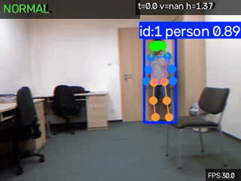
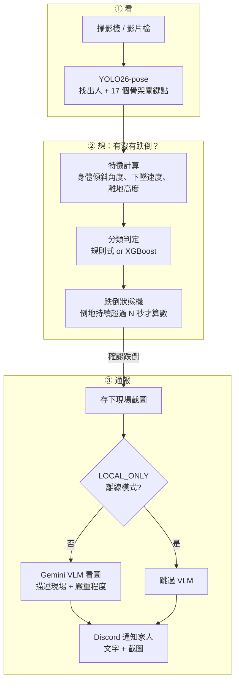
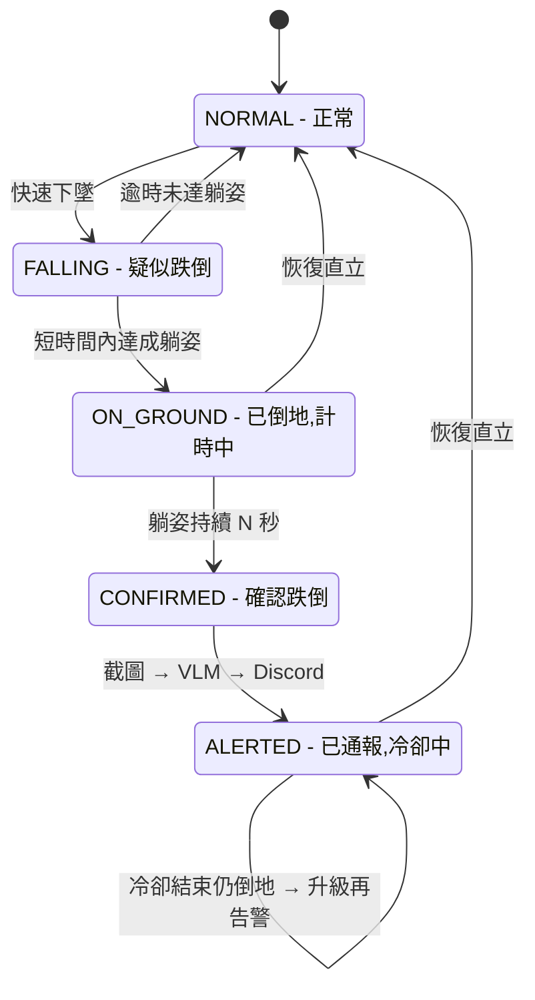
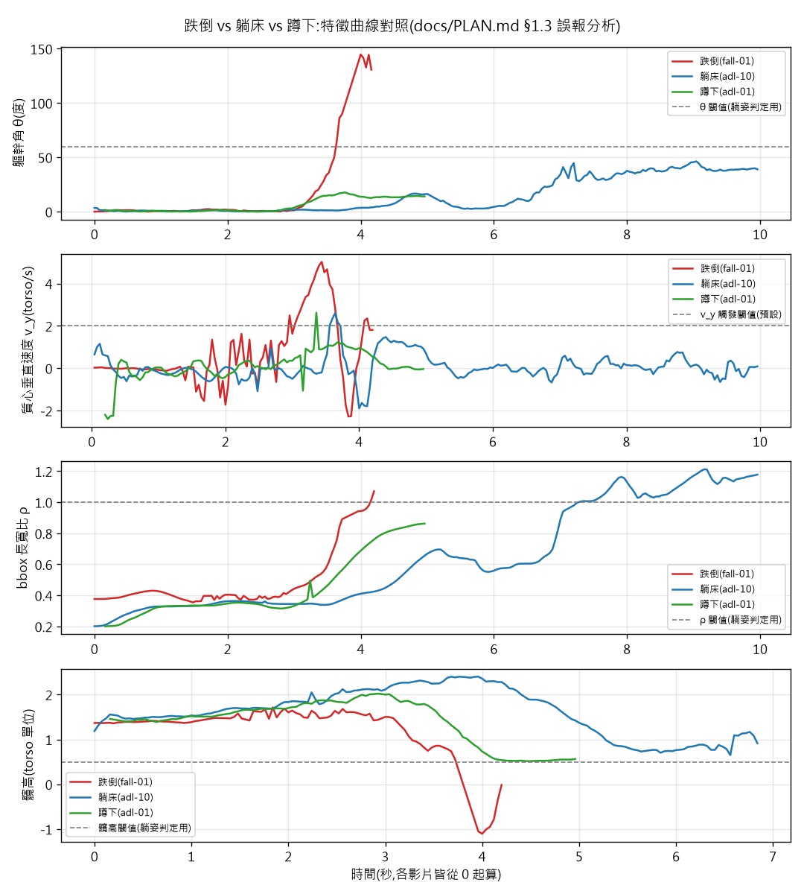

# fall-guard-cv:居家即時跌倒偵測與家人通報

[](https://www.python.org/downloads/release/python-3110/)
[](https://github.com/astral-sh/uv)
[](LICENSE)

> 🚧 開發中。進度見 [PROGRESS.md](PROGRESS.md),完整開發藍圖見 [docs/PLAN.md](docs/PLAN.md)。



畫面素材為 UR Fall Detection Dataset,授權 CC BY-NC-SA 4.0,引用 Kwolek & Kepski 2014,只取原始畫面的 RGB 半邊、不用深度圖,細節見「資料集與授權」。**示範用的 `confirm_seconds` 為了在短片段內看到完整流程而調短,部署預設是 10 秒,片尾以最後一個有效姿態延伸讓狀態機走完**——僅為展示用途,不是評估數字,評估數字見下方評估結果的離線 LOSO 流程。

## 系統架構

三大步驟：**看 → 想 → 通報**。前兩步全程在本機跑,不碰網路;只有第三步、且只在「確認跌倒」時才會上網。



**什麼是「狀態機」？** 系統任何時刻只處於一種狀態，像紅綠燈一樣，要發生特定事件才會切換。這裡的用途是防誤報：不是「模型說跌倒就通報」，而要依序過三關——快速下墜 → 確認躺地 → 持續躺超過 N 秒——才會通報；中途站起來就退回正常。躺床、蹲下這些動作會在某一關被擋掉。



## 模型選型

### 表1:Pose 模型 — YOLO26-pose,ultralytics 8.4.102

| 尺寸 | COCO pose mAP | 本專案用途 |
|---|---|---|
| n | 57.2 | 開發期打通流程用,下載快、迭代快 |
| s | 63.0 | — |
| **m，預設** | **68.8** | **正式評估與部署**:準確度與延遲的平衡點,4090 上仍可輕鬆跑到下方「即時偵測」一節的 FPS 目標 |
| l | 70.4 | — |
| x | 71.6 | — |

選 m 而非最高精度的 x:居家是單人近距離拍攝，不是擁擠人群小目標偵測，m 已足夠準，x 的額外算力換不到實際效益。YOLO26 是 2026-01 最新世代，NMS-free、對遮擋更穩——家具遮擋正是居家常態，細節見[官方文件](https://docs.ultralytics.com/models/yolo26)。

### 表2:分類器對照 — 規則式 baseline vs XGBoost，LOSO，視窗級

XGBoost 用 54 維視窗統計特徵，9 個基礎特徵 × 6 種統計量，在 Colab T4 上以[訓練 notebook](notebooks/fall-guard-cv_train_xgboost_colab.ipynb)訓練，方法細節見 [docs/PLAN.md](docs/PLAN.md) D17/D18。權重已上傳 Hugging Face：[steven0226/fall-guard-cv-xgboost](https://huggingface.co/steven0226/fall-guard-cv-xgboost)，授權 CC BY-NC-SA 4.0。

| 折 | Precision：規則/XGB | Recall：規則/XGB | F1：規則/XGB |
|---|---|---|---|
| P1 | 0.677 / 0.609 | 0.913 / 0.913 | 0.778 / 0.730 |
| P2 | 0.656 / 0.575 | 0.913 / 0.913 | 0.764 / 0.706 |
| P3 | 0.714 / 0.611 | 0.909 / 1.000 | 0.800 / 0.759 |
| P4 | 1.000 / 1.000 | 0.538 / 0.444 | 0.700 / 0.615 |
| P5 | 1.000 / 1.000 | 0.467 / 0.667 | 0.636 / 0.800 |

**折內調參後的規則式整體略優於 XGBoost**，符合小樣本預期——URFD 僅 1499 個視窗、145 個正例，樹模型優勢有限；但 XGBoost 在 P5 折 recall 明顯領先，0.667 比 0.467，顯示兩者錯誤模式不同。SHAP 分析顯示最重要特徵是 `y_std_min`、`hip_height_min`，恰好呼應規則式方法鎖定的「髖高」核心判別特徵，完整圖見 `models/xgboost/shap_summary.png`。本機重現驗證：5 折 × P/R/F1 全部 15 項指標與 Colab 誤差皆為 0.000，完全重現，細節見 D18。

### 表3:VLM 分工

| 角色 | 模型設定 | 用途 |
|---|---|---|
| 主力 — 現場描述 | `GEMINI_MODEL`,.env 設定,預設 `gemini-3.1-flash-lite` | 跌倒確認後,描述現場姿態/環境/嚴重程度,寫進 Discord 通報文字 |
| 備援/評審 | `OPENAI_MODEL`,.env 設定,預設 `gpt-5-mini` | 本專案主線未呼叫,保留供日後人工比較兩家描述品質用 |

> **台灣模型生態觀察**：pose 關鍵點偵測目前找不到台製開源模型可對照，國際生態已很成熟，台灣社群能量較集中在語言模型與特定領域；VLM 端也還沒有能對照 Gemini 多模態品質的本土公開選項，故此環節仍用 `GEMINI_MODEL`。

## 資料集與授權

主要資料集是 **UR Fall Detection Dataset，簡稱 URFD**，30 段跌倒 + 40 段日常活動，即 ADL，由 Microsoft Kinect 拍攝。授權 **CC BY-NC-SA 4.0**，非商業性質，引用：

> Bogdan Kwolek, Michal Kepski, "Human fall detection on embedded platform using depth maps and wireless accelerometer," *Computer Methods and Programs in Biomedicine*, 117(3), Dec 2014.

官方頁面：<https://fenix.ur.edu.pl/~mkepski/ds/uf.html>。備援與跨資料集泛化測試集：Le2i / IMVIA，Kaggle 資料集代碼 `tuyenldvn/falldataset-imvia`。

本 repo **不重新散佈** URFD 原始影片，僅提供 [scripts/download_data.py](scripts/download_data.py) 下載腳本。

## 快速開始

```bash
# 1. 安裝依賴 — Windows 需 cu128 index,已寫入 pyproject.toml
uv sync
uv run python -c "import torch; print(torch.cuda.is_available())"  # 應印出 True

# 2. 設定 .env — 複製 .env.example,填入金鑰與 DISCORD_WEBHOOK_URL

# 3. 下載 URFD + 抽取關鍵點
uv run python scripts/download_data.py
uv run python scripts/prepare_data.py

# 4. 首次執行需人工標註受試者 + ADL 動作類別,並產生評估切分
uv run python scripts/annotate_urfd.py
uv run python scripts/make_splits.py

# 5. 跑規則式 baseline 評估 — 可選 --model xgb 看 XGBoost 對照
uv run python scripts/evaluate.py --model rule --protocol loso
uv run python scripts/error_analysis.py

# 6. 即時偵測 — 影片檔或 webcam,見下方「即時偵測」一節
uv run python -m fallguard.detect --source data/raw/urfd/fall-01-cam0.mp4
uv run python -m fallguard.detect --source 0
```

## 即時偵測

```bash
uv run python -m fallguard.detect --source <影片路徑|0>       # 0 = webcam
uv run python -m fallguard.detect --source <影片路徑> --benchmark   # 量測管線 FPS 上限,不開視窗
```

三執行緒架構:capture 執行緒——1-slot 佇列,模擬攝影機丟舊幀;main 執行緒——推論 → 特徵 → 狀態機 → 疊加畫面;alert worker——非同步 VLM→Discord,不阻塞主迴圈。影片檔來源預設依原生 fps 配速,`--benchmark` 關閉配速以測真實吞吐量上限。確認跌倒時 `events/` 會存下撞擊幀與確認幀。設計細節見 [docs/PLAN.md](docs/PLAN.md) §8.4。

**即時效能實測**,RTX 4090、yolo26m-pose、fp16:`--benchmark` 量到平均 **42.8 FPS**,含特徵計算與狀態機、不含畫面顯示,高於 30 FPS 門檻。差距主要來自逐幀重跑 `compute_features()`——刻意與離線評估共用同一套邏輯,避免訓練/部署飄移,細節見 [docs/PLAN.md](docs/PLAN.md) D20。要衝更高 FPS,下一步是特徵計算增量化。

## 評估結果

**切分協定**：受試者級 **LOSO，Leave-One-Subject-Out** 為主協定，同一人的影片不會同時出現在訓練/測試集。經人工標註確認 ADL 40 段只有 P1、P2 兩位受試者出現，P3–P5 折的測試集沒有 ADL 樣本、只能算 Sensitivity，下表以 N/A 標示，不與 P1/P2 折平均。

### 視窗級指標 — 1.5 秒滑動視窗，precision/recall/F1/PR-AUC

| 折 | F1：文獻預設閾值 | F1：折內調參後 |
|---|---|---|
| P1 | 0.762 | 0.778 |
| P2 | 0.759 | 0.764 |
| P3 | 0.800 | 0.800 |
| P4 | 0.700 | 0.700 |
| P5 | 0.636 | 0.636 |

### 混淆矩陣 — 視窗級，折內調參後，5 折加總

| | 預測：非跌倒 | 預測：跌倒 |
|---|---|---|
| **實際：非跌倒** | TN = 1207 | FP = 46 |
| **實際：跌倒** | FN = 29 | TP = 115 |

誤報 FP 遠多於漏報 FN，符合這個系統的設計優先順序——寧可誤報家人多看一眼，也不要漏掉真的跌倒。各折逐一數字見 [docs/results/rule_baseline.md](docs/results/rule_baseline.md)。

### 事件級指標 — 整段影片是否被狀態機正確判定

| 折 | Sensitivity：文獻預設 | Sensitivity：折內調參後 | Specificity：調參後 |
|---|---|---|---|
| P1 | 0.00 | **1.00** | 0.92 |
| P2 | 0.00 | **1.00** | 0.94 |
| P3 | 0.00 | 0.83 | N/A，無 ADL 樣本 |
| P4 | 0.00 | 0.67 | N/A |
| P5 | 0.00 | 0.50 | N/A |

**重要發現**：文獻預設的時間參數，躺姿持續 2 秒才算數，對 URFD 短片段系統性過嚴——25/30 段影片判定「已倒地」後，剩餘片長中位數僅 0.77 秒，文獻預設下事件級 Sensitivity 恆為 0。折內搜尋較短時間參數後 Sensitivity 明顯回升，完整數據見 [docs/results/rule_baseline.md](docs/results/rule_baseline.md)。

**已知限制**：跌倒的「站姿起跌 / 坐姿起跌」分層報告因缺乏官方逐段對照表暫時從缺，細節見 [docs/PLAN.md](docs/PLAN.md) §7.2。

### 誤報案例分析

用各折折內調參後的設定，對全部 40 段 ADL 影片統計哪些日常動作最容易被誤判為跌倒：

| 動作類別 | 段數 | 誤報率 |
|---|---|---|
| 躺床 | 7 | 14.3% |
| 撿東西/彎腰 | 14 | 7.1% |
| 蹲下/綁鞋帶 | 6 | 0.0% |
| 坐下 | 9 | 0.0% |

跌倒 vs 躺床 vs 蹲下的特徵曲線對照，說明躺床為何幾乎不會誤觸發跌倒：



三條曲線中，藍色代表躺床——其軀幹角/bbox 比/髖高最終也會逼近跌倒範圍，但**下墜速度全程未超閾值**——這是躺床與跌倒唯一可靠的判別依據。完整分析見 [docs/results/error_analysis.md](docs/results/error_analysis.md)。

## 隱私設計

家用攝影機拍到的是私人生活空間,隱私設計不是加分項而是這個專案能不能用的前提:

- **平時零上傳**:pose 推論、特徵計算、狀態機判定全部在本機 GPU 跑,鏡頭畫面不會離開這台電腦。
- **只有「確認跌倒」才送一張截圖**:狀態機走到 CONFIRMED 才截圖給 VLM,一次事件僅 1-2 張圖,存在本機 `events/`。
- **`LOCAL_ONLY=true`**:跳過雲端 VLM,Discord 改用純文字通報——**通報本身不會被關掉**,告警送達是安全底線,細節見 [docs/PLAN.md](docs/PLAN.md) D8/§8.2。
- **`SEND_IMAGE=false`**:連截圖都不附進 Discord 訊息,只送文字+特徵摘要。

## 成本估算

- **訓練**:Colab 免費 T4 額度,**$0**,細節見[訓練 notebook](notebooks/fall-guard-cv_train_xgboost_colab.ipynb)。
- **推論**:pose/特徵/狀態機全在本機 GPU 跑,**$0**。
- **VLM — 唯一真的會計費**:每次通報 ≈ 1 張 720p JPEG + 短 prompt + ~150 token 輸出,用 `GEMINI_MODEL` 估算單次成本遠低於 $0.001。冷卻 120 秒,天花板情境每小時最多 30 次通報,但這不是預期的實際頻率。`LOCAL_ONLY=true` 可完全跳過此花費;`detect.py` 啟動時會印出這段估算。

## 關鍵套件版本

| 套件 | 版本 | 備註 |
|---|---|---|
| Python | 3.11 | `.python-version` 鎖定 |
| ultralytics | 8.4.102 | YOLO26-pose,D2 |
| torch / torchvision | 2.11.0+cu128 / 0.26.0+cu128 | Windows cu128 explicit index,D9 |
| langchain | 1.3.14 | 1.x 現行穩定版 API,`init_chat_model` 等 |
| langchain-google-genai | 4.2.7 | Gemini VLM 整合,D4 |
| xgboost | 3.2.0 | 鎖 Python 3.11 相容的最新版,D17 |
| huggingface-hub | 1.24.0 | 權重上傳/下載,D19 |

完整鎖定版本見 [uv.lock](uv.lock)。

## 開發紀錄與授權

- 進度追蹤:[PROGRESS.md](PROGRESS.md);每階段驗收以 git tag `phase-N` 標記
- License:程式碼 [MIT](LICENSE);訓練資料 URFD 為 CC BY-NC-SA 4.0,細節見「資料集與授權」;XGBoost 權重比照 CC BY-NC-SA 4.0,連結見「模型選型」表2
