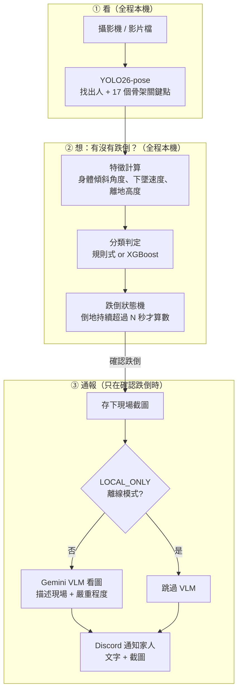

# fall-guard-cv:居家即時跌倒偵測與家人通報

> 🚧 開發中。進度見 [PROGRESS.md](PROGRESS.md),完整開發藍圖見 [docs/PLAN.md](docs/PLAN.md)。

<!-- TODO(Phase 4): demo GIF 置此(docs/assets/demo.gif,≤8MB,規格見 PLAN.md 第 9 章) -->

## 為什麼做這個專案

<!-- TODO(Phase 4): 第一人稱動機段(家中長輩獨處的跌倒憂慮 × 電腦視覺研究背景),草稿經作者修改後定稿 -->

## 系統架構

三大步驟：**看 → 想 → 通報**。前兩步全程在本機跑（不碰網路）；只有第三步、且只在「確認跌倒」時才會上網。



**什麼是「狀態機」？** 系統在任何時刻只處於一種狀態，只有發生特定事件才會跳到下一個狀態，就像紅綠燈一樣。這裡的用途是防誤報：不是「模型說跌倒就馬上通報」，而是要依序過三關——(1) 偵測到快速下墜 → (2) 確認人躺在地上 → (3) 持續躺超過 N 秒——才會通報；中途只要人站起來就退回正常。躺床、蹲下這些日常動作會在某一關被擋掉。

```mermaid
stateDiagram-v2
    state "NORMAL（正常）" as NORMAL
    state "FALLING（疑似跌倒）" as FALLING
    state "ON_GROUND（已倒地，計時中）" as ON_GROUND
    state "CONFIRMED（確認跌倒）" as CONFIRMED
    state "ALERTED（已通報，冷卻中）" as ALERTED
    [*] --> NORMAL
    NORMAL --> FALLING : 快速下墜
    FALLING --> ON_GROUND : 短時間內達成躺姿
    FALLING --> NORMAL : 逾時未達躺姿
    ON_GROUND --> CONFIRMED : 躺姿持續 N 秒
    ON_GROUND --> NORMAL : 恢復直立
    CONFIRMED --> ALERTED : 截圖 → VLM → Discord
    ALERTED --> NORMAL : 恢復直立
    ALERTED --> ALERTED : 冷卻結束仍倒地 → 升級再告警
```



## 模型選型

<!-- TODO(Phase 4): 表3 VLM 分工;台灣模型生態觀察註記 -->

Pose 模型已於 Phase 1 選定 **YOLO26-pose**（ultralytics 官方 2026-01 發布之最新世代，NMS-free、對遮擋更穩），VLM 分工待 Phase 4 補齊。

### 分類器對照：規則式 baseline vs XGBoost（LOSO，視窗級）

XGBoost 使用 54 維視窗統計特徵（9 個基礎特徵 × mean/std/min/max/last−first/max|Δ| 六種統計量），在 Google Colab（T4）以 [notebooks/fall-guard-cv_train_xgboost_colab.ipynb](notebooks/fall-guard-cv_train_xgboost_colab.ipynb) 訓練，權重與本機重現驗證方式見 [docs/PLAN.md](docs/PLAN.md) D17/D18。

| 折 | Precision（規則/XGB） | Recall（規則/XGB） | F1（規則/XGB） |
|---|---|---|---|
| P1 | 0.677 / 0.609 | 0.913 / 0.913 | 0.778 / 0.730 |
| P2 | 0.656 / 0.575 | 0.913 / 0.913 | 0.764 / 0.706 |
| P3 | 0.714 / 0.611 | 0.909 / 1.000 | 0.800 / 0.759 |
| P4 | 1.000 / 1.000 | 0.538 / 0.444 | 0.700 / 0.615 |
| P5 | 1.000 / 1.000 | 0.467 / 0.667 | 0.636 / 0.800 |

**規則式（折內調參後）目前整體略優於 XGBoost 的預設超參數版本**，這符合小樣本情境的預期——URFD 只有 1499 個視窗、145 個正例，樹模型在這個規模下優勢有限；XGBoost 在 P5 折反而 recall 明顯領先（0.667 vs 0.467），顯示兩種方法的錯誤模式不同，並非單純的一方全面勝出。SHAP 特徵重要度分析（`models/xgboost/shap_summary.png`）顯示模型排名最高的特徵是 `y_std_min`、`hip_height_min`——跟規則式方法人工設計時鎖定的「髖高」核心判別特徵高度吻合，是一個有意思的交叉驗證。本機重現驗證：全部 15 項指標（5 折 × P/R/F1）與 Colab 訓練當下印出的數字誤差皆為 0.000（完全重現，過程中修正了一個視窗篩選邏輯不一致的 bug，見 D18）。

## 資料集與授權

主要資料集：**UR Fall Detection Dataset（URFD）**，30 段跌倒 + 40 段日常活動（ADL），Microsoft Kinect 拍攝。授權 **CC BY-NC-SA 4.0**（非商業），引用：

> Bogdan Kwolek, Michal Kepski, "Human fall detection on embedded platform using depth maps and wireless accelerometer," *Computer Methods and Programs in Biomedicine*, 117(3), Dec 2014.

官方頁面：<https://fenix.ur.edu.pl/~mkepski/ds/uf.html>。備援與跨資料集泛化測試集：Le2i / IMVIA（Kaggle `tuyenldvn/falldataset-imvia`）。

本 repo **不重新散佈** URFD 原始影片，僅提供 [scripts/download_data.py](scripts/download_data.py) 下載腳本。

## 快速開始

```bash
# 1. 安裝依賴(Windows 需 cu128 index,已寫入 pyproject.toml)
uv sync
uv run python -c "import torch; print(torch.cuda.is_available())"  # 應印出 True

# 2. 設定 .env(複製 .env.example,填入金鑰與 DISCORD_WEBHOOK_URL)

# 3. 下載 URFD + 抽取關鍵點
uv run python scripts/download_data.py
uv run python scripts/prepare_data.py

# 4. (首次)人工標註受試者 + ADL 動作類別,並產生評估切分
uv run python scripts/annotate_urfd.py
uv run python scripts/make_splits.py

# 5. 跑規則式 baseline 評估
uv run python scripts/evaluate.py --model rule --protocol loso
uv run python scripts/error_analysis.py
```

## 評估結果

**切分協定**：受試者級 **Leave-One-Subject-Out（LOSO）** 為主協定，同一人的所有影片永遠不會同時出現在訓練與測試集。URFD 官方未提供受試者對照表，經人工標註確認：**ADL 40 段中只有 2 位受試者（P1、P2）出現**，其餘 3 位（P3–P5）只在 30 段 fall 中出現——這使得 LOSO 的 P3/P4/P5 折的測試集沒有 ADL 樣本，只能計算 Sensitivity，無法計算 Specificity（下表以 N/A 誠實標示，不與 P1/P2 折平均）。

### 視窗級指標（1.5 秒滑動視窗，precision/recall/F1/PR-AUC）

| 折 | F1（文獻預設閾值） | F1（折內調參後） |
|---|---|---|
| P1 | 0.762 | 0.778 |
| P2 | 0.759 | 0.764 |
| P3 | 0.800 | 0.800 |
| P4 | 0.700 | 0.700 |
| P5 | 0.636 | 0.636 |

### 事件級指標（整段影片是否被狀態機正確判定）

| 折 | Sensitivity（文獻預設） | Sensitivity（折內調參後） | Specificity（調參後） |
|---|---|---|---|
| P1 | 0.00 | **1.00** | 0.92 |
| P2 | 0.00 | **1.00** | 0.94 |
| P3 | 0.00 | 0.83 | N/A（無 ADL 樣本） |
| P4 | 0.00 | 0.67 | N/A |
| P5 | 0.00 | 0.50 | N/A |

**重要發現**：文獻預設的狀態機時間參數（跌倒後 1 秒內須確認躺姿、躺姿持續 2 秒才算數）對 URFD 這批短片段系統性過嚴——實測 25/30 段影片成功判定「已倒地」，但判定後到影片結束的剩餘時長全數不到 2 秒（中位數僅 0.77 秒），導致文獻預設下事件級 Sensitivity 恆為 0。改為在訓練資料上搜尋較短的時間參數後，Sensitivity 明顯回升。這個「文獻預設 vs 資料實測校準」的落差本身就是規則式方法的重要發現，完整數據見 [docs/results/rule_baseline.md](docs/results/rule_baseline.md)。

**已知限制**：跌倒的「站姿起跌 / 坐姿起跌」分層報告因缺乏官方逐段對照表暫時從缺（見 PLAN.md §7.2）。

### 誤報案例分析

用各折折內調參後的設定，對全部 40 段 ADL 影片統計哪些日常動作最容易被誤判為跌倒：

| 動作類別 | 段數 | 誤報率 |
|---|---|---|
| 躺床 | 7 | 14.3% |
| 撿東西/彎腰 | 14 | 7.1% |
| 蹲下/綁鞋帶 | 6 | 0.0% |
| 坐下 | 9 | 0.0% |

跌倒 vs 躺床 vs 蹲下的特徵曲線對照（説明躺床為何幾乎不會誤觸發跌倒）：


三條特徵曲線顯示：躺床（藍）的軀幹角/bbox 比/髖高最終也會緩慢逼近跌倒的數值範圍，但**下墜速度全程未超過觸發閾值**——這正是躺床與跌倒唯一可靠的判別依據。完整分析見 [docs/results/error_analysis.md](docs/results/error_analysis.md)。

## 隱私設計

<!-- TODO(Phase 4): 平時零上傳(推論與特徵全地端)、僅確認跌倒事件送單張截圖、LOCAL_ONLY 完全離線模式、SEND_IMAGE 開關 -->

## 成本估算

<!-- TODO(Phase 4): 訓練 $0(Colab T4)/推論 $0(地端)/VLM 每次通報成本與月估(實測 token 數回填) -->

## 關鍵套件版本

<!-- TODO(Phase 4): 與 uv.lock 一致的版本表(ultralytics/torch/langchain/langchain-google-genai/xgboost) -->

## 開發紀錄與授權

- 進度追蹤:[PROGRESS.md](PROGRESS.md);每階段驗收以 git tag `phase-N` 標記
- License:[MIT](LICENSE)
<!-- TODO(Phase 1): 資料授權註記(URFD CC BY-NC-SA 4.0) -->
