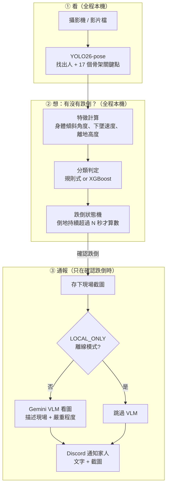
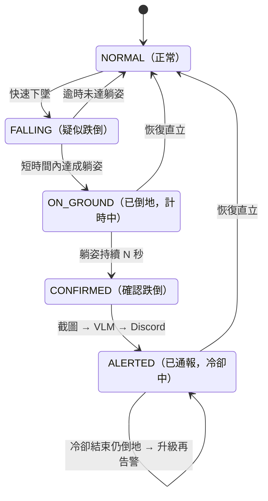

# fall-guard-cv:居家即時跌倒偵測與家人通報

[](https://www.python.org/downloads/release/python-3110/)
[](https://github.com/astral-sh/uv)
[](LICENSE)

> 🚧 開發中。進度見 [PROGRESS.md](PROGRESS.md),完整開發藍圖見 [docs/PLAN.md](docs/PLAN.md)。


畫面素材:UR Fall Detection Dataset(CC BY-NC-SA 4.0,Kwolek & Kepski 2014)。畫面只取原始 cam0 左右拼接幀的 RGB 半邊(本專案不使用深度圖,見「資料集與授權」一節)。**為了讓短短數秒的片段能完整看到 CONFIRMED/ALERTED,示範用的 `confirm_seconds` 調得比部署預設(10 秒)短很多**,且片尾用最後一個有效姿態「凍結延伸」了幾幀讓狀態機走完全程——這是示範限制,不是評估數字(評估數字全部來自 §7 的離線 LOSO 流程,與這支 GIF 無關)。

## 為什麼做這個專案

<!-- 草稿,待作者本人修改定稿 -->

家裡長輩年紀漸長後,獨自在家的時間變多,「萬一跌倒了沒人知道」是那種平常不會掛在嘴邊、但偶爾半夜會突然想到的擔心。市面上的緊急救援按鈕需要長輩自己記得按——真的跌倒失去意識或恐慌時,常常反而按不下去。這個專案想做的是反過來:不需要長輩做任何動作,系統自己看得出「這次不對勁」,再通知家人。

另一方面,這也是我練習電腦視覺與 CV+VLM 應用的專案:從關鍵點特徵工程、規則式狀態機到 XGBoost 分類器的對照實驗,再到多模態 VLM 描述現場,是一次把「學術資料集上的評估數字」跟「居家場景真的要考慮的工程問題(誤報、隱私、延遲)」放在一起做的練習。也想順便記錄台灣開源模型生態在這類應用上的可用性——哪些環節已經有本土選項、哪些還得依賴國際模型。

## 系統架構

三大步驟：**看 → 想 → 通報**。前兩步全程在本機跑（不碰網路）；只有第三步、且只在「確認跌倒」時才會上網。



**什麼是「狀態機」？** 系統在任何時刻只處於一種狀態，只有發生特定事件才會跳到下一個狀態，就像紅綠燈一樣。這裡的用途是防誤報：不是「模型說跌倒就馬上通報」，而是要依序過三關——(1) 偵測到快速下墜 → (2) 確認人躺在地上 → (3) 持續躺超過 N 秒——才會通報；中途只要人站起來就退回正常。躺床、蹲下這些日常動作會在某一關被擋掉。



## 模型選型

### 表1:Pose 模型（YOLO26-pose,ultralytics 8.4.102）

| 尺寸 | COCO pose mAP | 本專案用途 |
|---|---|---|
| n | 57.2 | 開發期打通流程用(下載快、迭代快) |
| s | 63.0 | — |
| **m（預設）** | **68.8** | **正式評估與部署**:準確度與延遲的平衡點,4090 上仍可輕鬆跑到 §「即時效能」的 FPS 目標 |
| l | 70.4 | — |
| x | 71.6 | — |

選 m 而非最高精度的 x:居家場景是單人近距離拍攝(非擁擠人群小目標偵測),m 已足夠穩定辨識關鍵點,x 的額外算力換不到明顯的實際效益。依據:[docs.ultralytics.com/models/yolo26](https://docs.ultralytics.com/models/yolo26)。YOLO26 是 2026-01 發布的最新世代,NMS-free 端到端推論、對遮擋更穩(家具遮擋是居家場景常態)。

### 表3:VLM 分工

| 角色 | 模型設定 | 用途 |
|---|---|---|
| 主力(現場描述) | `GEMINI_MODEL`(.env,預設 `gemini-3.1-flash-lite`) | 跌倒確認後,描述現場姿態/環境/嚴重程度,寫進 Discord 通報文字 |
| 備援/評審 | `OPENAI_MODEL`(.env,預設 `gpt-5-mini`) | 本專案主線未呼叫,保留供日後人工比較兩家描述品質用 |

> **台灣模型生態觀察**:本專案 CV 主體(pose 關鍵點偵測)目前找不到台製開源模型可對照——YOLO26 之類的通用姿態偵測模型國際生態已經很成熟,台灣社群目前的能量比較集中在語言模型與特定領域(醫療影像、農業等)。VLM 端如果要換成本土模型,目前也還沒有能力對照 Gemini 多模態品質的公開選項,故本專案 VLM 仍照 CLAUDE.md 模型政策以 `GEMINI_MODEL` 為主。這個落差本身也是做這個作品集系列的觀察之一。

### 分類器對照：規則式 baseline vs XGBoost（LOSO，視窗級）

XGBoost 使用 54 維視窗統計特徵（9 個基礎特徵 × mean/std/min/max/last−first/max|Δ| 六種統計量），在 Google Colab（T4）以 [notebooks/fall-guard-cv_train_xgboost_colab.ipynb](notebooks/fall-guard-cv_train_xgboost_colab.ipynb) 訓練，權重與本機重現驗證方式見 [docs/PLAN.md](docs/PLAN.md) D17/D18。權重已上傳 Hugging Face：[steven0226/fall-guard-cv-xgboost](https://huggingface.co/steven0226/fall-guard-cv-xgboost)（CC BY-NC-SA 4.0，比照訓練資料 URFD 的非商業授權）。

| 折 | Precision（規則/XGB） | Recall（規則/XGB） | F1（規則/XGB） |
|---|---|---|---|
| P1 | 0.677 / 0.609 | 0.913 / 0.913 | 0.778 / 0.730 |
| P2 | 0.656 / 0.575 | 0.913 / 0.913 | 0.764 / 0.706 |
| P3 | 0.714 / 0.611 | 0.909 / 1.000 | 0.800 / 0.759 |
| P4 | 1.000 / 1.000 | 0.538 / 0.444 | 0.700 / 0.615 |
| P5 | 1.000 / 1.000 | 0.467 / 0.667 | 0.636 / 0.800 |

**規則式（折內調參後）目前整體略優於 XGBoost 的預設超參數版本**，這符合小樣本情境的預期——URFD 只有 1499 個視窗、145 個正例，樹模型在這個規模下優勢有限；XGBoost 在 P5 折反而 recall 明顯領先（0.667 vs 0.467），顯示兩種方法的錯誤模式不同，並非單純的一方全面勝出。SHAP 特徵重要度分析（`models/xgboost/shap_summary.png`）顯示模型排名最高的特徵是 `y_std_min`、`hip_height_min`——跟規則式方法人工設計時鎖定的「髖高」核心判別特徵高度吻合，是一個有意思的交叉驗證。本機重現驗證：全部 15 項指標（5 折 × P/R/F1）與 Colab 訓練當下印出的數字誤差皆為 0.000（完全重現，過程中修正了一個視窗篩選邏輯不一致的 bug，見 D18）。

## 資料集與授權

主要資料集：**UR Fall Detection Dataset（URFD）**，30 段跌倒 + 40 段日常活動（ADL），Microsoft Kinect 拍攝。授權 **CC BY-NC-SA 4.0**（非商業），引用：

> Bogdan Kwolek, Michal Kepski, "Human fall detection on embedded platform using depth maps and wireless accelerometer," *Computer Methods and Programs in Biomedicine*, 117(3), Dec 2014.

官方頁面：<https://fenix.ur.edu.pl/~mkepski/ds/uf.html>。備援與跨資料集泛化測試集：Le2i / IMVIA（Kaggle `tuyenldvn/falldataset-imvia`）。

本 repo **不重新散佈** URFD 原始影片，僅提供 [scripts/download_data.py](scripts/download_data.py) 下載腳本。

## 快速開始

```bash
# 1. 安裝依賴(Windows 需 cu128 index,已寫入 pyproject.toml)
uv sync
uv run python -c "import torch; print(torch.cuda.is_available())"  # 應印出 True

# 2. 設定 .env(複製 .env.example,填入金鑰與 DISCORD_WEBHOOK_URL)

# 3. 下載 URFD + 抽取關鍵點
uv run python scripts/download_data.py
uv run python scripts/prepare_data.py

# 4. (首次)人工標註受試者 + ADL 動作類別,並產生評估切分
uv run python scripts/annotate_urfd.py
uv run python scripts/make_splits.py

# 5. 跑規則式 baseline 評估(可選 --model xgb 看 XGBoost 對照)
uv run python scripts/evaluate.py --model rule --protocol loso
uv run python scripts/error_analysis.py

# 6. 即時偵測(影片檔或 webcam,見下方「即時偵測」一節)
uv run python -m fallguard.detect --source data/raw/urfd/fall-01-cam0.mp4
uv run python -m fallguard.detect --source 0
```

## 即時偵測

```bash
uv run python -m fallguard.detect --source <影片路徑|0>       # 0 = webcam
uv run python -m fallguard.detect --source <影片路徑> --benchmark   # 量測管線 FPS 上限,不開視窗
```

三執行緒架構:capture(1-slot 佇列,只留最新幀,模擬即時攝影機丟舊幀行為)/ main(pose 推論 → 特徵 → 狀態機 → 疊加畫面)/ alert worker(非同步 VLM→Discord,不阻塞主迴圈)。影片檔來源預設會配速至原生 fps 模擬即時攝影機(`--benchmark` 關閉配速,單執行緒跑全部影格量測真實吞吐量上限)。確認跌倒時會在 `events/` 存下撞擊幀與確認幀兩張截圖。詳細設計見 [docs/PLAN.md](docs/PLAN.md) §8.4。

**即時效能實測**(RTX 4090,yolo26m-pose,fp16):`--benchmark` 量到平均 **42.8 FPS**(pose 推論 + 特徵計算 + 狀態機,不含畫面顯示),高於 30 FPS 的驗收門檻,但低於純 pose 推論本身「4090 fp16 可上看 100+ FPS」的理論值——差距主要來自逐幀對滑動緩衝區重跑 `compute_features()`(重採樣、滾動中位數等 Python/NumPy 運算)而非模型推論本身,兩者共用同一套邏輯是刻意選擇(見 [docs/PLAN.md](docs/PLAN.md) D20:評估與部署共用同一套特徵邏輯,不另寫增量版,避免重蹈 D18 視窗篩選飄移的覆轍;`--benchmark` 本身的量測設計見 D21),之後若要衝更高 FPS,優化方向會是特徵計算的增量化而非重新設計。

## 評估結果

**切分協定**：受試者級 **Leave-One-Subject-Out（LOSO）** 為主協定，同一人的所有影片永遠不會同時出現在訓練與測試集。URFD 官方未提供受試者對照表，經人工標註確認：**ADL 40 段中只有 2 位受試者（P1、P2）出現**，其餘 3 位（P3–P5）只在 30 段 fall 中出現——這使得 LOSO 的 P3/P4/P5 折的測試集沒有 ADL 樣本，只能計算 Sensitivity，無法計算 Specificity（下表以 N/A 誠實標示，不與 P1/P2 折平均）。

### 視窗級指標（1.5 秒滑動視窗，precision/recall/F1/PR-AUC）

| 折 | F1（文獻預設閾值） | F1（折內調參後） |
|---|---|---|
| P1 | 0.762 | 0.778 |
| P2 | 0.759 | 0.764 |
| P3 | 0.800 | 0.800 |
| P4 | 0.700 | 0.700 |
| P5 | 0.636 | 0.636 |

### 混淆矩陣（視窗級，折內調參後，5 折加總）

| | 預測：非跌倒 | 預測：跌倒 |
|---|---|---|
| **實際：非跌倒** | TN = 1207 | FP = 46 |
| **實際：跌倒** | FN = 29 | TP = 115 |

FP(誤報)遠多於 FN(漏報)，符合這個系統的設計優先順序——寧可誤報家人多看一眼，也不要漏掉真的跌倒。各折逐一數字見 [docs/results/rule_baseline.md](docs/results/rule_baseline.md)。

### 事件級指標（整段影片是否被狀態機正確判定）

| 折 | Sensitivity（文獻預設） | Sensitivity（折內調參後） | Specificity（調參後） |
|---|---|---|---|
| P1 | 0.00 | **1.00** | 0.92 |
| P2 | 0.00 | **1.00** | 0.94 |
| P3 | 0.00 | 0.83 | N/A（無 ADL 樣本） |
| P4 | 0.00 | 0.67 | N/A |
| P5 | 0.00 | 0.50 | N/A |

**重要發現**：文獻預設的狀態機時間參數（跌倒後 1 秒內須確認躺姿、躺姿持續 2 秒才算數）對 URFD 這批短片段系統性過嚴——實測 25/30 段影片成功判定「已倒地」，但判定後到影片結束的剩餘時長全數不到 2 秒（中位數僅 0.77 秒），導致文獻預設下事件級 Sensitivity 恆為 0。改為在訓練資料上搜尋較短的時間參數後，Sensitivity 明顯回升。這個「文獻預設 vs 資料實測校準」的落差本身就是規則式方法的重要發現，完整數據見 [docs/results/rule_baseline.md](docs/results/rule_baseline.md)。

**已知限制**：跌倒的「站姿起跌 / 坐姿起跌」分層報告因缺乏官方逐段對照表暫時從缺（見 PLAN.md §7.2）。

### 誤報案例分析

用各折折內調參後的設定，對全部 40 段 ADL 影片統計哪些日常動作最容易被誤判為跌倒：

| 動作類別 | 段數 | 誤報率 |
|---|---|---|
| 躺床 | 7 | 14.3% |
| 撿東西/彎腰 | 14 | 7.1% |
| 蹲下/綁鞋帶 | 6 | 0.0% |
| 坐下 | 9 | 0.0% |

跌倒 vs 躺床 vs 蹲下的特徵曲線對照（説明躺床為何幾乎不會誤觸發跌倒）：


三條特徵曲線顯示：躺床（藍）的軀幹角/bbox 比/髖高最終也會緩慢逼近跌倒的數值範圍，但**下墜速度全程未超過觸發閾值**——這正是躺床與跌倒唯一可靠的判別依據。完整分析見 [docs/results/error_analysis.md](docs/results/error_analysis.md)。

## 隱私設計

家用攝影機拍到的是私人生活空間,隱私設計不是加分項而是這個專案能不能用的前提:

- **平時零上傳**:pose 關鍵點推論、特徵計算、狀態機判定全部在本機 GPU 跑,鏡頭畫面不會離開這台電腦。真正會傳出去的只有「兩個數字組成的關鍵點座標」在記憶體裡流動,不落地、不上網。
- **只有「確認跌倒」才送一張截圖**:不是全程錄影上傳,而是狀態機走到 CONFIRMED 那一刻才截一張圖給 VLM 分析,一次事件只有 1-2 張圖(撞擊幀+確認幀存在本機 `events/`,只有確認幀會送給 VLM)。
- **`LOCAL_ONLY=true`**:完全跳過雲端 VLM 呼叫,截圖只留在本機,Discord 通報改用制式文字(不含 AI 描述),但**通報本身不會被關掉**——告警送達是安全底線,不因為離線模式而犧牲(見 [docs/PLAN.md](docs/PLAN.md) D8/§8.2)。
- **`SEND_IMAGE=false`**:更保守的選項,連截圖都不附進 Discord 訊息,家人只收到文字通報+特徵摘要,連「這張照片被存在 Discord 伺服器上」的疑慮都排除。

## 成本估算

- **訓練**:Colab 免費 T4 額度,**$0**(見 Phase 3,[notebooks/fall-guard-cv_train_xgboost_colab.ipynb](notebooks/fall-guard-cv_train_xgboost_colab.ipynb))。
- **推論**:pose/特徵/狀態機全在本機 GPU 跑,**$0**。
- **VLM(唯一真的會計費的部分)**:每次跌倒通報 = 1 張 720p JPEG 截圖 + 短 prompt + 約 150 token 輸出,用 `GEMINI_MODEL`(flash-lite 等級)估算單次成本遠低於 $0.001。`ALERT_COOLDOWN_SECONDS` 預設 120 秒,天花板情境(理論上持續倒地不起)每小時最多 30 次通報——這是上限估算,不是預期實際頻率(正常家用場景一個月可能 0 次)。`LOCAL_ONLY=true` 可完全跳過這筆花費。`uv run python -m fallguard.detect` 啟動時會印出這段估算,VLM 呼叫前隨時可見。

## 關鍵套件版本

| 套件 | 版本 | 備註 |
|---|---|---|
| Python | 3.11 | `.python-version` 鎖定 |
| ultralytics | 8.4.102 | YOLO26-pose(D2) |
| torch / torchvision | 2.11.0+cu128 / 0.26.0+cu128 | Windows cu128 explicit index(D9) |
| langchain | 1.3.14 | 1.x 現行穩定版 API(`init_chat_model` 等) |
| langchain-google-genai | 4.2.7 | Gemini VLM 整合(D4) |
| xgboost | 3.2.0 | 鎖 Python 3.11 相容的最新版(D17) |
| huggingface-hub | 1.24.0 | 權重上傳/下載(D19) |

完整鎖定版本見 [uv.lock](uv.lock)。

## 開發紀錄與授權

- 進度追蹤:[PROGRESS.md](PROGRESS.md);每階段驗收以 git tag `phase-N` 標記
- License:程式碼 [MIT](LICENSE);訓練資料 URFD 為 CC BY-NC-SA 4.0(見「資料集與授權」);XGBoost 權重比照 CC BY-NC-SA 4.0(見「模型選型」HF 連結)
