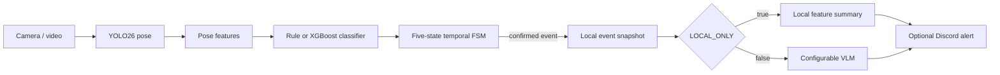

# fall-guard-cv

[](https://github.com/kuotunyu/fall-guard-cv/actions/workflows/test.yml)


[](LICENSE)

以人體姿態、時序狀態機與事件級 VLM 描述組成的居家跌倒偵測研究原型。影像預設先在本機處理；只有狀態機確認事件後，系統才依設定保存影格、呼叫 VLM 或送出 Discord 通報。

> **使用邊界**：這是作品集與研究原型，不是醫療器材、照護保證或緊急救援服務，也不是臨床驗證。不可單獨用於攸關生命安全的決策。


## 系統架構


```mermaid
flowchart LR
    A[Camera / video] --> B[YOLO26 pose]
    B --> C[Pose features]
    C --> D[Rule or XGBoost classifier]
    D --> E[Five-state temporal FSM]
    E -->|confirmed event| F[Local event snapshot]
    F --> G{LOCAL_ONLY}
    G -->|true| H[Local feature summary]
    G -->|false| I[Configurable VLM]
    H --> J[Optional Discord alert]
    I --> J
```

狀態機依序處理 `NORMAL → FALLING → ON_GROUND → CONFIRMED → ALERTED`，用姿態變化、倒地狀態與持續時間降低單幀誤報。這是可解釋的工程設計，不代表已在所有居家行為或族群上證明安全。

## 模型選型

| 元件 | 預設／選項 | 定位 |
|---|---|---|
| Pose | `yolo26m-pose.pt` | 取得 17 個人體關鍵點；上游 COCO pose mAP 68.8 是 Ultralytics 公布的通用姿態指標，不是本專案跌倒偵測成績 |
| 事件分類 | 可解釋規則／XGBoost | 以姿態時序特徵判斷候選事件；XGBoost 權重另存於 Hugging Face |
| 事件描述 | `gemini-3.5-flash-lite` | 僅在確認事件後產生文字描述，可用環境變數替換 |
| 對照模型 | `gpt-5-mini` | 曾用於 12 張私有事件截圖的非正式供應商對照，不是安全驗證或自動備援共識機制 |

模型名稱與能力請以 [Ultralytics YOLO26 文件](https://docs.ultralytics.com/models/yolo26/)、[Gemini 3.5 Flash-Lite 文件](https://ai.google.dev/gemini-api/docs/models/gemini-3.5-flash-lite)及 [OpenAI GPT-5 mini 文件](https://developers.openai.com/api/docs/models/gpt-5-mini)為準。

## 評估結果

### URFD 視窗級結果

五個受試者折的規則基線彙總如下。這是固定視窗分類統計，不等同於「一次影片是否成功通報」的事件級指標。

| | 預測非跌倒 | 預測跌倒 |
|---|---:|---:|
| 實際非跌倒 | TN 1,207 | FP 46 |
| 實際跌倒 | FN 29 | TP 115 |

### URFD 事件級結果

評估腳本在各 fold 的訓練資料內選參數，測試時使用 1.5 秒逾時與 0.3 秒確認門檻。P1、P2 同時含 fall 與 ADL；P3/P4/P5 的測試折只有 fall。

| Fold | Fall / ADL 影片 | Sensitivity | Specificity |
|---|---:|---:|---:|
| P1 | 6 / 24 | 1.000 | 0.917 |
| P2 | 6 / 16 | 1.000 | 0.938 |
| P3 | 6 / 0 | 0.833 | N/A |
| P4 | 6 / 0 | 0.667 | N/A |
| P5 | 6 / 0 | 0.500 | N/A |

因此 P3/P4/P5 的 **Specificity 無法估計**，不可把它們與 P1/P2 平均成完整的五折 specificity。

### 跨資料集測試

URFD 調整後直接在 Le2i 測試：事件級 Sensitivity **0.559**（95% CI 0.47–0.64），Specificity **0.000**（95% CI 0.00–0.56）。Le2i 測試集雖有 130 段影片，但非跌倒樣本只有 **3 段 ADL**、總長 97.8 秒，因此 specificity 與 FP/hour 都極不穩定。這個結果揭露了明顯的跨場域泛化缺口，而不是可部署證明。

[Failure analysis case study](docs/FAILURE_ANALYSIS_CASE_STUDY.md) 將這個未經 Le2i 調參補救的負面結果整理成可稽核的工程案例。

完整可追溯結果：

- [規則基線、事件級評估與限制](docs/results/rule_baseline.md)
- [XGBoost 基線](docs/results/xgb_baseline.md)
- [URFD → Le2i 跨資料集評估](docs/results/cross_dataset.md)
- [錯誤分析](docs/results/error_analysis.md)
- [VLM 非正式描述對照](docs/results/vlm_comparison.md)


## 評估限制

- URFD 只有 5 位受試者；ADL 又只出現在 P1/P2，折間的指標可用性不對稱。
- 時間參數雖在每折 train IDs 內選擇，但候選範圍 0.3–1.5 秒先由全部 30 段 fall 影片的探索分析決定；不是嚴格 nested cross-validation，Sensitivity 可能偏樂觀。
- 評估使用的 0.3 秒確認值與即時執行預設 `FALL_CONFIRM_SECONDS=10` 不同；研究結果不能直接代表預設部署行為。
- Le2i 的 ADL 樣本過少，且資料來源、場景與標註語意和 URFD 不完全相同。
- VLM 對照只有同一居家環境的 12 張私有截圖，沒有獨立標註者、盲評或固定評分規準；只證明 API 能完成這批呼叫。
- 尚未進行老人族群、遮擋、多攝影機、長時間家庭測試、臨床工作流程或故障安全驗證。

## 資料集與授權

1. **UR Fall Detection Dataset (URFD)**：30 段 fall、40 段 ADL。來源為 [University of Rzeszów 官方頁面](https://fenix.ur.edu.pl/~mkepski/ds/uf.html)，依其資料集說明以 **CC BY-NC-SA 4.0** 使用；本 repository 不重新散布原始資料。

   > Bogdan Kwolek and Michal Kepski, “Human fall detection on embedded platform using depth maps and wireless accelerometer,” *Computer Methods and Programs in Biomedicine*, 117(3), 2014.

2. **Le2i Fall Detection Dataset**：本機研究評估使用 Coffee room 與 Home 場景的 Kaggle mirror。該 mirror 沒有清楚的再散布授權，因此原始影片不納入 repository，也不隨 release 發布；請引用 Charfi et al. (2013) 並自行確認資料使用權利。

本專案 MIT License 只涵蓋作者自己的程式與文件。Ultralytics 套件及模型另受其 [AGPL-3.0／Enterprise 授權](https://www.ultralytics.com/license)約束；資料集、模型權重與第三方服務不因本 repository 的 MIT License 而改變授權。

## 快速開始

核心測試與文件檢查不需要下載資料或使用 GPU：

```powershell
uv sync --locked
uv run ruff check .
uv run pytest -q
uv run python scripts/check_public_text.py --tracked
```

如要執行推論，先複製 `.env.example`，只填入實際需要的服務憑證；`data/`、`models/`、`events/` 與 `.env` 都不會進 Git。

```powershell
Copy-Item .env.example .env
uv run python scripts/download_data.py
uv run python scripts/prepare_data.py
uv run python scripts/annotate_urfd.py
uv run python scripts/make_splits.py
```

## 即時偵測

```powershell
# 完全本機模式：不呼叫 VLM；Discord 僅能收到本機摘要
$env:LOCAL_ONLY="true"
uv run python -m fallguard.detect --source data/raw/urfd/fall-01-cam0.mp4

# 顯示效能統計；數值會依硬體、輸入與模型而變化
uv run python -m fallguard.detect --source 0 --benchmark
```

沒有經過明確記錄的硬體、輸入解析度、暖機與量測流程，本 README 不宣稱固定 FPS。

## 隱私設計

- Pose 與時序判斷通常在本機執行。
- 確認事件後，系統可能把影格送至所設定的 VLM 供應商；`LOCAL_ONLY=true` 可完全跳過 VLM。
- `SEND_IMAGE=false` 可避免 Discord 附上影像，但若未啟用 `LOCAL_ONLY`，VLM 仍可能收到確認影格。
- `events/` 的私人截圖、逐圖 VLM 描述、資料集與模型檔均被 Git 排除；公開 repository 只保留彙總證據。

## API 費用邊界

VLM 與通知服務的價格會變動，費用也取決於供應商、模型、影像大小與輸出長度。本專案不承諾固定單次成本；執行前請查閱供應商當期定價，或使用 `LOCAL_ONLY=true` 完全停用 VLM 呼叫。

## 關鍵套件版本

精確、可重建的解析版本以 [`uv.lock`](uv.lock) 為準；主要相依範圍定義於 [`pyproject.toml`](pyproject.toml)。目前鎖定 Python 3.11、CUDA 12.8 PyTorch 索引、Ultralytics、OpenCV、XGBoost 與 LangChain provider packages。

## 評估紀錄與授權

- 可重跑命令、結果表與方法限制集中於 [`docs/results/`](docs/results/)。
- XGBoost 權重發布於 Hugging Face：[`steven0226/fall-guard-cv-xgboost`](https://huggingface.co/steven0226/fall-guard-cv-xgboost)。
- 作者程式與文件使用 [MIT License](LICENSE)；第三方模型、資料與服務依各自條款。
