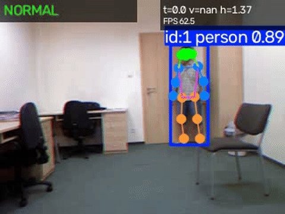
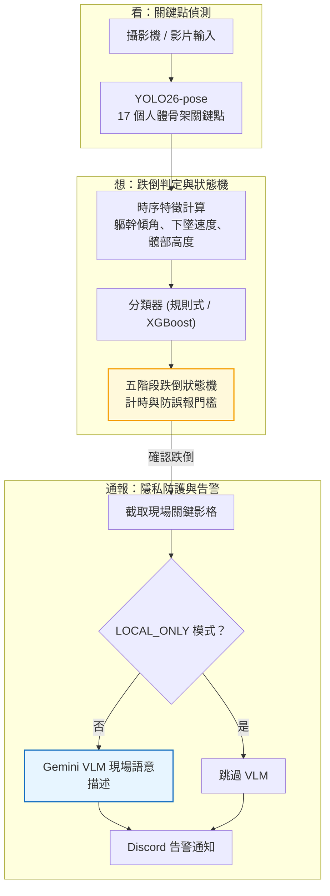
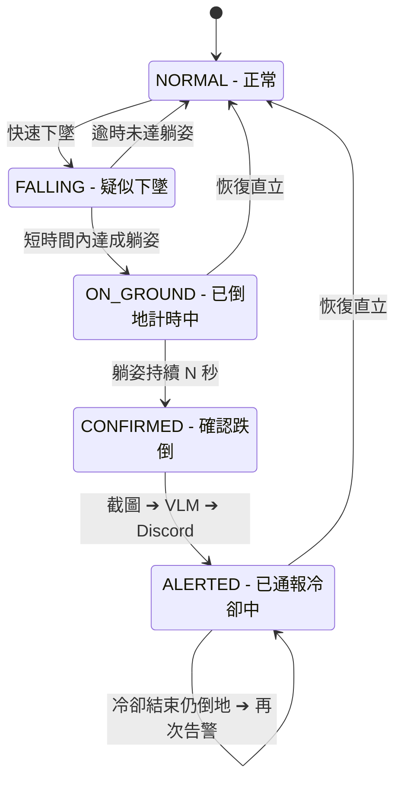
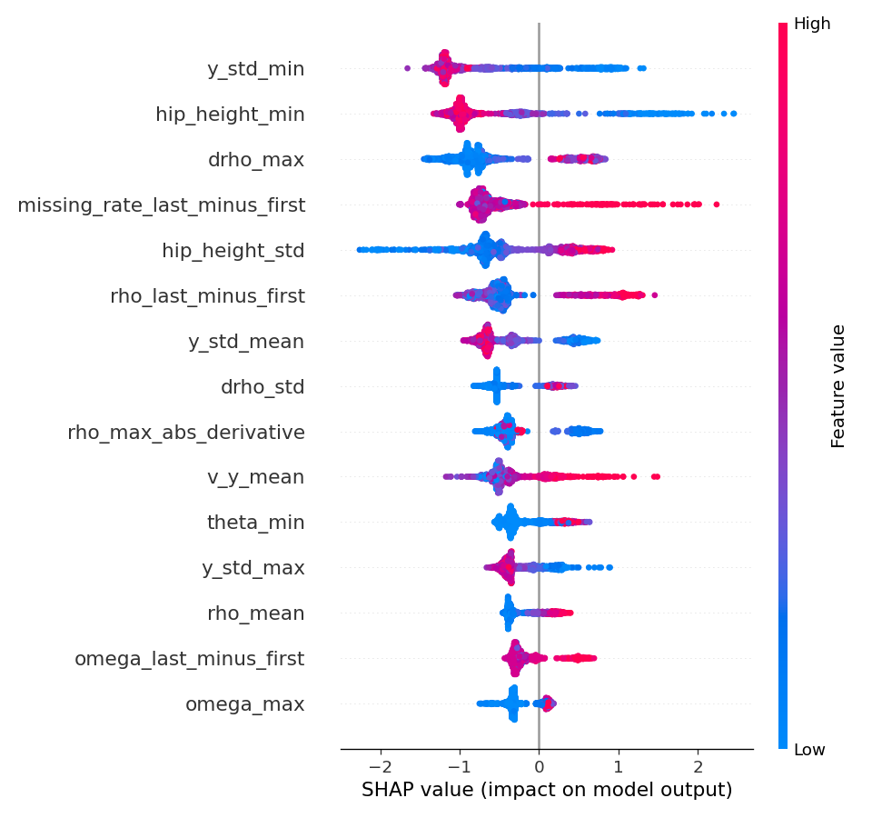
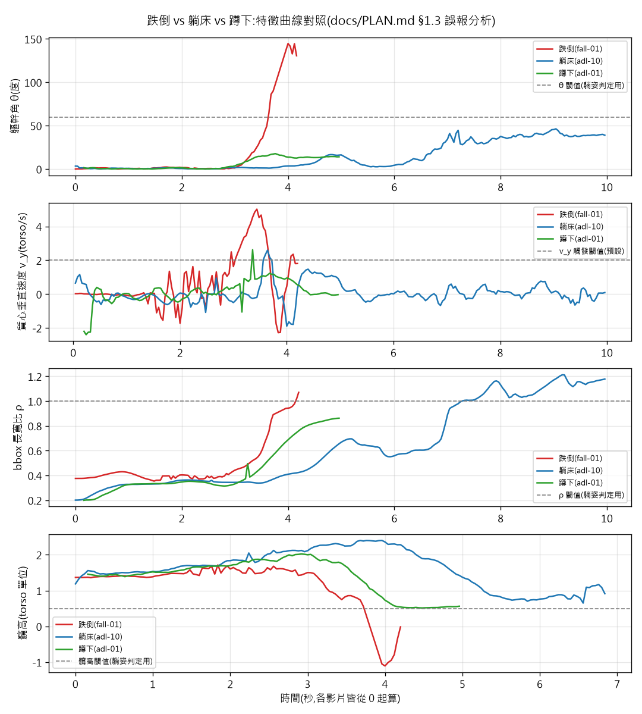

# fall-guard-cv

[](https://github.com/kuotunyu/fall-guard-cv/actions/workflows/test.yml)


[](LICENSE)

本專案為針對高齡照護情境設計之邊緣運算即時跌倒偵測與隱私防護通報系統。系統採用 Edge-first 理念，即時攝影機影像與 17 個姿態骨架關鍵點全數於本機推論處理，僅在狀態機確認觸發跌倒事件時，方調用 Multimodal VLM 產生現場語意描述並透由 Discord 發起安全告警。

> **免責聲明**：本專案為個人演算法與電腦視覺實驗展示，不構成任何醫療、長照機構放行或緊急救護系統承諾。



---

## 系統核心機制

1. **隱私優先與零影像常態上傳 (Edge-First Privacy)**：
   YOLO26-pose 人體骨架抽取、特徵計算與狀態機判定 100% 於本機 GPU 執行，平時串流影像完全不離開本機記憶體。
2. **多關卡狀態機防誤報 (5-State Machine)**：
   依序驗證「快速下墜 ➔ 確認躺姿 ➔ 姿態持續 N 秒」三道門檻，能精確排除日常蹲下、撿東西與正常躺床行為。
3. **異質 VLM 語意描述與事件簽章**：
   確認跌倒後截取撞擊與確認影格，調用 Gemini VLM 產生現場姿勢、環境與嚴重度評分，並於本地歸因備份。
4. **受試者層級 LOSO 交叉驗證 (Leave-One-Subject-Out)**：
   在 UR Fall Detection (URFD) 資料集上執行 5 折受試者嚴格隔離驗證，並於 Le2i 資料集進行跨場域泛化檢驗。

---

## 系統架構與狀態機

### 系統推論與通報管線


```mermaid
%%{init: {'themeVariables': {'fontSize': '20px'}}}%%
flowchart TD
    subgraph S1["看：關鍵點偵測"]
        A["攝影機 / 影片輸入"] --> B["YOLO26-pose<br/>17 個人體骨架關鍵點"]
    end

    subgraph S2["想：跌倒判定與狀態機"]
        B --> C["時序特徵計算<br/>軀幹傾角、下墜速度、髖部高度"]
        C --> D["分類器 (規則式 / XGBoost)"]
        D --> E["五階段跌倒狀態機<br/>計時與防誤報門檻"]
    end

    subgraph S3["通報：隱私防護與告警"]
        E -->|確認跌倒| F["截取現場關鍵影格"]
        F --> G{"LOCAL_ONLY 模式？"}
        G -->|否| H["Gemini VLM 現場語意描述"]
        G -->|是| I["跳過 VLM"]
        H --> J["Discord 告警通知"]
        I --> J
    end

    style E fill:#fff9db,stroke:#f59f00,stroke-width:2px
    style H fill:#e7f5ff,stroke:#1971c2,stroke-width:2px
```

### 五階段跌倒狀態機


```mermaid
%%{init: {'themeVariables': {'fontSize': '20px'}}}%%
stateDiagram-v2
    state "NORMAL - 正常" as NORMAL
    state "FALLING - 疑似下墜" as FALLING
    state "ON_GROUND - 已倒地計時中" as ON_GROUND
    state "CONFIRMED - 確認跌倒" as CONFIRMED
    state "ALERTED - 已通報冷卻中" as ALERTED

    [*] --> NORMAL
    NORMAL --> FALLING : 快速下墜
    FALLING --> ON_GROUND : 短時間內達成躺姿
    FALLING --> NORMAL : 逾時未達躺姿
    ON_GROUND --> CONFIRMED : 躺姿持續 N 秒
    ON_GROUND --> NORMAL : 恢復直立
    CONFIRMED --> ALERTED : 截圖 ➔ VLM ➔ Discord
    ALERTED --> NORMAL : 恢復直立
    ALERTED --> ALERTED : 冷卻結束仍倒地 ➔ 再次告警
```

---

## 模組選型與特徵分析

### 1. Pose 骨架模型選型 (YOLO26-pose)

| 模型的尺寸 | COCO Pose mAP | 本專案配置與選型理由 |
|---|---:|---|
| YOLO26n-pose | 57.2 | 開發期快速打通管線 |
| YOLO26s-pose | 63.0 | 輕量化測試 |
| **YOLO26m-pose** | **68.8** | **正式部署預設**：準確度與推理延遲之黃金平衡點，無 NMS 後處理 |
| YOLO26l-pose | 70.4 | 高算力場景 |
| YOLO26x-pose | 71.6 | 邊際效益遞減，算力開銷過高 |

### 2. 分類器選型 (規則式 vs XGBoost, LOSO 視窗級)

採用受試者層級 (Leave-One-Subject-Out) 5 折驗證，XGBoost 採用 54 維時序統計特徵：

| Fold 拆分 | Precision (規則 / XGB) | Recall (規則 / XGB) | F1-Score (規則 / XGB) |
|---|---:|---:|---:|
| **P1** | 0.677 / 0.609 | 0.913 / 0.913 | **0.778** / 0.730 |
| **P2** | 0.656 / 0.575 | 0.913 / 0.913 | **0.764** / 0.706 |
| **P3** | 0.714 / 0.611 | 0.909 / 1.000 | **0.800** / 0.759 |
| **P4** | 1.000 / 1.000 | 0.538 / 0.444 | **0.700** / 0.615 |
| **P5** | 1.000 / 1.000 | 0.467 / 0.667 | 0.636 / **0.800** |

#### SHAP 特徵重要度分析

SHAP 分析證實特徵極度集中於 `y_std_min` 與 `hip_height_min`，驗證了物理領域知識中「髖部垂直高度」為判別跌倒之核心因子：



### 3. VLM 語意描述對比

| 模型角色 | 預設 API 模型 | 功能與職責 |
|---|---|---|
| **主力模型** | `gemini-3.5-flash-lite` | 跌倒確認後描述姿勢、環境與嚴重度評分 |
| **備援與質檢** | `gpt-5-mini` | 異質模型 cross-validation 與描述品質比對 |

---

## 評測結果與誤報分析

### 1. 視窗級混淆矩陣 (1.5s 滑動視窗, 5 折加總)

| 實際 \ 預測 | 預測：非跌倒 | 預測：跌倒 |
|---|---:|---:|
| **實際：非跌倒** | **TN = 1,207** | FP = 46 |
| **實際：跌倒** | FN = 29 | **TP = 115** |

### 2. 日常動作 (ADL) 誤報率剖析

針對 40 段日常活動 (Activities of Daily Living) 進行分類統計：

| 日常動作類別 | 測試影片段數 | 誤報率 (FP Rate) | 特徵行為說明 |
|---|---:|---:|---|
| **其他日常動作** | 4 | 25.0% | 包含劇烈肢體擺動 |
| **正常躺床** | 7 | 14.3% | 軀幹角度漸變，下墜速度低 |
| **撿東西 / 彎腰** | 14 | 7.1% | 姿態快速恢復直立 |
| **蹲下 / 綁鞋帶** | 6 | 0.0% | 髖部高度降，無急劇下墜 |
| **坐下** | 9 | 0.0% | 姿態保持垂直 |

#### 跌倒 vs 躺床 vs 蹲下 特徵時序曲線對照

藍色代表「躺床」，雖然最終姿態與跌倒相似，但**下墜速度全程低於門檻**，此為區分躺床與跌倒的最關鍵物理物理特徵：



---

## 資料集與合規授權

1. **UR Fall Detection Dataset (URFD)**：包含 30 段跌倒與 40 段日常活動影片，遵循 **CC BY-NC-SA 4.0** 授權。
2. **Le2i Fall Dataset**：包含 Coffee room 與 Home 場景共 130 段逐幀標註影片，用於跨場域泛化評測。

---

## 快速開始

需求：Python 3.11、NVIDIA GPU、`uv`。

### 1. 環境初始化與資料準備

```bash
# 1. 安裝相依套件 (Windows cu128 PyTorch)
uv sync
uv run python -c "import torch; print(torch.cuda.is_available())"

# 2. 設定環境變數 (.env 填入 DISCORD_WEBHOOK_URL 與 GEMINI_API_KEY)
copy .env.example .env

# 3. 下載 URFD 與骨架關鍵點抽取
uv run python scripts/download_data.py
uv run python scripts/prepare_data.py
uv run python scripts/annotate_urfd.py
uv run python scripts/make_splits.py
```

### 2. 執行評測與即時偵測

```bash
# 評估規則式與 XGBoost 分類器 (LOSO 協定)
uv run python scripts/evaluate.py --model rule --protocol loso

# 影片檔或 Webcam 即時偵測 (開啟 --benchmark 可測 42.8 FPS 吞吐量)
uv run python -m fallguard.detect --source data/raw/urfd/fall-01-cam0.mp4 --benchmark
```

---

## 隱私防護機制

- **常態零上傳**：Pose 骨架計算與狀態機推論 100% 於本機 GPU 執行。
- **事件驅動觸發**：僅在進入 `CONFIRMED` 狀態時截取關鍵影格送交 VLM。
- **純文字防護模式 (`LOCAL_ONLY=true`)**：可完全跳過雲端 VLM，Discord 僅發送文字與特徵摘要告警。

---

## 算力開銷與成本分析

- **本機推論**：RTX 4090 + YOLO26m-pose 平均運算速度為 **42.8 FPS**，無雲端費用。
- **VLM API 呼叫**：採用 `gemini-3.5-flash-lite`，單次告警成本低於 **$0.001 USD**。

---

## 依賴套件規格

| 套件名稱 | 鎖定版本 | 用途說明 |
|---|---|---|
| Python | 3.11 | 環境基準 |
| ultralytics | 8.4.102 | YOLO26-pose 骨架檢測 |
| torch / torchvision | 2.11.0+cu128 / 0.26.0+cu128 | PyTorch CUDA 12.8 加速 |
| langchain / langchain-google-genai | 1.3.14 / 4.2.7 | Gemini VLM 結構化呼叫 |
| xgboost | 3.2.0 | 54 維時序特徵梯度提升分類 |

---

## 授權與聲明

程式碼採用 [MIT License](LICENSE)。URFD 資料集遵循 CC BY-NC-SA 4.0 授權，XGBoost 權重託管於 Hugging Face [`steven0226/fall-guard-cv-xgboost`](https://huggingface.co/steven0226/fall-guard-cv-xgboost)。
