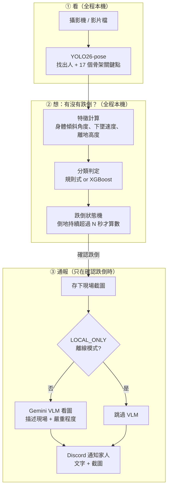
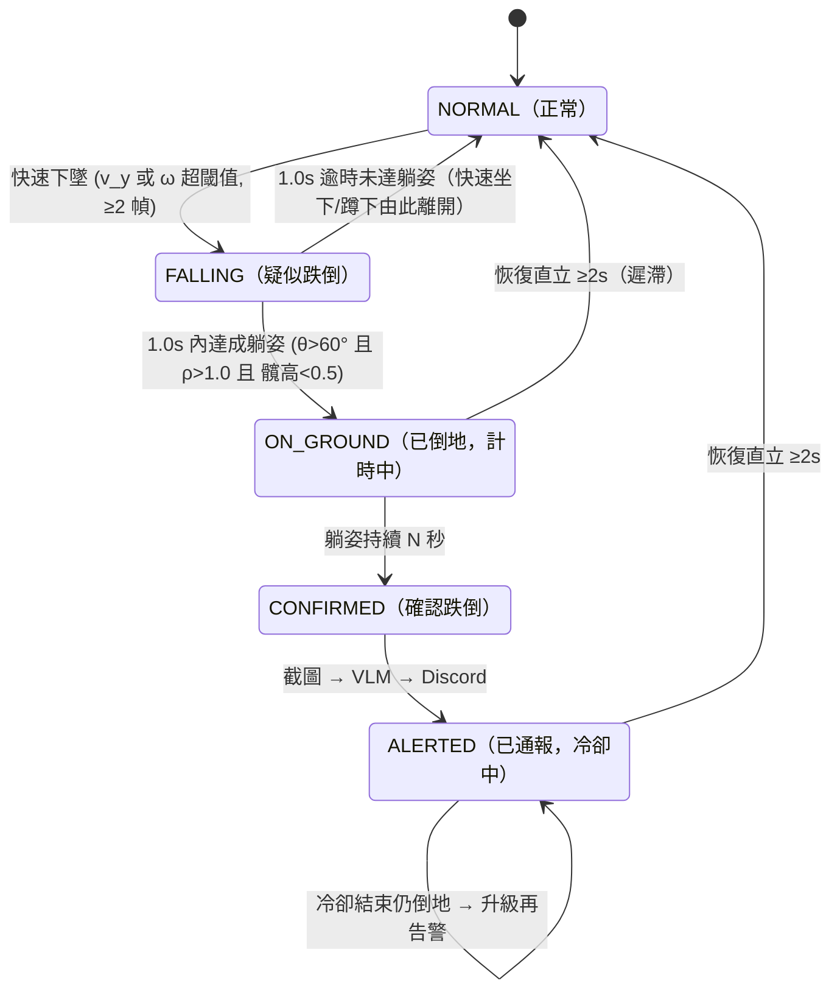

# fall-guard-cv 開發藍圖（PLAN.md）

> 建立日期：2026-07-20。外部資源與 API 事實均於當日以官方文件/實測 HTTP 驗證。

## 0. 文件用途與閱讀順序

- 本檔是「照著做就能收工」的開發規格書：每個 Phase 的驗收標準（DoD）寫成可執行指令 + 預期輸出，不寫形容詞。
- **回到專案時的閱讀順序**：`PROGRESS.md` 🧭 快速回憶區 →（`/resume-context` skill）→ 本檔當前 Phase 的 DoD。
- **修改規則**：第 2 章 Decision Log 是唯一可「追加」的章節；其他章節若要改，必須先在 Decision Log 加一條新決策（標明 supersedes 哪一條），再改內文。
- 本檔可進公開 repo：不得出現任何公司名/產品名、API 金鑰值、本機絕對路徑。

## 1. Context 與目標 / 非目標

### 目標

在 Windows 11 原生環境（RTX 4090、Python 3.11、uv）打造居家場景的即時跌倒偵測系統：

1. 攝影機/影片 → pose 模型抽 17 關鍵點 → 特徵工程 → 「規則式 baseline vs ML 分類器」判定跌倒
2. 跌倒持續超過 N 秒 → 存影格 → Gemini 多模態 VLM 描述現場與嚴重程度 → Discord Webhook 通報家人（含冷卻機制）
3. 以 URFD 學術標準資料集做防洩漏評估，報告視窗級與事件級指標 + 誤報案例分析
4. 成品上 GitHub（README 繁中：動機/mermaid/選型對照/評估/成本）+ 權重上 Hugging Face

### 非目標（防 scope creep）

- 不做多人場景優化：居家單人假設，推論 `max_det=1`
- 不做邊緣裝置部署（Jetson/手機）；目標平台就是本機 GPU
- 不做 24/7 daemon 服務化 / 系統服務安裝；`detect.py` 是前景 CLI
- 不重新散佈 URFD 原始影像（授權 CC BY-NC-SA；repo 只附下載腳本）
- 不使用 URFD 的深度圖與加速度計資料——本專案走純 RGB 路線（貼近家用 webcam 現實），此取捨在 README 說明

## 2. Decision Log（append-only）

> 格式：`D# | 日期 | 決策 | 依據 | supersedes`。改決策 = 加新條目，不改舊條目。

| # | 日期 | 決策 | 依據 |
|---|---|---|---|
| D1 | 2026-07-20 | 資料集主選 URFD：官方頁 `https://fenix.ur.edu.pl/~mkepski/ds/uf.html`（舊 `fenix.univ.rzeszow.pl` 網域 DNS 已死，勿用）。下載 base `https://fenix.ur.edu.pl/~mkepski/ds/data/`，取 `fall-{01..30}-cam0.mp4`、`adl-{01..40}-cam0.mp4`、`urfall-cam0-falls.csv`、`urfall-cam0-adls.csv`。授權 **CC BY-NC-SA 4.0**，必引 Kwolek & Kepski 2014（CMPB 117(3)）。備案與泛化集：Le2i/IMVIA（Kaggle `tuyenldvn/falldataset-imvia`） | 全部 URL 實測 HTTP 200、支援 Range 斷點續傳（2026-07-20）。mp4 為官方提供之預覽格式，足供 pose 抽取；若抽取品質不佳可改抓 `fall-XX-cam0-rgb.zip`（PNG 序列，備援旗標） |
| D2 | 2026-07-20 | Pose 模型用 **YOLO26-pose**（ultralytics），預設 `yolo26m-pose.pt`，開發期先用 `yolo26n-pose.pt` 打通 | YOLO26 於 2026-01-14 發布，官方文件標示為 latest/recommended；NMS-free 端到端推論、pose head 導入 RLE，官方宣稱較 YOLO11 最高 +7.2 AP、遮擋關鍵點更穩（居家有家具遮擋，直接相關）。ultralytics PyPI 現行 8.4.102 |
| D3 | 2026-07-20 | 分類器三路對照：規則式 baseline（必做）、XGBoost（必做）、輕量 GRU（選做，Phase 3b）。GRU 成績即使不如 XGBoost 也照實報告，當作「模型容量 vs 資料量」的討論素材 | URFD 僅 5 位受試者、約 4 千視窗：XGBoost 樣本效率高、可出 SHAP 圖、與規則 baseline 共用特徵空間（消融故事乾淨）。使用者拍板 |
| D4 | 2026-07-20 | VLM 用 LangChain 1.x：`init_chat_model(GEMINI_MODEL, model_provider="google_genai")`；影像用 1.x 標準 content block `{"type":"image","base64":...,"mime_type":"image/jpeg"}`（**不用** 舊 `image_url` / `source_type` 寫法）；`safety_settings` 放寬 `HARM_CATEGORY_DANGEROUS_CONTENT`（倒地影像可能觸發安全過濾），並備妥被擋時的純文字 fallback | langchain 1.3.14、langchain-google-genai 4.2.7（官方 docs 兩處獨立確認 content block 格式，2026-07-20） |
| D5 | 2026-07-20 | Discord 通報用純 requests + Webhook：multipart（`payload_json` + `files[0]`）附截圖、embed 以 `attachment://檔名` 引用；429 依回應 body `retry_after` 重送；冷卻 `ALERT_COOLDOWN_SECONDS` 預設 120 秒 | Discord 官方 webhook 文件（multipart/attachment 寫法、429 body 格式）；速率額度官方建議依 X-RateLimit-* 標頭動態處理（每 webhook 約 5 req/2s 為社群觀測值），冷卻 120s 遠低於任何已知上限 |
| D6 | 2026-07-20 | 評估切分三層：**P2 受試者級 LOSO 為主協定**（使用者人工標註 subject_id）、P1 影片級 GroupKFold 為最低防線、P3 Le2i 跨資料集泛化為加分項。**只用 cam0**（fall 才有 cam1 俯視；混入則「視角」完美預測標籤，屬洩漏）。URFD 無官方 subject↔sequence 對照表 → 人工看 70 段預覽片標註（約 1–2 小時，兩輪自我一致性檢查），無法確定者標 unknown 且只進訓練集 | URFD 官方頁只說 5 位受試者；使用者拍板願意人工標註 |
| D7 | 2026-07-20 | `.env` 金鑰命名：`config.py` 統一 mapping——`GOOGLE_API_KEY` 不存在時 fallback 讀 `GEMINI_API_KEY`；`.env.example` 以 `GOOGLE_API_KEY` 為主。現況缺 `DISCORD_WEBHOOK_URL`、`GEMINI_MODEL` 等模型字串變數與整份 `.env.example` → Phase 0 補齊 | langchain-google-genai 兩者皆讀，官方範例以 `GOOGLE_API_KEY` 為主；CLAUDE.md 金鑰政策 |
| D8 | 2026-07-20 | 隱私設計：平時零上傳（pose 推論與特徵全地端）；僅「確認跌倒事件」時送單張截圖給 VLM；`LOCAL_ONLY=true` 為完全離線模式（跳過 VLM，Discord 通報純文字 + 截圖僅存本機）。README 隱私專節照此寫 | 化解「只上傳關鍵點」與「VLM 需要影像」的表面矛盾；家用場景個資敏感性 |
| D9 | 2026-07-20 | PyTorch 安裝：pyproject 用 `[[tool.uv.index]] name="pytorch-cu128" explicit=true` + `[tool.uv.sources]` **同時鎖 torch 與 torchvision** | Windows PyPI 預設 torch wheel 是 CPU-only；torchvision 漏鎖會回退 PyPI 拿到 CPU 版。uv 官方 PyTorch 整合指南 |
| D10 | 2026-07-20 | Repo 採 src layout：`src/fallguard/` + hatchling；推論介面為 `python -m fallguard.detect`（原構想 `src/detect.py` 改為套件化，利於 pytest 與打包） | 對齊 pytest/打包慣例 |
| D11 | 2026-07-20 | 跌倒確認秒數雙值分離：**評估用 N=2s**（URFD 片段短，N 太大測不到）、**部署預設 N=10s**（居家誤報成本高）。`FALL_CONFIRM_SECONDS` 進 .env，README 說明兩值差異 | 評估值與部署值分離是誠實方法論；URFD 片段長度限制 |

## 3. 系統架構

### 資料流（README 直接複用）

三大步驟：**看 → 想 → 通報**。前兩步全程在本機跑（不碰網路）；只有第三步、且只在「確認跌倒」時才會上網。



> 技術參數（`cv2.VideoCapture`、`stream=True, max_det=1, half=True`、滑動視窗 1.5s 等）不放進圖裡，見第 7.3 節與第 8.4 節。

### 狀態機

**什麼是「狀態機」（state machine）？** 一種很簡單的程式設計方法：系統在任何時刻**只處於一種狀態**，只有發生特定事件才會跳到下一個狀態。紅綠燈就是最常見的狀態機——只會是紅/黃/綠其中之一，條件到了（秒數倒數完）才切換。

**在本專案的用途是防誤報**：不是「模型說跌倒就馬上通報」，而是要依序過三關——(1) 偵測到快速下墜 → (2) 確認人躺在地上 → (3) 持續躺超過 N 秒——才會通報；中途只要人站起來就退回正常。躺床、蹲下這些日常動作會在某一關被擋掉（躺床太慢，過不了第 1 關；蹲下沒躺平，過不了第 2 關）。

| 狀態 | 白話意思 | 畫面標籤顏色 |
|---|---|---|
| NORMAL | 一切正常（站、走、坐） | 綠 |
| FALLING | 偵測到快速下墜——「疑似」跌倒 | 黃 |
| ON_GROUND | 確認躺在地上，開始計時 | 橙（顯示秒數） |
| CONFIRMED | 躺超過 N 秒——認定真的跌倒 | 紅 |
| ALERTED | 已通報家人，冷卻中（防重複轟炸） | 紅 |



## 4. 模型與外部資源總表（驗證日期 2026-07-20）

| 類別 | 選用 | 版本/字串 | 依據 |
|---|---|---|---|
| Pose | YOLO26-pose（m 為預設、n 開發用） | ultralytics 8.4.x；`POSE_MODEL` 進 .env | docs.ultralytics.com/models/yolo26 · /tasks/pose；COCO pose mAP：n 57.2 / s 63.0 / m 68.8 / l 70.4 / x 71.6 |
| VLM 主力 | Gemini（多模態） | `GEMINI_MODEL`（.env，預設 gemini-3.1-flash-lite） | CLAUDE.md 模型政策；使用前確認字串現行有效 |
| 第二供應商 | OpenAI | `OPENAI_MODEL`（.env，預設 gpt-5-mini） | CLAUDE.md（本專案僅備援/評審用，主線不呼叫） |
| LLM 框架 | LangChain 1.x | langchain 1.3.14 / langchain-google-genai 4.2.7 | docs.langchain.com（1.x messages / google_genai integration） |
| ML | XGBoost（+ GRU 選做） | 版本以 uv lock 為準；Colab 端 pin 同版 | D3 |
| 資料集（主） | URFD | 30 fall + 40 ADL，cam0，CC BY-NC-SA 4.0 | fenix.ur.edu.pl/~mkepski/ds/uf.html（實測 200） |
| 資料集（備/泛化） | Le2i / IMVIA | Kaggle `tuyenldvn/falldataset-imvia`（原始 ~221 段；附 frame 級標註可用子集 ~191 段） | 官方 UBFC 頁與 Kaggle 鏡像均可用（實測 200） |
| 通報 | Discord Webhook | `DISCORD_WEBHOOK_URL`（.env） | docs.discord.com/developers/resources/webhook |

> 台灣模型對照說明：本專案 CV 主體（pose 偵測）目前無台製開源模型可對照；VLM 端仍依 CLAUDE.md 以 `GEMINI_MODEL` 為主。此生態觀察寫進 README 選型章節。

## 5. Repo 結構

```
fall-guard-cv/                       # git repo root（GitHub 名同）
├── .claude/
│   ├── skills/                      # 專案級 skills（第 13 章）
│   └── private/redlist.txt          # 禁詞清單，不進 git
├── .githooks/                       # pre-commit + commit-msg → check_public_text.py
├── docs/
│   ├── PLAN.md                      # 本檔
│   ├── assets/                      # demo.gif、Discord 通知截圖、特徵曲線圖
│   └── results/                     # rule_baseline.md、ml_comparison.md、error_analysis.md
├── data/                            # 全部 .gitignore；只留 data/README.md 說明取得方式
│   ├── raw/urfd/                    # mp4 ×70 + urfall CSV ×2
│   ├── processed/                   # *.npz 關鍵點序列
│   ├── urfd_meta.csv                # 人工標註：subject_id + ADL 動作類別（Phase 1）
│   └── splits.json                  # LOSO / GroupKFold 切分定義
├── models/                          # 權重 .gitignore；README 指向 HF 下載
├── events/                          # 執行期跌倒截圖，.gitignore
├── notebooks/train_colab.ipynb
├── scripts/
│   ├── download_data.py             # URFD 下載（斷點續傳）+ --fallback le2i
│   ├── prepare_data.py              # 影片 → npz 關鍵點序列（本機 GPU）
│   ├── evaluate.py                  # --model {rule,xgb,gru} --protocol {loso,groupkfold}
│   └── check_public_text.py         # 公開文案守門（Phase 0 自既有專案移植）
├── src/fallguard/                   # src layout（hatchling packages=["src/fallguard"]）
│   ├── config.py                    # .env 載入、金鑰 mapping（D7）、模型字串
│   ├── pose.py                      # YOLO26-pose 包裝（stream、track、half）
│   ├── features.py                  # 特徵定義（第 7.3 節）+ 滑動視窗
│   ├── rules.py                     # 規則式判定（閾值邏輯）
│   ├── classifier.py                # XGBoost/GRU 載入與推論
│   ├── fsm.py                       # 狀態機（第 8.1 節），純函式可測
│   ├── vlm.py                       # init_chat_model + base64 content block
│   ├── notify.py                    # Discord webhook multipart + 429 處理
│   └── detect.py                    # CLI：python -m fallguard.detect --source {path|0}
├── tests/                           # 扁平佈局
│   ├── test_features.py             # 合成關鍵點 → 已知角度/速度
│   ├── test_rules.py / test_fsm.py  # 狀態機純邏輯（含「慢速躺下不告警」）
│   ├── test_splits.py               # 防洩漏守門：fold 群組交集為空
│   ├── test_notify.py               # mock webhook、429 retry、VLM 失敗 fallback
│   ├── test_docs.py                 # README/PLAN 必含章節守門
│   └── test_smoke.py
├── .env / .env.example / .gitignore / .python-version(3.11)
├── LICENSE                          # MIT
├── PROGRESS.md                      # 進度追蹤（root，第一眼可見）
├── README.md
├── pyproject.toml                   # cu128 index（D9）+ src layout
└── uv.lock
```

### .env 變數清單（`.env.example` 同步維護，不含真值）

| 變數 | 預設/說明 |
|---|---|
| `GOOGLE_API_KEY` | Gemini 金鑰（缺時 config.py fallback 讀 `GEMINI_API_KEY`，D7） |
| `OPENAI_API_KEY` / `HF_TOKEN` / `WANDB_API_KEY` | 第二供應商 / HF 上傳權重 / Colab 訓練紀錄（選用） |
| `DISCORD_WEBHOOK_URL` | 通報目的地（**待使用者人工建立**） |
| `GEMINI_MODEL` | 預設 `gemini-3.1-flash-lite`（VLM 主力） |
| `GEMINI_LITE_MODEL` | 預設 `gemini-2.5-flash-lite`（大量前處理用，本專案暫無） |
| `OPENAI_MODEL` | 預設 `gpt-5-mini`（評審/備援） |
| `POSE_MODEL` | 預設 `yolo26m-pose.pt` |
| `FALL_CONFIRM_SECONDS` | 部署預設 `10`；評估腳本內固定用 2（D11） |
| `ALERT_COOLDOWN_SECONDS` | 預設 `120` |
| `LOCAL_ONLY` | 預設 `false`；`true` = 完全離線（D8） |
| `SEND_IMAGE` | 預設 `true`；`false` = Discord 只發文字+特徵摘要 |

## 6. Phase 規劃（DoD 全部指令化）

> 每個 Phase 結束：跑 `/update-progress`（PROGRESS.md 日誌 + 三檔一致 checklist + `git tag phase-N`），把結果給使用者確認後才進下一個 Phase（CLAUDE.md 規範）。
>
> 寫或改任何使用外部套件（ultralytics、LangChain、xgboost 等）的程式前，先用 Context7 MCP（resolve-library-id + query-docs）確認現行 API，查不到再讀官方文件（CLAUDE.md 規範，適用 Phase 1–4 全部實作）。

### Phase 0 環境與骨架（約 0.5 天）

- [ ] `git init` + 首 commit（`chore: scaffold project`）；MIT LICENSE；`.gitignore`（data/、models/、events/、.env、.claude/private/、.venv/）
- [ ] `pyproject.toml`：src layout + cu128 index（完整寫法見 D9：explicit index + torch/torchvision 同鎖）；`uv sync` 成功
- [ ] **驗收指令**：`uv run python -c "import torch; print(torch.cuda.is_available())"` → `True`
- [ ] `.env` 補齊（第 5 章清單）+ `.env.example` 建立；**待使用者人工處理**：建 Discord Webhook 填 `DISCORD_WEBHOOK_URL`（不阻塞 Phase 1–3）
- [ ] 移植 `.githooks/` + `scripts/check_public_text.py` + `.claude/private/redlist.txt`（不進 git）；**驗收**：含禁詞的測試 commit 被擋（exit 1）
- [ ] README 骨架（第 10 章章節標題全到位，內容標 TODO）；`uv run pytest`（smoke）綠

### Phase 1 資料下載 + 關鍵點抽取（約 1–1.5 天）

- [ ] `uv run python scripts/download_data.py` → `data/raw/urfd/` 下 70 支 mp4 + 2 份 CSV；斷點續傳；結束印檔數/總大小 summary；`--fallback le2i` 走 Kaggle API（token 在 `~/.kaggle/kaggle.json`）
- [ ] 檢查 ADL 標籤分佈：確認 `urfall-cam0-adls.csv` 中躺床動作的 label 語意（是否標 1=lying）——結論記入 Decision Log（影響第 7.2 節視窗標籤規約）
- [ ] `uv run python scripts/prepare_data.py` → `data/processed/*.npz` ×70；每檔含 `xyn (T,17,2)`、`conf (T,17)`、`bbox_xywh (T,4)`、`label (T,)`（對齊 urfall CSV，容許 ±1 幀）、`fps`、`timestamps`；結束印 `70/70 ok` + 標籤對齊 mismatch 報告 + 關鍵點缺測率統計（躺床/遮擋幀預期較高）
- [ ] **使用者人工標註** `data/urfd_meta.csv`：70 段 × `subject_id`（兩輪自我一致性，不確定標 unknown）+ 40 段 ADL × `action_category ∈ {走動, 坐下, 蹲下/綁鞋帶, 撿東西/彎腰, 躺床, 其他}`（約 1–2 小時；URFD 缺的動作類別在 README 註明覆蓋缺口，不硬湊）
- [ ] `data/splits.json`：LOSO（5 折，unknown 只進訓練）+ 影片級 GroupKFold（5 折，fall/ADL 分層），隨機種子固定
- [ ] `uv run pytest` 綠（npz schema、標籤對齊、`test_splits.py` fold 交集為空）
- [ ] `git tag phase-1`

### Phase 2 特徵工程 + 規則 baseline（約 1–1.5 天）

- [ ] `src/fallguard/features.py`：第 7.3 節特徵全實作；單元測試用合成關鍵點驗證已知值（例：水平軀幹 → θ≈90°、勻速下降序列 → v_y 已知值）
- [ ] `src/fallguard/fsm.py`：第 8.1 節狀態機，純函式類（輸入特徵幀 → 輸出狀態 + 轉移日誌）；pytest 合成序列：快速下墜+躺平 → CONFIRMED；緩慢躺下 → 不告警；蹲下 → 不告警
- [ ] `uv run python scripts/evaluate.py --model rule --protocol loso` → 視窗級 + 事件級指標（第 7.2 節），結果落 `docs/results/rule_baseline.md`；**閾值只准用各折訓練群組調**（報「文獻預設」與「調參後」兩組）
- [ ] 誤報分析 → `docs/results/error_analysis.md`：動作類別 × FP 表 + ≥3 個誤判片段的特徵曲線圖（跌倒 vs 躺床 vs 蹲下三聯圖存 `docs/assets/`）
- [ ] README 回填：mermaid 架構圖 + 規則 baseline 初步數字；`git tag phase-2`

### Phase 3 Colab 訓練 + 權重回程（約 1–2 天；3b 選做）

- [ ] 打包 `data/processed/`（npz 共約數 MB～數十 MB）上傳 Colab；`notebooks/train_colab.ipynb` 在 T4 端到端跑完：讀 npz → 切窗 → **以 group id 斷言切分（notebook 內防呆，不信任外部）** → XGBoost（視窗統計特徵 ~50–80 維：8–10 基礎特徵 × {mean,std,min,max,last−first,max-derivative}）→ LOSO 評估 → SHAP 特徵重要度圖
- [ ] notebook 開頭 pin 版本（xgboost 本機/Colab 同版，避免序列化不相容）
- [ ] （3b 選做）GRU：1 層 hidden=64（~2–4 萬參數）、輸入 `(T≈38 @25Hz×1.5s, F)`、資料增強（水平翻轉/縮放/時間抖動/關鍵點噪聲）、3 seeds + 早停；LOSO 全跑約 20–30 分鐘
- [ ] 權重回 `models/`；**驗收**：`uv run python scripts/evaluate.py --model xgb --protocol loso` 本機重現 Colab 數字（±0.01）
- [ ] 權重上傳 HF（模型卡過 public-copy-check）；README 對照表成形（rule vs XGB (vs GRU)）；`git tag phase-3`

### Phase 4 即時偵測 + 通報 + demo 收尾（約 1.5–2 天）

- [ ] `uv run python -m fallguard.detect --source <mp4>` 與 `--source 0`（webcam）皆可跑；疊加骨架 + bbox + 狀態標籤（NORMAL 綠 / FALLING 黃 / ON_GROUND 橙+計秒 / CONFIRMED 紅）+ 三條特徵即時讀數；結束印平均 FPS，**目標 ≥30 FPS**（yolo26m-pose 在 4090 fp16 預期 100+）
- [ ] 執行緒模型（第 8.4 節）：capture（1-slot queue）/ main（推論+疊加）/ alert worker（非同步 VLM+Discord，主迴圈不等待）
- [ ] 事件鏈實測：CONFIRMED → `events/` 存截圖（撞擊幀+確認幀）→ VLM 描述（`LOCAL_ONLY` 時跳過）→ Discord embed+附圖送達（Discord 畫面截圖存 `docs/assets/`）；冷卻期間第二次跌倒不重發（log 佐證）；VLM 失敗/被安全過濾 → 純文字通報照發；429 → 依 `retry_after` 重送（pytest 以 mock 驗證）
- [ ] VLM 呼叫前印成本估算（第 11 章公式 + 實測 token 數回填）
- [ ] `docs/assets/demo.gif` 符合第 9 章規格並嵌入 README
- [ ] README 全章節完成（第 10 章 checklist 逐項打勾）；public-copy-check 全綠；`uv run pytest` 全綠；`git tag phase-4`

## 7. 評估設計

### 7.1 切分協定（防洩漏）

| 協定 | 做法 | 角色 |
|---|---|---|
| **P2 LOSO（主協定）** | 以人工標註的 `subject_id` 做 Leave-One-Subject-Out（5 折）；unknown 強制只進訓練集 | 主報告數字（mean±std over folds） |
| P1 影片級 GroupKFold（最低防線） | 以 sequence id 為 group、5 折、fall/ADL 分層；同影片的幀/視窗永不跨折 | 對照數字；若 subject 標註失敗則升為主協定 |
| P3 跨資料集泛化（加分項） | URFD 全量訓練 → Le2i 當純測試集（受試者天然不相交） | 只報事件級指標；README 泛化章節 |

- **只用 cam0**：URFD 的 fall 有 cam0/cam1 雙視角但 ADL 只有 cam0——混入 cam1（俯視）則視角本身完美預測標籤，屬結構性洩漏。cam1 至多做附錄的視角魯棒性小節。
- 防洩漏 checklist（寫進 `test_splits.py` 與 evaluate.py 防呆）：閾值/超參只在外折訓練群組內調（nested、group-aware）；特徵標準化統計量只從訓練折計算；滑動視窗不跨影片；任一折 train/test 群組交集為空。

### 7.2 指標（視窗級 + 事件級同時報告）

- **URFD frame label 規約**：`-1` 未倒 / `0` 跌倒過渡 / `1` 已倒地。視窗標籤：含 ≥1 幀 label=1 或涵蓋 0→1 轉移 ⇒ 正例；全 -1 ⇒ 負例；只含 0 ⇒ 剔除（過渡幀語意不明確，文獻慣例）。事件級 ground-truth 區間 = [第一個 0 幀, 躺地段結束]，過渡幀在此層完整使用。（ADL 躺床標籤語意待 Phase 1 檢查後定案——見 Phase 1 DoD。）
- **視窗級**：precision / recall / F1 / **PR-AUC**（類別不平衡下必附）+ 混淆矩陣。
- **事件級**：Event Sensitivity（30 段 fall 中狀態機到達 CONFIRMED 的比例）、Event Specificity（40 段 ADL 誤觸段數）、**false alarms per hour**（分母 = ADL 總時長；URFD 時數短需註明信賴區間寬，用 Le2i 標註子集補足（~191 段：143 fall / 48 ADL；Phase 1 下載後以實際檔數校正，記入 Decision Log））。
- **偵測延遲分開報**：(a) 演算法延遲 = GT 撞擊幀 → 進入 ON_GROUND；(b) 告警延遲 = 撞擊 → CONFIRMED（含刻意設計的 N 秒）。混報是常見方法論錯誤。
- **分層報告**：URFD 跌倒 15 段站姿 / 15 段坐姿——坐姿跌倒質心下降幅度與速度天然較小，是規則 baseline 的預期弱點，sensitivity 必須分兩列報。
- 與 Kwolek & Kepski 2014 的 accuracy/sensitivity/specificity 同表對照（README）。

### 7.3 特徵定義（COCO 17 點索引；底層用 `keypoints.xyn` + `.conf`）

**尺度正規化**：人身尺度 `s(t)` = 軀幹長 `‖shoulder_mid(5,6) − hip_mid(11,12)‖` 的近 3 秒滑動中位數（對跌倒瞬間的透視縮短魯棒）。速度/高度類特徵一律以 `s(t)` 為單位 ⇒ 距離無關。**陷阱：不可用瞬時 bbox 高正規化**（跌倒時自身塌縮，會把訊號正規化掉）。換算參考：1.0 m/s（1.7m 成人）≈ 2.0 torso/s。

| 特徵 | 定義 | keypoint index |
|---|---|---|
| 軀幹角 θ | `v = hip_mid − shoulder_mid`；`θ = atan2(|v_x|, v_y)`；站≈0°、平躺≈90° | 5,6,11,12 |
| 軀幹角速度 ω | Savitzky-Golay（窗 7 幀）平滑後 dθ/dt（度/秒，用真實 timestamp） | 同上 |
| 質心垂直速度 v_y | 質心 = conf≥0.5 關鍵點的信心加權平均（fallback hip_mid）；Δt=0.2s 差分 + 5 幀移動平均；單位 torso/s，向下為正 | 全部 |
| bbox 長寬比 ρ 與 dρ/dt | `ρ = w/h`；站≈0.3–0.5、躺>1.0 | —（bbox） |
| 頭踝垂直差 | `(y_ankle_max − y_nose) / s(t)`；平躺趨近 0 | 0,15,16 |
| 髖高 | `(y_ankle_mean − y_hip_mid) / s(t)`；**蹲下仍 >0、躺地趨近 0——區分蹲 vs 躺的關鍵** | 11,12,15,16 |
| y 分佈離散度 | `std(y_i, conf≥0.5) / s(t)`；平躺時收斂 | 全部 |
| 缺失率 | 視窗內 conf<0.5 的關鍵點幀比例（顯式特徵，讓 ML 學遮擋模式） | — |

- **滑動視窗**：1.5s、訓練 stride 0.2s、推論逐幀更新（ring buffer）；消融實驗 {1.0, 1.5, 2.0}s 進 README。依據：跌倒動力學（失衡→撞擊）約 0.4–0.8s（Noury et al. 2007），視窗需涵蓋跌前直立+下墜+落地後。
- **fps 無關化**：特徵以真實 timestamp 計算後**重採樣到固定 25Hz 網格**再切窗（URFD 30fps / Le2i 25fps / webcam 不穩——避免 fps 差異成為資料集指紋，也是防洩漏點）。
- **缺失處理**：conf<0.5 視為缺失；左右對稱備援（軀幹角需至少一肩+一髖）；缺口 ≤0.3s 線性內插，更長 ⇒ 視窗 invalid（訓練剔除）；軀幹點缺失率 >50% ⇒ **凍結狀態機**（hold 不轉移不重置——人跌倒後常被家具遮擋，重置等於漏報）；整人消失 >2s 且狀態 ∈ {ON_GROUND, CONFIRMED} ⇒ 維持告警邏輯。
- Sanity check：URFD 官方 CSV 內含深度衍生的 bbox ratio 等特徵，與我們 RGB 版本做相關性比對（免費的正確性驗證）。

## 8. 通報管線設計

### 8.1 狀態機轉移條件（預設值；折內可調，遲滯防抖）

| 轉移 | 條件（預設） | 依據 |
|---|---|---|
| NORMAL→FALLING | `v_y > 2.0 torso/s`（≈1.0 m/s）或 `ω > 120°/s`，連續 ≥2 幀 | 跌倒垂直速度顯著高於日常動作（Wu 2000；Bourke 2007 系列） |
| FALLING→ON_GROUND | 觸發後 1.0s 內同時：`θ > 60°` 且 `ρ > 1.0` 且 髖高 `< 0.5 torso` | 撞擊到靜止 <1s（Noury 2007）；θ 文獻常用 45–60°，取 60° 保 specificity |
| FALLING→NORMAL | 1.0s 逾時未達躺姿（快速坐下/蹲下的出口） | — |
| ON_GROUND→CONFIRMED | 躺姿持續 N 秒（允許 ≤0.5s 姿勢抖動）；評估 N=2 / 部署 N=10（D11） | — |
| 恢復→NORMAL | `θ < 40°` 且髖高 `> 0.7 torso` 持續 ≥2s（進 60°/出 40° 遲滯） | 狀態機防 chatter 標準做法 |
| CONFIRMED→ALERTED | 截圖→VLM→Discord；冷卻 `ALERT_COOLDOWN_SECONDS=120`；冷卻結束仍倒地 ⇒ 升級再告警 | — |

**混淆動作為何被排除**（README 表格化）：躺床=緩慢受控下降，永不觸發 FALLING（速度前置條件是躺床 vs 跌倒唯一可靠的 RGB 判別子）；蹲下/綁鞋帶=θ 小且髖高 >0.5；撿東西/彎腰=θ 大但無下墜速度。**已知弱點誠實記載**：坐姿跌倒初速低可能漏觸發（對應 7.2 分層報告）；「坐床沿再躺下」的兩段式動作是預期 FP 源。

ML 模型只取代「FALLING+ON_GROUND 判定」（機率經折內校準選閾值）；**持續 N 秒確認與冷卻的外層狀態機保留**。

### 8.2 VLM 呼叫（vlm.py）

```python
model = init_chat_model(settings.GEMINI_MODEL, model_provider="google_genai",
                        safety_settings={HarmCategory.HARM_CATEGORY_DANGEROUS_CONTENT:
                                         HarmBlockThreshold.BLOCK_NONE})
msg = HumanMessage(content=[
    {"type": "text", "text": PROMPT},
    {"type": "image", "base64": img_b64, "mime_type": "image/jpeg"},
])
```

Prompt 草稿（繁中）：「你是居家照護助理。這是跌倒偵測系統確認跌倒後的現場截圖。請描述：(1) 人物姿態與位置 (2) 周遭環境是否有危險物 (3) 可見的受傷跡象 (4) 嚴重程度 1–5 分與理由。100 字內，供家人快速判讀。」被安全過濾擋下或呼叫失敗 ⇒ 描述欄改「（VLM 描述暫缺）」，**通報照發——告警送達是安全關鍵，VLM 只是增強**。

### 8.3 Discord 送出（notify.py）

multipart：`data={"payload_json": json.dumps({"embeds":[embed]})}` + `files={"files[0]": ("snapshot.jpg", fh, "image/jpeg")}`；embed 含標題/描述（VLM 文字）/紅色/ISO8601 timestamp/`image.url="attachment://snapshot.jpg"`（檔名必須一致）。429 ⇒ 依 body `retry_after` sleep 後重送一次。官方不保證固定額度，建議依 `X-RateLimit-*` 標頭動態處理（每 webhook 約 5 req/2s 為社群觀測值）；冷卻 120s 遠低於任何已知上限，429 屬防禦性處理。

### 8.4 即時推論架構（detect.py）

- **Capture thread**：`cv2.VideoCapture` 連續 read，1-slot queue 只留最新幀（webcam 驅動有內部緩衝，直接 read 會累積延遲）
- **Main thread**：`model.track(frame, persist=True, tracker="bytetrack.yaml", half=True, device=0, verbose=False)`（sticky：取最大 bbox 的 track id 為受監護對象）→ 特徵 → 狀態機 → overlay → imshow
- **Alert worker**：`ThreadPoolExecutor(max_workers=1)`，CONFIRMED 時 enqueue（截圖路徑+特徵摘要），依序 VLM → Discord；主迴圈不等待，畫面標 `ALERT: sending… / sent`
- 時間基準一律 `time.monotonic()` 幀時間戳（webcam fps 不穩，幀序號差分是常見錯誤）；`--source 影片檔` 與 webcam 走同一條路徑；`--dump-features out.csv` 供失敗分析與測試 fixture；`--infer-every k` 留給 CPU 降級

## 9. Demo GIF 規格

- **腳本（12–20 秒）**：URFD fall 片段推論畫面——NORMAL 綠（2–4s）→ 跌倒發生 FALLING 黃（1–2s）→ ON_GROUND 橙+計秒（3–4s）→ CONFIRMED 紅 + 角落「已通報 ✓」→ 切 Discord 收到 embed+截圖畫面收尾（1–2s）。全程骨架+bbox 疊加可見。
- **技術**：寬 720px、10–12 fps、**≤8 MB**；ffmpeg palettegen/paletteuse 兩段式；檔名固定 `docs/assets/demo.gif`，README 放動機段之後第一屏。
- **授權**：README 註明「畫面素材：UR Fall Detection Dataset（CC BY-NC-SA 4.0，Kwolek & Kepski 2014）」。
- **守門**：GIF 與 Discord 截圖過 public-copy-check（無本機路徑/webhook URL/無關個資，Discord 截圖遮 server 名以外資訊）。

## 10. README 最終樣貌（= Phase 4 驗收 checklist）

1. 標題 + badges（Python 3.11 / uv / MIT）+ **demo GIF**
2. 為什麼做這個專案（第一人稱：家中長輩獨處的跌倒憂慮 × 自己的 CV 研究背景；草稿由 Claude 擬、使用者修改）
3. 系統架構（第 3 章兩張 mermaid）
4. 模型選型：表1 pose（YOLO26 n/s/m mAP/延遲/選 m 理由/ultralytics 版本/依據連結）；表2 分類器（rule vs XGB (vs GRU) 成績）；表3 VLM 分工（GEMINI_MODEL 主力 / OPENAI_MODEL 備援）+ 台灣模型生態觀察註記（CLAUDE.md 六要素之「台灣模型 vs 基準模型對照表」在本專案以此形式呈現——CV 主體暫無台製開源模型可對照，屬計畫階段已揭露的合理偏離）
5. 資料集與授權（URFD 來源/引用/CC BY-NC-SA；Le2i 備案；不重佈原始資料只附下載腳本）
6. 快速開始（uv sync 與 cu128 注意、.env 設定表、download → prepare → evaluate → detect 四步指令）
7. 評估結果（切分方式與防洩漏聲明、視窗級+事件級、混淆矩陣、站/坐姿分層、誤報分析摘要+三聯特徵曲線圖）
8. 隱私設計專節（平時零上傳、僅事件單張截圖、LOCAL_ONLY 全離線、SEND_IMAGE 開關；家用個資敏感性口吻）
9. 成本估算（第 11 章數字）
10. 關鍵套件版本 / 開發紀錄（連 PROGRESS.md、phase tags）/ License 與引用

## 11. 成本估算

- 訓練：Colab 免費 T4 → **$0**。推論：全地端 → **$0**。
- VLM：每次通報 = 1 張 720p JPEG + 短 prompt + ~150 token 輸出，用 `GEMINI_MODEL`（flash-lite 級）估算——單次成本遠低於 $0.001，月估以「冷卻 120s ⇒ 每小時上限 30 次告警」為天花板情境；實際單價以官方定價頁為準，Phase 4 實測 token 數回填 README。
- 開發期測試呼叫：預算上限 100 次以內，Phase 4 開工前印估算給使用者確認（CLAUDE.md 規範）。

## 12. 風險與對策總表

| Phase | 風險 | 對策 |
|---|---|---|
| 0 | Windows PyPI torch = CPU wheel | D9 cu128 explicit index；DoD 驗證 `cuda.is_available()` |
| 1 | URFD 站況變動 | URL 已實測 200；`--fallback le2i` 內建 |
| 1 | mp4 壓縮影響 pose 品質 | 抽查關鍵點疊圖目視；必要時改抓 rgb.zip（D1 備援旗標） |
| 1 | 受試者外觀難分辨、標註失敗 | LOSO 降級為 P1 影片級為主，README 明說限制 |
| 1 | ADL 躺床幀 pose 缺測率高 | conf 過濾 + 缺測率統計進 DoD；缺失率本身是特徵 |
| 2 | 閾值過擬合 test | evaluate.py 強制 protocol/fold 參數；只在訓練群組調參；報預設+調參兩組 |
| 3 | GRU 過擬合（5 受試者） | XGBoost 為主、GRU 選做；折間變異照實報告 |
| 3 | 本機/Colab xgboost 版本不一致 | notebook pin 版本；回程重現 ±0.01 為 DoD |
| 4 | Gemini 安全過濾擋倒地影像 | safety_settings 放寬 DANGEROUS_CONTENT + 純文字 fallback（D4） |
| 4 | VLM 延遲卡住偵測迴圈 | alert worker 非同步（8.4） |
| 4 | webcam 與 URFD 域差 | demo 以 URFD 影片為準、webcam 定性展示，README 說明 |
| 4 | GIF 超重 | ≤8MB 規格 + palettegen |
| 全程 | 公開文案洩漏（公司名/金鑰/路徑） | public-copy-check skill + .githooks 從首 commit 生效 |

## 13. 進度管理與專案級 skills

- **PROGRESS.md**：🧭 快速回憶區（≤30 行、直接改寫、五欄：現在做到哪/下一步=一條可執行指令/未決問題/待使用者人工處理/已知坑，首行=上次收工日期）+ 📜 Phase 日誌（append-only，每條附驗證指令+當時輸出數字+commit 範圍）。
- **git tag `phase-N`** 標記每階段驗收。
- **skills 清單**（`.claude/skills/`）：

| skill | 建立時點 | 用途 |
|---|---|---|
| resume-context | 計畫階段（已建） | 回專案第一動作：唯讀恢復脈絡 |
| update-progress | 計畫階段（已建） | 收工/收 Phase 的 PROGRESS.md 固定格式 + 三檔一致 checklist + tag |
| public-copy-check | 計畫階段（已建） | 公開產出守門 |
| extract-keypoints | Phase 1 完成當天 | download→prepare 標準流程、npz schema、重抽判斷 |
| colab-roundtrip | Phase 3 完成當天 | npz 打包上傳、版本 pin、權重回程驗證、HF 上傳 |
| demo-release | Phase 4 完成當天 | detect 標準跑法、GIF 錄製指令、README 收尾 checklist |

- 後三支的原則：**在對應 Phase 第一次跑完該流程的當天**，用當天實際執行過的指令沉澱成 skill，不寫想像流程。

## 14. 收尾一致性檢查清單（發布前逐項）

- [ ] README 第一人稱動機段（使用者已過目修改）
- [ ] 兩張 mermaid 圖正常渲染
- [ ] 評估數字表完整（LOSO 主協定 + 分層 + 事件級）
- [ ] demo.gif ≤8MB 且 README 首屏可見
- [ ] MIT LICENSE、.env.example 齊備
- [ ] 公開文案掃描：無公司名/產品名/內部術語/本機路徑/金鑰（check_public_text.py 全綠）
- [ ] URFD 引用（Kwolek & Kepski 2014）與 CC BY-NC-SA 註記在 README 與 GIF 說明處
- [ ] HF 權重連結有效、模型卡過 public-copy-check
- [ ] `uv run pytest` 全綠；`uv lock` 已鎖定；README 關鍵套件版本表與 lock 一致
- [ ] PROGRESS.md 快速回憶區更新為「已發布」狀態
