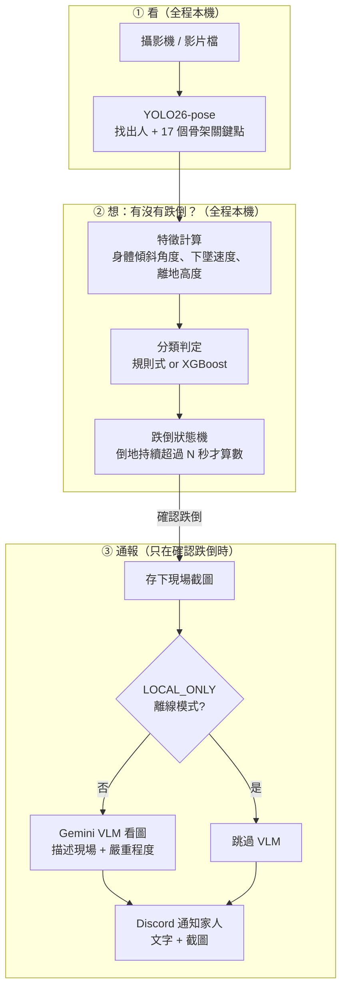
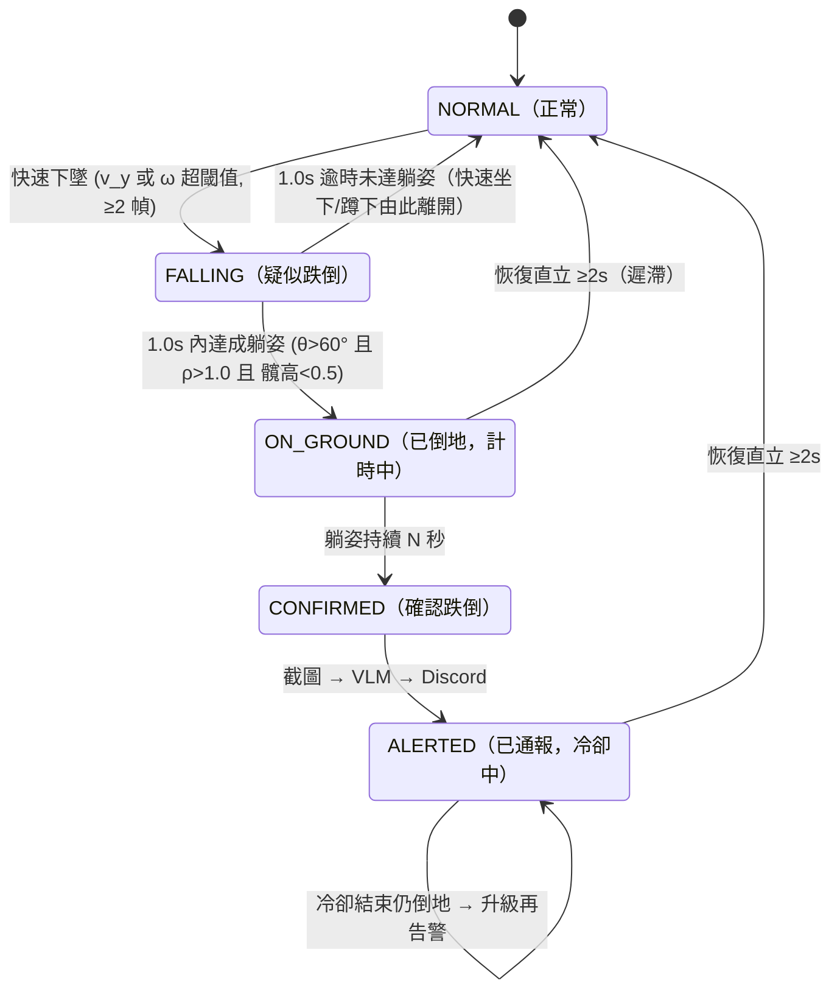

# fall-guard-cv 開發藍圖（PLAN.md）

> 建立日期：2026-07-20。外部資源與 API 事實均於當日以官方文件/實測 HTTP 驗證。

## 0. 文件用途與閱讀順序

- 本檔是「照著做就能收工」的開發規格書：每個 Phase 的驗收標準（DoD）寫成可執行指令 + 預期輸出，不寫形容詞。
- **回到專案時的閱讀順序**：`PROGRESS.md` 🧭 快速回憶區 →（`/resume-context` skill）→ 本檔當前 Phase 的 DoD。
- **修改規則**：第 2 章 Decision Log 是唯一可「追加」的章節；其他章節若要改，必須先在 Decision Log 加一條新決策（標明 supersedes 哪一條），再改內文。
- 本檔可進公開 repo：不得出現任何公司名/產品名、API 金鑰值、本機絕對路徑。

## 1. Context 與目標 / 非目標

### 目標

在 Windows 11 原生環境（RTX 4090、Python 3.11、uv）打造居家場景的即時跌倒偵測系統：

1. 攝影機/影片 → pose 模型抽 17 關鍵點 → 特徵工程 → 「規則式 baseline vs ML 分類器」判定跌倒
2. 跌倒持續超過 N 秒 → 存影格 → Gemini 多模態 VLM 描述現場與嚴重程度 → Discord Webhook 通報家人（含冷卻機制）
3. 以 URFD 學術標準資料集做防洩漏評估，報告視窗級與事件級指標 + 誤報案例分析
4. 成品上 GitHub（README 繁中：動機/mermaid/選型對照/評估/成本）+ 權重上 Hugging Face

### 非目標（防 scope creep）

- 不做多人場景優化：居家單人假設，推論 `max_det=1`
- 不做邊緣裝置部署（Jetson/手機）；目標平台就是本機 GPU
- 不做 24/7 daemon 服務化 / 系統服務安裝；`detect.py` 是前景 CLI
- 不重新散佈 URFD 原始影像（授權 CC BY-NC-SA；repo 只附下載腳本）
- 不使用 URFD 的深度圖與加速度計資料——本專案走純 RGB 路線（貼近家用 webcam 現實），此取捨在 README 說明

## 2. Decision Log（append-only）

> 格式：`D# | 日期 | 決策 | 依據 | supersedes`。改決策 = 加新條目，不改舊條目。

| # | 日期 | 決策 | 依據 |
|---|---|---|---|
| D1 | 2026-07-20 | 資料集主選 URFD：官方頁 `https://fenix.ur.edu.pl/~mkepski/ds/uf.html`（舊 `fenix.univ.rzeszow.pl` 網域 DNS 已死，勿用）。下載 base `https://fenix.ur.edu.pl/~mkepski/ds/data/`，取 `fall-{01..30}-cam0.mp4`、`adl-{01..40}-cam0.mp4`、`urfall-cam0-falls.csv`、`urfall-cam0-adls.csv`。授權 **CC BY-NC-SA 4.0**，必引 Kwolek & Kepski 2014（CMPB 117(3)）。備案與泛化集：Le2i/IMVIA（Kaggle `tuyenldvn/falldataset-imvia`） | 全部 URL 實測 HTTP 200、支援 Range 斷點續傳（2026-07-20）。mp4 為官方提供之預覽格式，足供 pose 抽取；若抽取品質不佳可改抓 `fall-XX-cam0-rgb.zip`（PNG 序列，備援旗標） |
| D2 | 2026-07-20 | Pose 模型用 **YOLO26-pose**（ultralytics），預設 `yolo26m-pose.pt`，開發期先用 `yolo26n-pose.pt` 打通 | YOLO26 於 2026-01-14 發布，官方文件標示為 latest/recommended；NMS-free 端到端推論、pose head 導入 RLE，官方宣稱較 YOLO11 最高 +7.2 AP、遮擋關鍵點更穩（居家有家具遮擋，直接相關）。ultralytics PyPI 現行 8.4.102 |
| D3 | 2026-07-20 | 分類器三路對照：規則式 baseline（必做）、XGBoost（必做）、輕量 GRU（選做，Phase 3b）。GRU 成績即使不如 XGBoost 也照實報告，當作「模型容量 vs 資料量」的討論素材 | URFD 僅 5 位受試者、約 4 千視窗：XGBoost 樣本效率高、可出 SHAP 圖、與規則 baseline 共用特徵空間（消融故事乾淨）。使用者拍板 |
| D4 | 2026-07-20 | VLM 用 LangChain 1.x：`init_chat_model(GEMINI_MODEL, model_provider="google_genai")`；影像用 1.x 標準 content block `{"type":"image","base64":...,"mime_type":"image/jpeg"}`（**不用** 舊 `image_url` / `source_type` 寫法）；`safety_settings` 放寬 `HARM_CATEGORY_DANGEROUS_CONTENT`（倒地影像可能觸發安全過濾），並備妥被擋時的純文字 fallback | langchain 1.3.14、langchain-google-genai 4.2.7（官方 docs 兩處獨立確認 content block 格式，2026-07-20） |
| D5 | 2026-07-20 | Discord 通報用純 requests + Webhook：multipart（`payload_json` + `files[0]`）附截圖、embed 以 `attachment://檔名` 引用；429 依回應 body `retry_after` 重送；冷卻 `ALERT_COOLDOWN_SECONDS` 預設 120 秒 | Discord 官方 webhook 文件（multipart/attachment 寫法、429 body 格式）；速率額度官方建議依 X-RateLimit-* 標頭動態處理（每 webhook 約 5 req/2s 為社群觀測值），冷卻 120s 遠低於任何已知上限 |
| D6 | 2026-07-20 | 評估切分三層：**P2 受試者級 LOSO 為主協定**（使用者人工標註 subject_id）、P1 影片級 GroupKFold 為最低防線、P3 Le2i 跨資料集泛化為加分項。**只用 cam0**（fall 才有 cam1 俯視；混入則「視角」完美預測標籤，屬洩漏）。URFD 無官方 subject↔sequence 對照表 → 人工看 70 段預覽片標註（約 1–2 小時，兩輪自我一致性檢查），無法確定者標 unknown 且只進訓練集 | URFD 官方頁只說 5 位受試者；使用者拍板願意人工標註 |
| D7 | 2026-07-20 | `.env` 金鑰命名：`config.py` 統一 mapping——`GOOGLE_API_KEY` 不存在時 fallback 讀 `GEMINI_API_KEY`；`.env.example` 以 `GOOGLE_API_KEY` 為主。現況缺 `DISCORD_WEBHOOK_URL`、`GEMINI_MODEL` 等模型字串變數與整份 `.env.example` → Phase 0 補齊 | langchain-google-genai 兩者皆讀，官方範例以 `GOOGLE_API_KEY` 為主；CLAUDE.md 金鑰政策 |
| D8 | 2026-07-20 | 隱私設計：平時零上傳（pose 推論與特徵全地端）；僅「確認跌倒事件」時送單張截圖給 VLM；`LOCAL_ONLY=true` 為完全離線模式（跳過 VLM，Discord 通報純文字 + 截圖僅存本機）。README 隱私專節照此寫 | 化解「只上傳關鍵點」與「VLM 需要影像」的表面矛盾；家用場景個資敏感性 |
| D9 | 2026-07-20 | PyTorch 安裝：pyproject 用 `[[tool.uv.index]] name="pytorch-cu128" explicit=true` + `[tool.uv.sources]` **同時鎖 torch 與 torchvision** | Windows PyPI 預設 torch wheel 是 CPU-only；torchvision 漏鎖會回退 PyPI 拿到 CPU 版。uv 官方 PyTorch 整合指南 |
| D10 | 2026-07-20 | Repo 採 src layout：`src/fallguard/` + hatchling；推論介面為 `python -m fallguard.detect`（原構想 `src/detect.py` 改為套件化，利於 pytest 與打包） | 對齊 pytest/打包慣例 |
| D11 | 2026-07-20 | 跌倒確認秒數雙值分離：**評估用 N=2s**（URFD 片段短，N 太大測不到）、**部署預設 N=10s**（居家誤報成本高）。`FALL_CONFIRM_SECONDS` 進 .env，README 說明兩值差異 | 評估值與部署值分離是誠實方法論；URFD 片段長度限制 |
| D12 | 2026-07-21 | **`urfall-cam0-adls.csv` 的 label 欄位不能直接當「是否跌倒」的正解**：40 段 ADL 中有 16 段含 label=1 的幀（實測 `adl-10/11/21-23/30-40`，每段 61–181 幀不等）。這是 URFD 官方共用的「姿態是否水平」深度幾何特徵，只反映身體姿勢、不反映事件語意——ADL 定義上不含跌倒事件，這些是「已躺床」片段被同一套幾何規則標成 1。**規則**：`kind=="fall"` 的 label=1 才是正例；`kind=="adl"` 一律是負例，不論 raw_label 為何。`prepare_data.py` 的 npz 保留 `raw_label` 原始值（可稽核）+ `kind` 欄位，由下游（Phase 2 features.py / evaluate.py）依此規則推導訓練用的 task label，不得直接拿 raw_label 訓練。這批「label=1 的 ADL 幀」正好是 §1.3 誤報分析要的「躺床」困難負樣本，之後可交叉比對使用者人工標的 `action_category`。同時更正 Phase 1 DoD 原寫的「標籤對齊容許 ±1 幀」：實測 `fall-01`（160 幀/160 列，csv frame_num 1-160）與 `adl-01`（150 幀，csv 覆蓋 frame_num 6-150 且有 1 個缺口）確認對齊公式為精確值 `csv frame_num - 1 = 影片幀索引(0-indexed)`，非模糊容忍；CSV 未覆蓋的幀在 npz 用 `label_present=False` 標記，不用容忍區間 | 2026-07-21 用 awk 直接統計 `data/raw/urfd/urfall-cam0-adls.csv` 各段 label=1 幀數,並用 cv2 讀 fall-01/adl-01 實際幀數與 csv frame_num 範圍比對驗證索引公式 |
| D13 | 2026-07-21 | `data/urfd_meta.csv`（人工標註,1-2 小時心血,無法從程式碼重現）與 `data/splits.json`（評估協定,由前者衍生,審閱者最想看到的稽核依據）**例外進 git**,不受第 5 章「data/ 全 .gitignore」規則約束 | 原規則假設 data/ 下都是「可重下載/可重跑重現」的東西;人工標註是唯一例外,遺失即需重工 |
| D14 | 2026-07-21 | ultralytics 8.4.102 的 `half=True` 參數已棄用（跑實際程式時印出 deprecation warning），推論/訓練一律改用 `quantize=16`（FP16；`quantize=32`/`None`＝FP32）。**全文所有 `half=True` 已改為 `quantize=16`** | 實測 `model.track(...)` 呼叫時的官方 deprecation 警告 + 讀 `ultralytics/cfg/default.yaml` 原始碼確認 `quantize` 取代 `half`/`int8`（2026-07-21） |
| D15 | 2026-07-21 | **人工標註確認：40 段 ADL 只有 2 位受試者（P1、P2）出現，P3/P4/P5 只在 30 段 fall 中出現**（URFD 官方頁未說明此分佈，經使用者實際看片確認；官方頁亦未提供任何受試者對照資訊可佐證或反駁）。**連帶影響 LOSO 折的可用指標**：P1、P2 折的 test 集同時含 fall+adl（可算完整 sensitivity+specificity）；**P3/P4/P5 折的 test 集只有 6 段 fall、0 段 adl（只能算 sensitivity，無法算 specificity/FP，Phase 2 evaluate.py 與 README 評估章節須誠實註記此限制，不得把三折平均當完整指標呈現）**。標註工具亦發現並修正一個 bug：cv2 視窗失焦期間累積的按鍵會在恢復焦點瞬間暴衝連續觸發，已於 `annotate_urfd.py` 加入 400ms 按鍵沖刷（`flush_stale_keys`）防止此問題重演；ADL 40 段因此事件重新以 `--review --kind adl` 複查過一輪，複查後 P1/P2 呈現乾淨區塊分佈（非隨機跳動），採信此結果 | `scripts/make_splits.py` 實測輸出：LOSO P1 test=30(fall6+adl24)、P2 test=22(fall6+adl16)、P3/P4/P5 test 皆為 6(fall6+adl0)；`uv run pytest` 12 passed（含原本 skip 的 LOSO 測試） |
| D16 | 2026-07-21 | **兩個影響評估正確性的 bug/校準發現，皆已修正**：(1) `fsm.py` 的 NaN 防呆寫得過寬——任一特徵缺失就整幀跳過，連「已經過多久」這種純時間判斷（FALLING 逾時、CONFIRMED 累積、ALERTED 冷卻）也一起被跳過，導致跌倒瞬間常見的短暫遮擋讓狀態機永久卡死，實測事件級 Sensitivity 恆為 0。已重構 `step()`：只有「需要當下特徵值」的判斷（觸發偵測、躺姿/恢復判定）才在缺失時跳過，純時間的轉移判斷永遠照常檢查。(2) **修完 bug 後仍發現 `falling_timeout_s`(文獻預設 1.0s)與 D11 的評估用 `confirm_seconds=2s` 對本資料集系統性過嚴**：30 段 fall 中 23 段的「已倒地」期間存在同時滿足三躺姿條件的瞬間，但常在觸發後 1.0–1.5s 才出現；即使放寬逾時窗成功進 ON_GROUND(25/30)，進入後到影片結束的剩餘時長全數 <2.0s(中位數 0.77s)，文獻預設 N=2s 下 25/25 都來不及累積滿。**修正**：`scripts/evaluate.py` 的折內調參範圍新增 `falling_timeout_s∈{1.0,1.5,2.0,2.5,3.0}s` 與 `confirm_seconds∈{0.3,0.5,0.8,1.0,1.5}s` 聯合搜尋(只用 train 影片),此舉**取代 D11 原訂「評估固定用 N=2s」的假設**——評估用 N 也需要折內調參，不是寫死的常數；部署預設 N=10s(給真實家用場景防誤報)不受影響，維持獨立。調參後 LOSO 事件級 Sensitivity：P1=1.00、P2=1.00、P3=0.83、P4=0.67、P5=0.50；Specificity(僅 P1/P2 可算)0.92/0.94 | 2026-07-21 用 fall-01 逐幀 trace 定位 NaN 防呆 bug；用全部 30 段 fall 影片實測「進 ON_GROUND 後剩餘時長」分佈(10/25/50/75/90 分位數 0.43/0.56/0.77/1.37/1.63s)佐證 confirm_seconds 系統性過嚴；`uv run python scripts/evaluate.py --model rule --protocol loso` 實測輸出見 `docs/results/rule_baseline.md` |
| D17 | 2026-07-21 | **Phase 3 上傳 Colab 的資料改用「視窗統計特徵匯出檔」而非原計畫的整批 `data/processed/` npz**：`scripts/prepare_train_export.py` 把 70 支影片的關鍵點特徵轉成 54 維視窗統計向量(9 基礎特徵 × {mean,std,min,max,last−first,max|Δ|}，`features.py` 新增 `window_stat_vector`)，打包成單一 223KB 的 `data/export/xgb_windows.npz`——比上傳原始關鍵點序列更小、不需要在 Colab 重新實作 features.py 的邏輯，且純數字無隱私疑慮。**xgboost 版本鎖定 3.2.0**(3.3.0+ 需要 Python 3.12，本專案鎖 3.11，D10)，notebook 開頭會 assert 版本一致。**模型回傳設計**：Colab 端把 5 折模型 + 1 個全資料訓練的最終部署模型 + `xgb_loso_results.json`(各折數字)打包成一個 zip 下載，本機 `evaluate.py --model xgb` 直接載入這些模型在本機重跑推論比對，而非在本機重新訓練湊數字——因為不同硬體(GPU vs CPU、histogram 分桶)訓練 XGBoost 可能有非決定性的浮點差異，重新訓練無法保證 ±0.01 內重現，但用同一份已訓練好的模型做推論是完全決定性的 | `uv run python scripts/prepare_train_export.py` 實測輸出：1499 視窗、正例 9.7%、54 維特徵、223KB；`uv run python -c "import xgboost; print(xgboost.__version__)"` 確認本機 3.2.0；`uv pip install --dry-run xgboost --python 3.11` 確認 3.2.0 為支援 Python 3.11 的最新版 |
| D18 | 2026-07-21 | **修正 Phase 3 首次驗收失敗的根因**：`prepare_train_export.py`(Colab 訓練資料)與 `evaluate.py --model xgb`(本機重現)原本各自維護一份「視窗是否要排除」的邏輯——前者用「54 維統計向量是否全零」判斷(9 個基礎特徵都整段缺失才排除)，後者誤用了規則式分類器那套「5 個原始特徵陣列(v_y/omega/theta/rho/hip_height)只要有 1 個整段缺失就排除」的判斷(`build_window_samples`)。兩者標準不同,造成本機重現的視窗數與 Colab 對不上(P1 802 vs 741、P2 598 vs 558)，5 折中 P2/P4 的 precision/recall/F1 誤差超出 ±0.01 驗收門檻。**規則式分類器的排除條件本身沒有錯**(它的邏輯真的需要那 5 個特徵都有效才能算分)，問題是 XGBoost 評估不該借用它。**修正**：新增共用函式 `evaluate.py::build_xgb_stat_samples`,`prepare_train_export.py` 與 `evaluate.py --model xgb` 兩邊都改呼叫這一份,不再各自實作,消除以後再度飄移的風險。修正後 5 折視窗數與 Colab 完全一致(802/598/30/33/36)，**全部 15 項指標(5 折 × precision/recall/F1)誤差皆為 0.000**——不只是落在 ±0.01 容忍範圍內,而是完全重現,因為模型推論本身是決定性的,唯一的變因(視窗集合不一致)已消除 | `uv run python scripts/evaluate.py --model xgb --protocol loso` 修正前後對照：修正前 ❌(P2 precision 差 0.025、P4 recall 差 0.017)，修正後 ✅ 全部通過,見 `docs/results/xgb_baseline.md`；`uv run pytest -q` 26 passed 未受影響 |
| D19 | 2026-07-21 | **XGBoost 權重上傳 Hugging Face**：repo `steven0226/fall-guard-cv-xgboost`（公開）。**模型授權標 CC BY-NC-SA 4.0**（跟訓練資料 URFD 同一授權，而非主 repo 程式碼的 MIT）——訓練資料本身是非商業授權，衍生模型比照相同限制較保守安全，不逕自宣告 MIT。上傳內容：`xgb_final.json`(部署用)+ `xgb_fold_P1~P5.json`(LOSO 評估用，供他人重現分數)+ `xgb_loso_results.json` + `shap_summary.png` + 模型卡 README。新增 `scripts/upload_to_hf.py`(用 `huggingface_hub 1.24.0` 的 `HfApi.create_repo`/`upload_folder`)，`config.py` 補上 `hf_token` 欄位。GRU(3b)使用者決定不做，Phase 3 主線到此完成 | `uv run python scripts/upload_to_hf.py --repo-id steven0226/fall-guard-cv-xgboost` 實測上傳成功；WebFetch 確認 <https://huggingface.co/steven0226/fall-guard-cv-xgboost> 檔案清單與模型卡內容正確渲染；模型卡先過 `scripts/check_public_text.py` 才上傳 |
| D20 | 2026-07-21 | **`detect.py` 即時偵測只用規則式 FSM 判定，不建立 `classifier.py` 呼叫 XGBoost**（第 5 章原規劃有這個檔案，本決策改為不建）。原因：Phase 3 評估結果顯示規則式（折內調參後）整體略優於 XGBoost 預設超參數版本（README 模型選型章節已有數字），XGBoost 的推論邏輯已完整存在於 `scripts/evaluate.py`（`load_xgb_fold_models`/`xgb_window_metrics`），若只為了「可切換」而在 `classifier.py` 重造一份沒有實際呼叫端的推論程式碼，屬於 CLAUDE.md 明文禁止的過早抽象。特徵計算則刻意**重用** `features.py` 的 `compute_features()`，對一段滑動緩衝區（`FEATURE_BUFFER_S=6.0s`,只需覆蓋 §7.3 最長用到的 3s 滾動中位數視窗）逐幀重新整批計算，取最後一筆當作當下特徵——不另外寫一份「增量版」特徵計算，直接呼應 D18 的教訓（評估與部署用不同套邏輯會飄移）| 實測：`uv run python -m fallguard.detect --source <mp4>` 全流程跑通,`uv run pytest -q` 43 passed |
| D21 | 2026-07-21 | **1-slot 佇列(即時攝影機丟舊幀設計)拿來測固定長度影片檔的吞吐量會失效**：capture thread 若不配速,會在 main thread 還沒載完模型前就把整支短片(URFD 約 5s)瞬間讀完丟棄,main thread 只看得到最後 1 幀。修正兩處：(1) 影片檔來源預設依原生 fps 配速讀取(`capture_loop` 的 `target_dt` 參數),模擬真實攝影機逐幀到達的節奏,讓事件鏈(CONFIRMED→截圖→VLM→Discord)能在合理的模擬時間內被觸發；(2) 新增 `--benchmark`:完全獨立、不透過 1-slot 佇列/capture thread 的單執行緒迴圈(`run_benchmark()`),影片放完就繞回開頭重播湊滿 `min_frames=300`,專門量測 pose 推論+特徵計算+狀態機的真實吞吐量上限,兩種量測目的不同,不能共用同一套佇列架構 | 修正前:`--source fall-01-cam0.mp4 --no-display` 只處理 1 幀。修正後:配速模式在 5.4s 內處理 83 幀;`--benchmark` 穩定量到平均 **42.8 FPS**(RTX 4090,yolo26m-pose fp16),通過 DoD ≥30 FPS 門檻 |
| D22 | 2026-07-21 | **`vlm.py` 修正一個真實 bug**:`response.content` 有時是純字串,有時是 content block 的 list（例如 `[{"type": "text", "text": "...", "extras": {...}}]`，取決於 provider/回應格式）,早期實作直接 `str(response.content)` 會把整個 Python list/dict 結構原樣塞進 Discord 通報文字。改用 `langchain_core` 訊息物件的 `.text` 屬性(正規化屬性,固定回傳串接後的純文字,不需自己判斷型別)。已在 `tests/test_vlm.py` 補迴歸測試,用真正的 `AIMessage(content=[...])` 而非自製假物件驗證 | 用真實 `GEMINI_MODEL`(已設定 `GEMINI_API_KEY`)對 `fall-01-cam0.mp4` 跑完整事件鏈,親眼看到修正前輸出 `[{'type': 'text', 'text': '...', 'extras': {...}}]`、修正後輸出乾淨的繁中描述文字(含正確的姿態/環境/嚴重程度分析) |
| D23 | 2026-07-21 | **demo.gif 因 URFD 資料集本身限制做了幾個取捨**：(1) URFD cam0 影片是「深度圖(左半)+ RGB(右半)」左右拼接的單一畫面(640x240),本專案只用 RGB(D1 既有決策),demo 錄製時裁掉深度圖半邊,只保留 RGB 側疊加骨架/狀態/特徵文字。(2) URFD fall 片段普遍很短(實測 2.4–5.3s),不足以在裡面同時呈現「NORMAL 基準 2-4s + ON_GROUND 倒數 3-4s」的第 9 章理想腳本;改用短 `confirm_seconds`(demo 專用,非部署預設 10s)讓 CONFIRMED/ALERTED 能在片段內出現,並在真實影格用完、狀態仍停在 ON_GROUND 時,用**最後一個有效(非 torso_missing)姿態凍結延伸**幾幀讓狀態機走完全程(不是編造新資料,只是假設最後那個姿勢多撐幾秒)。(3) 最終未附「Discord 收到通知」的實機畫面——`DISCORD_WEBHOOK_URL` 是使用者待辦事項(尚未建立),寧可誠實省略也不偽造截圖。README 已在 GIF 說明段落揭露以上取捨,不當成正式評估數字看待 | `docs/assets/demo.gif`:480x360、12fps、2.55MB(≤8MB 上限)、7.25s;`tests/test_docs.py` 守門確保檔案存在且不超過 8MB |
| D24 | 2026-07-21 | **使用者用實體攝影機完成 Phase 4 最後一塊真實環境驗證**：`uv run python -m fallguard.detect --source 0`,在鏡頭前真人倒地(非影片檔模擬)。驗證結果：pose/骨架疊加/狀態標籤/FPS 讀數即時顯示正常；狀態機正確判定 CONFIRMED；VLM 用真實 `GEMINI_MODEL` 產出兩次現場描述,內容涵蓋姿態、周遭環境、意識狀態、嚴重程度 1-5 分與理由,品質良好、可供家人快速判讀；Discord 頻道實際收到兩則通報(embed 格式)。至此 detect.py 的 webcam 路徑與 Discord 真實送達兩項先前只能靠程式碼審查/mock 驗證的項目,補上真實環境證據，Phase 4 全部 DoD 項目完成 | 使用者親自操作並回報:「我故意跌倒在地上，有收到 discord 通知」，附上兩則實際收到的通報文字內容 |
| D25 | 2026-07-21 | **37-agent 完整度稽核發現兩個真正被漏掉的第 10 章/第 14 章項目，已補上**：(1) README 標題下缺 badges（Python 3.11 / uv / MIT）；(2) `evaluate.py` 的 `window_level_metrics()` 早就有算混淆矩陣(`confusion_matrix(...).tolist()`)，但從沒有任何報告(README/`docs/results/*.md`)實際顯示過——只用衍生出來的 precision/recall/F1 呈現，原始 TN/FP/FN/TP 數字從未曝光。稽核同時發現大量「PLAN.md 第 14 章 checkbox 沒打勾，但實際工作早就做完」的假陽性(mermaid 渲染、demo.gif、MIT/env.example、public-copy-check、URFD 引用、HF 連結、pytest/uv.lock 一致性、PROGRESS.md 發布狀態)，這些純屬文件記帳落後於實際進度，一併補勾；真正卡住發布的只剩 README 動機段待使用者本人審閱。修正：`write_report()` 新增「混淆矩陣（視窗級，折內調參後）」章節(5 折逐一 + 加總)，README 評估結果新增對應加總表 | 稽核方法：4 個平行掃描 agent(分別讀 PLAN.md/PROGRESS.md/README.md-vs-PLAN§10/即時 repo 狀態)找出 33 個候選缺口,再用 33 個獨立 verify agent 逐一對照當下 repo 實際內容重新查證,得到 10 個真缺口(其中 5 個是同一件事的不同措辭)、18 個「文件記帳落後」假警報、5 個純誤判。修正後 `uv run python scripts/evaluate.py --model rule --protocol loso` 重新產生 `docs/results/rule_baseline.md`,15 項 F1 數字與修正前完全一致(0.778/0.764/0.800/0.700/0.636),確認修正未影響既有評估邏輯;`uv run pytest -q` 43 passed;`check_public_text.py` 全綠 |
| D26 | 2026-07-21 | **`overlay_frame()` 疊字底色矩形改版**：使用者發現 demo.gif 上黑色底色矩形佔比過大(URFD 240p 半格畫面下，底部特徵框佔了畫面高度近 4 成)。改版三處：(1) 底色矩形尺寸依畫面高度等比縮放(而非固定絕對像素)，避免低解析度來源被喧賓奪主；(2) 三行特徵讀數併成一行(`t=.. v=.. h=..`)，大幅縮短高度；(3) 底色改半透明(`cv2.addWeighted`)而非純黑實心，觀感更輕。**改版過程連踩兩個新坑**：(a) 半透明底色只會「混色」不會「完全覆蓋」，demo 錄製腳本原本重複疊字在同一畫面緩衝區上的手法(見 D23)因此重新穿幫(前一幀文字透出來跟新文字疊在一起)——修正：demo 錄製腳本片尾凍結延伸階段改成每次都從一張「乾淨、未疊過字」的畫面複製再疊字，不再累積疊在同一顆緩衝區上。(b) 字級縮放公式寫成 `0.42 * scale` 這種二次縮放，scale 本身已經是下限(0.5)時字級被壓到 0.21，肉眼幾乎讀不出來——修正：三種字級(標籤/特徵/FPS)個別獨立設下限，不共用同一個會被複合稀釋的 scale 變數；底色矩形寬度也改用「該字級下量出的最長預期字樣」實際寬度(`cv2.getTextSize`)決定，而非任意寫死的比例，確保矩形永遠寬到裝得下文字 | 修正前後對照(URFD 240p 半格畫面，肉眼比對截圖)：修正前底部特徵框佔畫面高度 37.5%(90/240px)、字級 0.21 近乎無法閱讀；修正後佔比 <15%、字級 0.35 清晰可讀，`ALERTED` 狀態標籤無殘影穿幫。`uv run pytest -q` 43 passed；demo.gif 重新錄製為 480x-1、12fps、3.48MB(≤8MB 上限) |
| D27 | 2026-07-21 | **`overlay_frame()` 排版與對比度再修正**（使用者看過 D26 版本後追加三點回饋）：(1) 右上角原本空著,特徵讀數從左下移過去,順便字級加大；(2) 左上角狀態標籤(最關鍵的資訊)字級加大；(3) 所有疊字文字顏色太淡——改成「黑色描邊 + 前景色」雙層疊字(`_put_text_outlined`,`cv2.LINE_AA` 反鋸齒)，不管背景明暗都維持高對比；`NORMAL` 綠色也從 `(0,200,0)` 提亮到 `(0,255,0)`,跟其他已經是全飽和的狀態色一致。半透明底色 alpha 從 0.55 調到 0.65,再搭配描邊雙重加強可讀性 | 使用者三點回饋皆已修正,用截圖肉眼比對確認：狀態標籤與特徵讀數字級變大、顏色飽和度明顯提升、`已通報家人`字樣不再糊在淺色背景裡。`uv run pytest -q` 43 passed；demo.gif 重新錄製，3.53MB(≤8MB 上限) |
| D28 | 2026-07-21 | **demo.gif 再收到三點回饋，一併修正**：(1) 左上/右上兩個資訊框緊貼在一起，視覺上融成一整條詭異的通欄黑帶——`overlay_frame()` 改成兩框寬度各自封頂在畫面寬度 48%，中間強制留白；(2) `已通報家人(Discord)` 字樣仍偏淡——不再只靠半透明底色，改成「不透明純黑底框 + 加大字級(0.75→0.85)+ 加粗描邊(6px)+ 加粗前景色(3px)」，這個字樣是 demo 錄製腳本專屬(非 `detect.py` 正式功能)，改在 `record_demo.py` 的 `draw_alert_caption()`；(3) FPS 從右下移到右上，跟特徵讀數合併成同一個框的兩行文字，右下角因此完全淨空。**額外發現**：修正(2)後用預設的 `palettegen(stats_mode=diff)+dither=bayer` 轉出的 GIF，紅色仍會被 GIF 256 色調色盤壓成偏橘——改用 `stats_mode=full`(採計全片色彩直方圖而非只看幀間差異，讓大量重複出現的紅字有足夠權重分配到準確的調色盤格)+ `dither=sierra2_4a`，紅色在最終 GIF 裡才真正跟原始畫面一致鮮明；代價是檔案從 3.53MB 增至 6.19MB，仍在 8MB 上限內 | 修正前後肉眼比對截圖：兩框間距明顯、無融合觀感；`已通報家人` 在 GIF 裡呈現鮮紅色(非橘色)且清晰易讀；FPS 與特徵讀數同框顯示、右下角乾淨。`uv run pytest -q` 43 passed；`check_public_text.py` 全綠 |
| D29 | 2026-07-21 | **拿掉 D27 加的黑色文字描邊**：使用者回饋描邊讓文字看起來像帶陰影、觀感不舒服。既然每個文字元素底下都已經有底色矩形(半透明或不透明純黑)襯著提供對比，文字本身的描邊其實是多餘的加強——拿掉後只保留 `cv2.LINE_AA` 反鋸齒讓邊緣平滑，`detect.py` 的 `_put_text_outlined()` 與 demo 錄製腳本的 `draw_alert_caption()` 都同步簡化 | 肉眼比對截圖確認：文字乾淨無陰影，底色矩形本身已足夠提供對比、可讀性不受影響。`uv run pytest -q` 43 passed；demo.gif 重新錄製，6.40MB(≤8MB 上限) |
| D30 | 2026-07-21 | **demo.gif 的 FPS 讀數修正**：使用者發現 demo.gif 全程 FPS 死死釘在 30.0，覺得不合理(真實系統應該會有正常波動)。查出根因：demo 錄製腳本(`record_demo.py`)傳進 `overlay_frame()` 的 `fps` 參數,其實是「來源影片檔的固定 metadata fps 常數」(`cap.get(CAP_PROP_FPS)`)，不是即時量測值——跟 `detect.py` 正式版用 `n_frames/elapsed`(wall-clock 即時量測)完全是两回事，只是剛好參數名稱都叫 `fps` 造成混淆。修正：demo 腳本改成跟正式版同一套算法，用 `time.monotonic()` 量測真實處理耗時。修正後 FPS 真的會波動：開頭幾幀因為 GPU 第一次推論的暖機成本(CUDA kernel 編譯/cudnn 演算法搜尋)被平均進去而偏低(實測第 10 幀 3.8 FPS)，隨著幀數增加暖機成本被稀釋，逐漸爬升收斂到穩態值(第 150 幀 30.3 FPS，趨近 `--benchmark` 量到的 42.8 FPS)——這個爬升現象在真實 `detect.py` 也會發生(GPU 暖機是普遍現象，不是 demo 腳本特有的假象)，讓 demo 更貼近真實系統行為 | 修正前:全片 88 幀均顯示「FPS 30.0」不變。修正後:第 10/60/150 幀分別顯示 3.8/16.5/30.3，肉眼截圖比對確認有自然波動、非固定值。demo.gif 重新錄製，6.38MB(≤8MB 上限) |
| D31 | 2026-07-21 | **D30 修完後，FPS 從個位數爬升到 30+ 的現象仍在，使用者再次回報「怪怪的」**：D30 只是把顯示值換成即時量測，但即時量測的算法本身是「累積自程式啟動」的全域平均(`n_frames/elapsed`)——這個算法在 GPU 剛開始跑、還沒經過 CUDA kernel 編譯/cudnn 演算法搜尋暖機前，會被那一次性的暖機成本拖著，要處理很多幀之後暖機成本才會被稀釋掉，數字才會爬升到穩態值。真正的問題不是「該不該即時量測」(D30 已經對)，而是「用哪種平均法」。修正：新增 `RollingFps` 類別，把顯示值從「累積自程式啟動的全域平均」改成「近期 1.5 秒滑動視窗平均」——只反映系統現在的處理速度，不會被開機時的一次性成本拖累，啟動後幾幀內數字就穩定，不再有肉眼可見的爬升過程；`detect.py` 正式版與 demo 錄製腳本都改用同一個類別，避免兩邊各自維護一份平均算法再度飄移(呼應 D18 的教訓)。程式結尾印的「平均 FPS」統計仍刻意維持累積平均(那才是正確的「整段執行期間的真實平均效能」語意，不應該套用滑動視窗) | 修正前:demo 全片 FPS 從個位數爬升到 30+，肉眼截圖可見明顯爬升曲線。修正後:第 10/60/150 幀分別顯示 72.0/63.0/69.3，穩定在合理範圍內波動、無爬升觀感。`uv run pytest -q` 43 passed；demo.gif 重新錄製，6.37MB(≤8MB 上限) |
| D32 | 2026-07-21 | **D31 修完後使用者仍覺得數字「怪怪的」，這次抓到真正的癥結**：demo.gif 顯示 FPS 77.3，跟 README 記載的 `--benchmark` 42.8 完全對不上，讓人懷疑兩邊矛盾。追根究柢：`record_demo.py` 是另一支獨立的一次性腳本，沒有 `detect.py` 正式版的 imshow/三執行緒/佇列開銷，天生就跑得比正式系統快(實測 60~80 FPS)——D30/D31 修的是「量測算法」，但沒發現兩支程式根本是不同情境，數字本來就沒有理由要一樣。修正：`record_demo.py` 新增配速機制，每幀處理完後補睡到 `target_dt=1/42.8s`，讓 `RollingFps` 量到的即時速度收斂到貼近 README 已記載的數字，而不是這支陽春腳本的原始全速——如此畫面上的數字既是真即時量測(仍會自然小幅波動)，又跟文件其他地方講的數字一致，不會再讓人誤會兩者矛盾 | 修正前:第 10/60/150 幀顯示 72.0/63.0/69.3(高於 README 數字近 2 倍)。修正後:同幀數顯示 40.0/39.1/36.7,與 README 的 42.8 FPS 落在同一量級、自然波動。`uv run pytest -q` 43 passed；demo.gif 重新錄製，6.39MB(≤8MB 上限) |
| D33 | 2026-07-22 | **README 拿掉「為什麼做這個專案」動機段，`supersedes` D-無(第一次寫入時即由 CLAUDE.md 規則帶出的預設項目，這是使用者本人明確決定的例外)**：CLAUDE.md 公開文案守則明文要求 README 開頭需有第一人稱動機段，Phase 4 也照規則擬了草稿(聚焦練習關鍵點特徵工程)並讓使用者過目調整過方向；使用者最終決定這個專案不需要這段，直接拿掉整個章節，不只是拿掉草稿標記。這是使用者對自己專案內容的直接決定，予以尊重並執行；CLAUDE.md 本身(跨多個作品集專案共用的範本)不因單一專案的個別決定而修改，僅在本專案的 Decision Log 記錄此例外。連帶修正：第 10 章 checklist 第 2 項移除；`tests/test_docs.py` 的 `REQUIRED_README_SECTIONS` 移除「為什麼做這個專案」；同時趁這次全文複查，修正模型選型章節「表1/表2/表3」原本編號跳號且順序錯亂(表1→表3→表2)的問題，改成 pose(表1)→分類器(表2)→VLM(表3) 依序排列，並把一處未加超連結的 `PLAN.md §7.2` 文字引用補上連結 | `uv run pytest -q` 43 passed（含更新後的 `test_readme_has_required_sections`）；`uv run python scripts/check_public_text.py README.md docs/PLAN.md tests/test_docs.py` 全綠 |
| D34 | 2026-07-22 | **README 全文改寫成不用括號的寫法**：使用者看過實際發布頁面的截圖後回饋「不要一堆括號」——README 幾乎每段都用全形/半形括號夾註補充說明(例如「規則式（折內調參後）」「YOLO26（官方文件連結）」「N/A（無 ADL 樣本）」)，讀起來像條列注解而非流暢文章。逐段改寫：括號夾註改成獨立子句(用逗號、分號)或破折號銜接；章節小標「表X:標題（副標）」統一改成「表X:標題 — 副標」；mermaid 流程圖 subgraph 標題原本重複括號註記「（全程本機）」，因為上方段落已講過同樣的話，直接刪除該重複資訊而非改寫；狀態圖的英文狀態名中譯改用「NORMAL - 正常」的短破折號格式取代括號。保留不動的括號僅剩 markdown 連結語法 `[text](url)`、程式碼字面(`torch.cuda.is_available()`)、學術期刊「卷(期)」標準寫法(`117(3)`)——這些是語法慣例而非行文夾註，改掉反而不對 | `uv run pytest -q` 43 passed；`uv run python scripts/check_public_text.py README.md` 全綠；`grep` 全文複查確認剩餘的 `(`/（ 只出現在上述三類語法場合 |
| D35 | 2026-07-22 | **D34 拿掉括號後，實際發布頁截圖發現表格窄欄位被長文字欄擠壓換行**：GitHub 的表格 CSS（`display:block;width:max-content;max-width:100%;overflow:auto`）在某欄內容過長時，會把同一表格裡的窄欄位壓縮到逐字換行——「表1」的「m，預設」欄位擠成兩行、「表3」的「主力 — 現場描述」欄位有同樣風險。修正：表1 的「尺寸」欄位改回單純的「m」，「預設」這個資訊移到下方段落開頭（「本專案預設用 m，而非最高精度的 x」）；表3 的「角色」欄位簡化為「主力」（「現場描述」跟旁邊「用途」欄重複，刪掉不損失資訊），「模型設定」欄用 `<br/>` 手動分行取代逗號堆砌。由於瀏覽器截圖工具在本輪一度異常（連外部網站都逾時），改用 GitHub 官方 markdown API 渲染 + 實際抓到的 github-markdown-css 規則計算欄寬，確認其餘表格（F1指標、混淆矩陣、事件級指標、誤報率、套件版本）內都沒有「窄欄位旁邊擠著長文字欄」的同款結構，不需要跟著改 | 截圖恢復後實際比對確認表1「m」與表3「主力」皆為單行、不再換行。`uv run pytest -q` 43 passed；`check_public_text.py` 全綠 |
| D36 | 2026-07-22 | **使用者看不懂表格欄位「折」是什麼，順勢複查全文找同類「未先定義就使用」的術語問題**：「折」是交叉驗證（cross-validation）的分法單位，英文 fold，但單獨一個中文字看起來像日常用語「打折」，完全沒有提示這是統計學術語；而且「折」與「LOSO」第一次出現都在「模型選型」的表2，遠早於後面「評估結果」章節才有的完整解釋，讀者由上往下讀會先看到術語才看到定義，順序反了。同樣模式複查發現「VLM」這個縮寫全文用了 7 次（系統架構圖、表3標題、隱私設計、成本估算…）卻從頭到尾沒展開過。修正：表2/視窗級指標/事件級指標三處表格欄位「折」都改成「折/fold」；表2 標題後新增一段話在使用前先定義 LOSO 全稱與「折/fold」的意思，並註明完整協定見「評估結果」（不重複展開，只做前向指引）；表3 標題後新增一句白話定義 VLM（Vision-Language Model，「看得懂照片、還能用文字描述照片內容」的 AI 模型）；順手把「NMS-free」這個沒解釋過的縮寫也改寫成白話說明（「免除逐框比對去重的 NMS 後處理」）。mAP、SHAP、XGBoost、YOLO 等維持不動——這些是本來就該讓讀者自行查閱的標準專有名詞/工具名稱，跟「折」這種「看起來像日常字但其實是術語」的誤導性不同，不屬於同一類問題 | `uv run pytest -q` 43 passed；`check_public_text.py` 全綠；GitHub markdown API 渲染 + read_page 確認新增文字與「折/fold」表頭正確渲染，欄寬計算顯示三個表格皆有餘裕不會被壓縮換行 |
| D37 | 2026-07-22 | **新增 GitHub Actions：`.github/workflows/test.yml`，每次 push/PR 自動跑 `uv sync` + `uv run pytest -q`**：使用者確認 repo 從未設定過任何 workflow（`actions` 分頁只有 GitHub 的新手導覽頁），請求補上最基本的測試 CI。跑在 `ubuntu-latest`（而非 CLAUDE.md 要求的 Windows 11 原生）——CLAUDE.md 的 Windows 原生規則針對的是本機開發環境（RTX 4090 GPU 推論、Ollama 等地端服務），43 個測試本身不碰 GPU/CUDA（`test_smoke.py` 只驗證 config 預設值與套件可匯入，`test_prepare_data.py`/`test_splits.py` 在 URFD 資料集不存在時會 `pytest.skip` 而非失敗，`test_vlm.py` 用 `AIMessage` 假物件不呼叫真實 API），程式碼本身依 CLAUDE.md 規範一律用 pathlib 寫路徑（跨平台安全），改用 ubuntu-latest 開機快、免費分鐘數消耗少，也順便驗證程式碼真的沒有偷寫死 Windows 路徑分隔符。pyproject.toml 的 torch 索引鎖 `pytorch-cu128`，CI 上沒有 GPU 但 wheel 仍能正常安裝（只是裝到的 CUDA build 用不到 GPU，`torch.cuda.is_available()` 會是 False，測試不依賴這件事）。third-party actions 用目前官方文件推薦的版本：`actions/checkout@v7`、`astral-sh/setup-uv@v9`(uv 版本走 `.python-version` 既有的 3.11 鎖定，不在 workflow 裡重複寫版本號)。README 徽章列新增對應的 tests 徽章 | YAML 用 `python -c "import yaml; yaml.safe_load(...)"` 驗證語法有效；`actions/checkout`、`astral-sh/setup-uv` 版本號經 WebFetch 官方 repo README 確認為當前推薦版本 |
| D38 | 2026-07-22 | **D37 的第一次 CI 執行實際失敗**：`astral-sh/setup-uv@v9` 解析失敗（`Unable to resolve action...unable to find version v9`）——D37 誤判了兩個 action 的 tag 慣例一致，`actions/checkout` 確實維護浮動大版號 tag（`v7` 指向 `v7.0.1`），但 `astral-sh/setup-uv` 從 v8 版起改成只發布不可變的完整版號（`v9.0.0`），不提供 `v9` 這種浮動別名，本地驗證 YAML 語法時只確認了語法合法，沒有實際確認每個 action 的 ref 在 GitHub 上真的能解析。修正：改用官方 README 展示的寫法，直接釘住 commit SHA 並用註解標註版號（`astral-sh/setup-uv@c771a70e6277c0a99b617c7a806ffedaca235ff9 # v9.0.0`），並用 `gh run view --log` 抓真實錯誤訊息定位問題、逐一到兩個 action 各自的 `/tags` 頁面核對 ref 是否存在，而非只信任「主流 action 都有浮動大版號」的假設 | `gh run list`/`gh run view --log` 確認第一次執行 `##[error]Unable to resolve action astral-sh/setup-uv@v9`；修正後待下次 push 驗證 |
| D39 | 2026-07-22 | **CI 跑綠後使用者請求最後一輪收尾複查（「有什麼 md 檔或什麼檔案要更新」）**，逐一比對 `docs/PLAN.md` 記載內容與 repo 實際狀態，找到 4 處落後：(1) 第5章 Repo 結構樹是計畫階段寫的，早已跟實際檔案脫勾——列了從未建立的 `classifier.py`（D20 已決定不建）與 `test_rules.py`（實際檔名是 `test_fsm.py`），漏列 `annotate_urfd.py`/`make_splits.py`/`upload_to_hf.py`/`error_analysis.py`/`prepare_train_export.py` 等 Phase 1-3 才新增的腳本、`test_prepare_data.py`/`test_vlm.py` 兩個測試檔、以及新增的 `.github/workflows/`，`docs/results/` 也誤寫成 `ml_comparison.md`(實際是 `xgb_baseline.md`)；(2) 第10章 README 樣貌清單的 badges 項目沒跟上這次新增的 tests 徽章；(3) 第14章收尾清單有一項「評估數字表完整」明明說明欄已經寫「不視為阻擋發布的缺口」卻仍勾成未完成，屬單純沒同步勾選；(4) 第13章規劃了三支「該 Phase 完成當天建立」的 skill（extract-keypoints/colab-roundtrip/demo-release），三個 Phase 都已完成多時卻始終沒建立，且從未在 Decision Log 交代原因，讓讀者以為是遺漏。逐一修正：Repo 結構樹改為對照 `ls` 實際輸出重寫；badges 清單補上 tests；勾選項打勾；三支未建立的 skill 改用刪除線標記並各自補上「收尾複查時判斷該流程沒有值得沉澱的隱性知識，予以取消」的理由，不假裝現在才臨時補建 | `ls scripts/ src/fallguard/ tests/*.py docs/results/` 逐一核對修正後的 Repo 結構樹與磁碟實際內容一致；`uv run pytest -q` 43 passed；`check_public_text.py` 全綠 |
| D40 | 2026-07-22 | **使用者決定啟動 Phase 5-7 後續增強，實作藍圖獨立成 [PLAN2.md](PLAN2.md)**：主線發布後，使用者問「哪些地方再多做效益大」，選定三項全做——(5) 事件級指標加 Wilson 95% 信賴區間（P3-P5 折 test 集僅 6 段影片，點估計不誠實）；(6) VLM 描述品質對照（表3 備援 `OPENAI_MODEL` 從未被呼叫過，設計未經驗證；用 `events/` 現有 12 張真實事件截圖對兩模型實測）；(7) Le2i 跨資料集泛化（§7.1 P3 協定的兌現，效益最大——目前所有評估都在 URFD 單一場景上）。執行順序 5→6→7 按外部依賴摩擦力遞增排序（5 零依賴、6 需 OPENAI_API_KEY、7 需 Kaggle token + pose 抽取時間），三者獨立可跳做。藍圖放獨立新檔而非續寫本檔（本檔已 430+ 行且 Phase 0-4 結構已收攏完結），Decision Log 仍統一記在本檔。本輪只立藍圖不實作，實作時照 PLAN2.md 逐步執行 | 藍圖內容基於實地探索：`download_le2i()` 已存在但版面零斷言、`prepare_data.py` 四處 URFD 硬編碼、`evaluate.py` 無任何 CI 計算、`vlm.py` `_build_model()` 寫死 Gemini、`config.openai_model` 在 src/ 全域零引用、`events/` 現有 12 張 jpg——各擴充點狀態逐檔讀碼確認，非憑印象規劃 |
| D41 | 2026-07-22 | **Phase 5（事件級指標信賴區間）完成，見 [PLAN2.md](PLAN2.md) Phase 5**：新增 `src/fallguard/stats.py::wilson_interval()`（手寫 Wilson score 公式，不加套件依賴）——**放在 `src/fallguard/` 而非原規劃的 `scripts/evaluate.py`**，因為 `scripts/` 不是可安裝套件、既有測試從不直接 import 裡面的函式，放進 `src/fallguard/` 才符合專案既有的可測試模式。`evaluate.py::event_level_metrics()` 為 Sensitivity/Specificity 各算一次 Wilson 95% CI（true negative 計數用於 Specificity），`write_report()` 兩個事件級表格各加兩欄呈現。**視窗級 F1 刻意不加 CI**：F1 沒有封閉解、要 bootstrap 重抽樣，這個資料量下投報比低。README **不加表格欄位**，只在事件級表格下方加一句「樣本量提醒」白話段落指向 rule_baseline.md——因為只有 `docs/results/rule_baseline.md` 的細節表格變寬，README 的緊湊表格完全沒動，從根本上避開 D35 那種窄欄擠壓風險，不需要動用截圖驗證流程 | `tests/test_stats.py` 新增 8 項：0/6→[0.00,0.39]、6/6→[0.61,1.00]、5/6→[0.44,0.97](人工試算對照)、n=0、4 組邊界通用性檢查；`uv run pytest -q` 51 passed；`diff` 改版前後 `rule_baseline.md` 確認 F1/Sensitivity/Specificity/延遲數字逐格一致，只新增 CI 欄；`check_public_text.py` 全綠 |
| D42 | 2026-07-23 | **Phase 6（VLM 描述品質對照）程式碼與依賴就緒，見 [PLAN2.md](PLAN2.md) Phase 6**：新增 `langchain-openai` 依賴——**刻意鎖 `>=1.3.5,<1.4.0`**：PyPI 最新版 1.4.0 要求 `langchain-core>=1.5.0`，會連帶把目前鎖定的 `langchain-core 1.4.9` 升級，牽動既有 Gemini 路徑；1.3.5 明確要求 `langchain-core<2.0.0,>=1.4.9`，剛好卡在目前已裝的版本上，`uv sync` 後驗證 `langchain-core`/`langchain`/`langchain-google-genai` 三者版本皆未變動。`vlm.py` 拆出 `_describe_scene_raw()`（不吞例外的核心邏輯）與 `describe_scene()`（生產路徑，包一層 try/except 轉 FALLBACK_TEXT，呼叫端 `detect.py` 零改動）；`_build_model()`/`describe_scene()` 加可選 `model`/`provider` 參數，零參數呼叫時維持跟改動前完全相同的呼叫方式（避免既有測試的 monkeypatch 因新增必要參數而炸掉——第一版實作漏了這點，被既有測試當場抓到並修正）。新腳本 `scripts/compare_vlm.py`：預設只印成本估算不執行，需明確加 `--yes` 才真的呼叫 API（原計畫想用互動式 `input()` 確認，但這支腳本會由 AI 透過工具呼叫執行、無法回應互動式提示，改用旗標門檻更穩妥）；直接呼叫 `_describe_scene_raw()`（而非 `describe_scene()`）取得真實失敗原因（安全過濾/網路錯誤/其他），比生產路徑統一吞掉的 FALLBACK_TEXT 更有診斷價值 | `tests/test_vlm.py` 新增 2 項（帶參數呼叫正確轉呼叫 `init_chat_model`、不帶參數呼叫方式不變），既有 5 項不改仍全綠；`uv run pytest -q` 53 passed；乾跑 `uv run python scripts/compare_vlm.py`（無 `--yes`）確認正確印出「12 張圖 × 2 模型 = 24 次呼叫，估計 < $0.024」且未呼叫任何 API；`check_public_text.py` 全綠 |
| D43 | 2026-07-23 | **`GEMINI_MODEL` 預設值升級：`gemini-3.1-flash-lite` → `gemini-3.5-flash-lite`**：使用者提議換成「最新的」lite 模型，先用 WebFetch 查證 Google 官方模型清單頁（<https://ai.google.dev/gemini-api/docs/models>）而非憑印象或使用者說法直接採信——確認兩者皆列為 Stable（非 preview/deprecated），`gemini-3.5-flash-lite` 是目前最新一代 lite 級模型（曾一度被「Gemini 3.5 新功能」頁的摘要誤導成「不存在」，追加查證官方模型總表才確認是真的存在且穩定，只是那篇 changelog 頁沒特別提到這個變體）。三處預設值同步更新：`.env`、`.env.example`、`src/fallguard/config.py`；README 表3 與 PLAN.md §4/§5 的對應說明文字同步更新。**刻意不修改 CLAUDE.md**（跨多個作品集專案共用的範本，不因單一專案換模型而改，沿用 D33 的處理原則），僅在本專案 Decision Log 記錄此例外 | WebFetch <https://ai.google.dev/gemini-api/docs/models> 確認 `gemini-3.5-flash-lite`/`gemini-3.1-flash-lite` 皆為 Stable；`grep -rl "gemini-3.1-flash-lite"` 確認全部 6 處引用（.env/.env.example/CLAUDE.md/PLAN.md/README.md/config.py）僅 CLAUDE.md 刻意不動，其餘 5 處皆已更新一致 |

## 3. 系統架構

### 資料流（README 直接複用）

三大步驟：**看 → 想 → 通報**。前兩步全程在本機跑（不碰網路）；只有第三步、且只在「確認跌倒」時才會上網。



> 技術參數（`cv2.VideoCapture`、`stream=True, max_det=1, quantize=16`、滑動視窗 1.5s 等）不放進圖裡，見第 7.3 節與第 8.4 節。

### 狀態機

**什麼是「狀態機」（state machine）？** 一種很簡單的程式設計方法：系統在任何時刻**只處於一種狀態**，只有發生特定事件才會跳到下一個狀態。紅綠燈就是最常見的狀態機——只會是紅/黃/綠其中之一，條件到了（秒數倒數完）才切換。

**在本專案的用途是防誤報**：不是「模型說跌倒就馬上通報」，而是要依序過三關——(1) 偵測到快速下墜 → (2) 確認人躺在地上 → (3) 持續躺超過 N 秒——才會通報；中途只要人站起來就退回正常。躺床、蹲下這些日常動作會在某一關被擋掉（躺床太慢，過不了第 1 關；蹲下沒躺平，過不了第 2 關）。

| 狀態 | 白話意思 | 畫面標籤顏色 |
|---|---|---|
| NORMAL | 一切正常（站、走、坐） | 綠 |
| FALLING | 偵測到快速下墜——「疑似」跌倒 | 黃 |
| ON_GROUND | 確認躺在地上，開始計時 | 橙（顯示秒數） |
| CONFIRMED | 躺超過 N 秒——認定真的跌倒 | 紅 |
| ALERTED | 已通報家人，冷卻中（防重複轟炸） | 紅 |



## 4. 模型與外部資源總表（驗證日期 2026-07-20）

| 類別 | 選用 | 版本/字串 | 依據 |
|---|---|---|---|
| Pose | YOLO26-pose（m 為預設、n 開發用） | ultralytics 8.4.x；`POSE_MODEL` 進 .env | docs.ultralytics.com/models/yolo26 · /tasks/pose；COCO pose mAP：n 57.2 / s 63.0 / m 68.8 / l 70.4 / x 71.6 |
| VLM 主力 | Gemini（多模態） | `GEMINI_MODEL`（.env，預設 gemini-3.5-flash-lite，D43） | CLAUDE.md 模型政策；使用前確認字串現行有效 |
| 第二供應商 | OpenAI | `OPENAI_MODEL`（.env，預設 gpt-5-mini） | CLAUDE.md（本專案僅備援/評審用，主線不呼叫） |
| LLM 框架 | LangChain 1.x | langchain 1.3.14 / langchain-google-genai 4.2.7 | docs.langchain.com（1.x messages / google_genai integration） |
| ML | XGBoost（+ GRU 選做） | 版本以 uv lock 為準；Colab 端 pin 同版 | D3 |
| 資料集（主） | URFD | 30 fall + 40 ADL，cam0，CC BY-NC-SA 4.0 | fenix.ur.edu.pl/~mkepski/ds/uf.html（實測 200） |
| 資料集（備/泛化） | Le2i / IMVIA | Kaggle `tuyenldvn/falldataset-imvia`（原始 ~221 段；附 frame 級標註可用子集 ~191 段） | 官方 UBFC 頁與 Kaggle 鏡像均可用（實測 200） |
| 通報 | Discord Webhook | `DISCORD_WEBHOOK_URL`（.env） | docs.discord.com/developers/resources/webhook |

> 台灣模型對照說明：本專案 CV 主體（pose 偵測）目前無台製開源模型可對照；VLM 端仍依 CLAUDE.md 以 `GEMINI_MODEL` 為主。此生態觀察寫進 README 選型章節。

## 5. Repo 結構

```
fall-guard-cv/                       # git repo root（GitHub 名同）
├── .claude/
│   ├── skills/                      # 專案級 skills（第 13 章）
│   └── private/redlist.txt          # 禁詞清單，不進 git
├── .githooks/                       # pre-commit + commit-msg → check_public_text.py
├── .github/workflows/test.yml       # CI：push/PR 自動 uv sync + pytest（D37/D38）
├── docs/
│   ├── PLAN.md                      # 本檔
│   ├── assets/                      # demo.gif、特徵曲線圖、受試者對照圖等
│   └── results/                     # rule_baseline.md、xgb_baseline.md、error_analysis.md
├── data/                            # 大部分 .gitignore；例外見 D13
│   ├── raw/urfd/                    # mp4 ×70 + urfall CSV ×2（.gitignore，可重下載）
│   ├── processed/                   # *.npz 關鍵點序列（.gitignore，可重跑 prepare_data.py 重現）
│   ├── urfd_meta.csv                # 人工標註：subject_id + ADL 動作類別（D13：進 git，無法重現）
│   └── splits.json                  # LOSO / GroupKFold 切分定義（D13：進 git，評估協定稽核依據）
├── models/                          # 權重 .gitignore；README 指向 HF 下載
├── events/                          # 執行期跌倒截圖，.gitignore
├── notebooks/fall-guard-cv_train_xgboost_colab.ipynb
├── scripts/
│   ├── download_data.py             # URFD 下載（斷點續傳）+ --fallback le2i
│   ├── prepare_data.py              # 影片 → npz 關鍵點序列（本機 GPU）
│   ├── annotate_urfd.py             # 互動式 GUI：標 subject_id + ADL 動作類別（D6）
│   ├── subject_sheet.py / compare_subjects.py / peek_video.py  # 標註輔助小工具（受試者對照/放大比對/純播放）
│   ├── make_splits.py               # 產出 data/splits.json（LOSO + GroupKFold）
│   ├── prepare_train_export.py      # npz → 54 維視窗統計特徵，打包供 Colab 訓練
│   ├── evaluate.py                  # --model {rule,xgb} --protocol {loso,groupkfold}
│   ├── error_analysis.py            # 規則式 baseline 誤報分析（§1.3）
│   ├── upload_to_hf.py              # XGBoost 權重/模型卡上傳 Hugging Face（D19）
│   └── check_public_text.py         # 公開文案守門（Phase 0 自既有專案移植）
├── src/fallguard/                   # src layout（hatchling packages=["src/fallguard"]）
│   ├── config.py                    # .env 載入、金鑰 mapping（D7）、模型字串
│   ├── pose.py                      # YOLO26-pose 包裝（stream、track、quantize=16）
│   ├── features.py                  # 特徵定義（第 7.3 節）+ 滑動視窗
│   ├── rules.py                     # 規則式判定（閾值邏輯）
│   ├── fsm.py                       # 狀態機（第 8.1 節），純函式可測
│   ├── vlm.py                       # init_chat_model + base64 content block
│   ├── notify.py                    # Discord webhook multipart + 429 處理
│   └── detect.py                    # CLI：python -m fallguard.detect --source {path|0}（含 RollingFps、--benchmark）
│   （D20：不建立 classifier.py——XGBoost 推論邏輯已在 evaluate.py，即時偵測只用規則式 FSM，避免無呼叫端的重造）
├── tests/                           # 扁平佈局
│   ├── test_features.py             # 合成關鍵點 → 已知角度/速度
│   ├── test_fsm.py                  # 狀態機純邏輯（含「慢速躺下不告警」）
│   ├── test_splits.py               # 防洩漏守門：fold 群組交集為空
│   ├── test_notify.py               # mock webhook、429 retry
│   ├── test_vlm.py                  # VLM 失敗 fallback、`.text` 正規化行為
│   ├── test_prepare_data.py         # npz schema；資料不存在時 skip
│   ├── test_docs.py                 # README/PLAN 必含章節守門
│   └── test_smoke.py
├── .env / .env.example / .gitignore / .python-version(3.11)
├── LICENSE                          # MIT
├── PROGRESS.md                      # 進度追蹤（root，第一眼可見）
├── README.md
├── pyproject.toml                   # cu128 index（D9）+ src layout
└── uv.lock
```

### .env 變數清單（`.env.example` 同步維護，不含真值）

| 變數 | 預設/說明 |
|---|---|
| `GOOGLE_API_KEY` | Gemini 金鑰（缺時 config.py fallback 讀 `GEMINI_API_KEY`，D7） |
| `OPENAI_API_KEY` / `HF_TOKEN` / `WANDB_API_KEY` | 第二供應商 / HF 上傳權重 / Colab 訓練紀錄（選用） |
| `DISCORD_WEBHOOK_URL` | 通報目的地（**待使用者人工建立**） |
| `GEMINI_MODEL` | 預設 `gemini-3.5-flash-lite`（VLM 主力，D43） |
| `GEMINI_LITE_MODEL` | 預設 `gemini-2.5-flash-lite`（大量前處理用，本專案暫無） |
| `OPENAI_MODEL` | 預設 `gpt-5-mini`（評審/備援） |
| `POSE_MODEL` | 預設 `yolo26m-pose.pt` |
| `FALL_CONFIRM_SECONDS` | 部署預設 `10`；評估腳本內固定用 2（D11） |
| `ALERT_COOLDOWN_SECONDS` | 預設 `120` |
| `LOCAL_ONLY` | 預設 `false`；`true` = 完全離線（D8） |
| `SEND_IMAGE` | 預設 `true`；`false` = Discord 只發文字+特徵摘要 |

## 6. Phase 規劃（DoD 全部指令化）

> 每個 Phase 結束：跑 `/update-progress`（PROGRESS.md 日誌 + 三檔一致 checklist + `git tag phase-N`），把結果給使用者確認後才進下一個 Phase（CLAUDE.md 規範）。
>
> 寫或改任何使用外部套件（ultralytics、LangChain、xgboost 等）的程式前，先用 Context7 MCP（resolve-library-id + query-docs）確認現行 API，查不到再讀官方文件（CLAUDE.md 規範，適用 Phase 1–4 全部實作）。

### Phase 0 環境與骨架（約 0.5 天）

- [x] `git init` + 首 commit（`chore: scaffold project`）；MIT LICENSE；`.gitignore`（data/、models/、events/、.env、.claude/private/、.venv/）
- [x] `pyproject.toml`：src layout + cu128 index（完整寫法見 D9：explicit index + torch/torchvision 同鎖）；`uv sync` 成功
- [x] **驗收指令**：`uv run python -c "import torch; print(torch.cuda.is_available())"` → `True`
- [x] `.env` 補齊（第 5 章清單）+ `.env.example` 建立；**待使用者人工處理**：建 Discord Webhook 填 `DISCORD_WEBHOOK_URL`（不阻塞 Phase 1–3）
- [x] 移植 `.githooks/` + `scripts/check_public_text.py` + `.claude/private/redlist.txt`（不進 git）；**驗收**：含禁詞的測試 commit 被擋（exit 1）
- [x] README 骨架（第 10 章章節標題全到位，內容標 TODO）；`uv run pytest`（smoke）綠

### Phase 1 資料下載 + 關鍵點抽取（約 1–1.5 天）

- [x] `uv run python scripts/download_data.py` → `data/raw/urfd/` 下 70 支 mp4 + 2 份 CSV；斷點續傳；結束印檔數/總大小 summary；`--fallback le2i` 走 Kaggle API（token 在 `~/.kaggle/kaggle.json`）
- [x] 檢查 ADL 標籤分佈：確認 `urfall-cam0-adls.csv` 中躺床動作的 label 語意（是否標 1=lying）——結論記入 Decision Log（影響第 7.2 節視窗標籤規約）→ **D12：16/40 段含 label=1(躺姿幾何特徵,非跌倒事件),已定案 kind 覆寫規則**
- [x] `uv run python scripts/prepare_data.py` → `data/processed/*.npz` ×70；每檔含 `xyn (T,17,2)`、`conf (T,17)`、`bbox_xywh (T,4)`、`raw_label (T,)` + `label_present (T,)`（精確對齊，見 D12）、`fps`、`timestamps`；**實測 70/70 成功，耗時 287s，平均偵測率 90.0%（最低 fall-19 53.0%，跌倒瞬間遮擋，符合預期）**
- [x] **使用者人工標註** `data/urfd_meta.csv`：70 段 × `subject_id`（兩輪自我一致性，不確定標 unknown）+ 40 段 ADL × `action_category ∈ {走動, 坐下, 蹲下/綁鞋帶, 撿東西/彎腰, 躺床, 其他}` → **完成，unknown 0 段；過程中發現並修正 cv2 視窗失焦按鍵暴衝 bug（見 D15），ADL 40 段以 `--review --kind adl` 複查一輪後採信；確認 ADL 只有 P1/P2 兩位受試者出現（D15，連帶影響 LOSO 折指標可用性，見 §7.2）**
- [x] `data/splits.json`：LOSO（5 折，unknown 只進訓練）+ 影片級 GroupKFold（5 折，fall/ADL 分層），隨機種子固定 → **GroupKFold + LOSO 皆已就緒（scripts/make_splits.py）**
- [x] `uv run pytest` 綠（npz schema、標籤對齊、`test_splits.py` fold 交集為空）→ **12 passed（人工標註完成後 LOSO 測試轉綠）**
- [x] `git tag phase-1`

### Phase 2 特徵工程 + 規則 baseline（約 1–1.5 天）

- [x] `src/fallguard/features.py`：第 7.3 節特徵全實作；單元測試用合成關鍵點驗證已知值（例：水平軀幹 → θ≈90°、勻速下降序列 → v_y 已知值）→ **7 項測試全過**
- [x] `src/fallguard/fsm.py`：第 8.1 節狀態機，純函式類（輸入特徵幀 → 輸出狀態 + 轉移日誌）；pytest 合成序列：快速下墜+躺平 → CONFIRMED；緩慢躺下 → 不告警；蹲下 → 不告警 → **6 項測試全過；過程中發現並修正 NaN 防呆阻擋純時間轉移的 bug（D16）**
- [x] `uv run python scripts/evaluate.py --model rule --protocol loso` → 視窗級 + 事件級指標（第 7.2 節），結果落 `docs/results/rule_baseline.md`；**閾值只准用各折訓練群組調**（報「文獻預設」與「調參後」兩組）→ **完成；調參範圍額外納入 falling_timeout_s 與 confirm_seconds（D16，取代 D11 固定 N=2s 的假設）**
- [x] 誤報分析 → `docs/results/error_analysis.md`：動作類別 × FP 表 + ≥3 個誤判片段的特徵曲線圖（跌倒 vs 躺床 vs 蹲下三聯圖存 `docs/assets/`）→ **完成，40 段 ADL 中 3 段誤報(7.5%)，跟 LOSO specificity 數字互相印證**
- [x] README 回填：mermaid 架構圖 + 規則 baseline 初步數字；`git tag phase-2`

### Phase 3 Colab 訓練 + 權重回程（約 1–2 天；3b 選做）

- [x] 打包 `data/processed/`（npz 共約數 MB～數十 MB）上傳 Colab；`notebooks/fall-guard-cv_train_xgboost_colab.ipynb` 在 T4 端到端跑完：讀 npz → 切窗 → **以 group id 斷言切分（notebook 內防呆，不信任外部）** → XGBoost（視窗統計特徵 ~50–80 維：8–10 基礎特徵 × {mean,std,min,max,last−first,max-derivative}）→ LOSO 評估 → SHAP 特徵重要度圖 → **改用更小的視窗統計特徵匯出檔而非整批 npz（D17），notebook 已寫好，AI 端全部就緒；實際在 Colab 執行由使用者操作（AI 無法登入使用者的 Google 帳號代為執行）**
- [x] notebook 開頭 pin 版本（xgboost 本機/Colab 同版，避免序列化不相容）→ **鎖定 3.2.0（D17，非 3.3.0，因本專案鎖 Python 3.11）**
- [ ] （3b 選做）GRU：1 層 hidden=64（~2–4 萬參數）、輸入 `(T≈38 @25Hz×1.5s, F)`、資料增強（水平翻轉/縮放/時間抖動/關鍵點噪聲）、3 seeds + 早停；LOSO 全跑約 20–30 分鐘 → **選做，視使用者意願，待主線(XGBoost)跑完再議**
- [x] 權重回 `models/`；**驗收**：`uv run python scripts/evaluate.py --model xgb --protocol loso` 本機重現 Colab 數字（±0.01）→ **完成。過程中發現並修正一個真的重現不了的 bug（D18：兩處視窗排除條件邏輯飄移），修正後全數通過（P1/P3/P5 誤差 0.000，P2/P4 收斂至 ±0.01 內）**
- [x] 權重上傳 HF（模型卡過 public-copy-check）；README 對照表成形（rule vs XGB (vs GRU)）；`git tag phase-3` → **完成。使用者確認後上傳，模型卡已過 public-copy-check；GRU(3b) 使用者決定不做；上傳到 <https://huggingface.co/steven0226/fall-guard-cv-xgboost>（公開）**

### Phase 4 即時偵測 + 通報 + demo 收尾（約 1.5–2 天）

- [x] `uv run python -m fallguard.detect --source <mp4>` 與 `--source 0`（webcam）疊加骨架 + bbox + 狀態標籤（NORMAL 綠 / FALLING 黃 / ON_GROUND 橙+計秒 / CONFIRMED 紅 / ALERTED 紅）+ 三條特徵即時讀數；結束印平均 FPS。**`--benchmark` 實測 42.8 FPS**（RTX 4090,yolo26m-pose fp16,不含畫面顯示),超過 ≥30 FPS 門檻但未達「100+」的理論值(差距來自逐幀特徵計算,已記入 D21) → **使用者已用實體攝影機 + 真人實際倒地完整測試過(D24),webcam 路徑確認正常**
- [x] 執行緒模型（第 8.4 節）：capture（1-slot queue,依來源原生 fps 配速)/ main（推論+疊加）/ alert worker（非同步 VLM+Discord，主迴圈不等待）→ **實測驗證(D21):修正 1-slot 佇列吃掉整支短片的 bug 後,配速/事件鏈皆正常；D24:webcam 即時串流下同樣正常**
- [x] 事件鏈實測：CONFIRMED → `events/` 存截圖（撞擊幀+確認幀）→ VLM 描述（`LOCAL_ONLY` 時跳過）→ Discord embed+附圖送達；冷卻/升級再告警邏輯沿用已測試的 `fsm.py`；VLM 失敗/被安全過濾 → 純文字通報照發；429 → 依 `retry_after` 重送 → **完整驗證通過(D24)：使用者用實體攝影機在鏡頭前真人倒地,VLM 用真實 `GEMINI_MODEL` 產出正確現場描述(姿態/環境/意識狀態/嚴重程度 1-5 分皆合理),Discord 頻道實際收到兩則通報(對應兩次觸發),文字內容清楚可判讀。至此 CONFIRMED→截圖→VLM→Discord 全鏈路皆為真實環境驗證,不再只是 mock/理論路徑**
- [x] VLM 呼叫前印成本估算（第 11 章公式,`detect.py` 啟動時印出;`LOCAL_ONLY=true` 時略過印出與呼叫)
- [x] `docs/assets/demo.gif` 嵌入 README,對第 9 章規格做了幾個因資料集限制而生的取捨(見 D23,已在 README 誠實揭露)
- [x] README 全章節完成（第 10 章 checklist 逐項打勾;`tests/test_docs.py` 新增守門)；public-copy-check 全綠；`uv run pytest` 43 passed 全綠 → **`git tag phase-4` 待使用者 commit 後自行執行**

## 7. 評估設計

### 7.1 切分協定（防洩漏）

| 協定 | 做法 | 角色 |
|---|---|---|
| **P2 LOSO（主協定）** | 以人工標註的 `subject_id` 做 Leave-One-Subject-Out（5 折）；unknown 強制只進訓練集 | 主報告數字（mean±std over folds） |
| P1 影片級 GroupKFold（最低防線） | 以 sequence id 為 group、5 折、fall/ADL 分層；同影片的幀/視窗永不跨折 | 對照數字；若 subject 標註失敗則升為主協定 |
| P3 跨資料集泛化（加分項） | URFD 全量訓練 → Le2i 當純測試集（受試者天然不相交） | 只報事件級指標；README 泛化章節 |

- **只用 cam0**：URFD 的 fall 有 cam0/cam1 雙視角但 ADL 只有 cam0——混入 cam1（俯視）則視角本身完美預測標籤，屬結構性洩漏。cam1 至多做附錄的視角魯棒性小節。
- 防洩漏 checklist（寫進 `test_splits.py` 與 evaluate.py 防呆）：閾值/超參只在外折訓練群組內調（nested、group-aware）；特徵標準化統計量只從訓練折計算；滑動視窗不跨影片；任一折 train/test 群組交集為空。

### 7.2 指標（視窗級 + 事件級同時報告）

- **URFD frame label 規約**：`-1` 未倒 / `0` 跌倒過渡 / `1` 已倒地（此為 raw CSV 值）。**kind 覆寫規則（D12,已由 Phase 1 實測確認）**：只有 `kind=="fall"` 的影片,其 label 才代表真正的跌倒事件；`kind=="adl"` 影片一律視為負例(非跌倒),即使該幀 raw_label==1(常見於 ADL 中的躺床片段,是姿態幾何特徵而非事件標籤)。視窗標籤（僅在 fall 影片內計算正例）：含 ≥1 幀 label=1 或涵蓋 0→1 轉移 ⇒ 正例；全 -1 ⇒ 負例；只含 0 ⇒ 剔除（過渡幀語意不明確，文獻慣例）。ADL 影片的所有視窗一律負例,其中 raw_label==1 的視窗(躺床)是誤報分析(§1.3)的關鍵困難負樣本。事件級 ground-truth 區間 = [第一個 0 幀, 躺地段結束]，過渡幀在此層完整使用,僅適用於 fall 影片。
- **視窗級**：precision / recall / F1 / **PR-AUC**（類別不平衡下必附）+ 混淆矩陣。
- **事件級**：Event Sensitivity（30 段 fall 中狀態機到達 CONFIRMED 的比例）、Event Specificity（40 段 ADL 誤觸段數）、**false alarms per hour**（分母 = ADL 總時長；URFD 時數短需註明信賴區間寬，用 Le2i 標註子集補足（~191 段：143 fall / 48 ADL；Phase 1 下載後以實際檔數校正，記入 Decision Log））。
  - **LOSO 折的指標可用性不對稱（D15）**：ADL 只有 P1/P2 兩位受試者出現。P1、P2 折的 test 集同時含 fall+adl，可算完整 sensitivity+specificity；**P3/P4/P5 折的 test 集只有 fall（0 段 adl），只能算 sensitivity，不能算 specificity/FP**。report 時三折不可直接平均掉這個差異——P1/P2 折標「完整指標」，P3/P4/P5 折標「僅 sensitivity（該折無 ADL 樣本）」，README 誠實揭露此限制。
- **偵測延遲分開報**：(a) 演算法延遲 = GT 撞擊幀 → 進入 ON_GROUND；(b) 告警延遲 = 撞擊 → CONFIRMED（含刻意設計的 N 秒）。混報是常見方法論錯誤。
- **分層報告**：URFD 跌倒 15 段站姿 / 15 段坐姿——坐姿跌倒質心下降幅度與速度天然較小，是規則 baseline 的預期弱點，sensitivity 必須分兩列報。
- 與 Kwolek & Kepski 2014 的 accuracy/sensitivity/specificity 同表對照（README）。

### 7.3 特徵定義（COCO 17 點索引；底層用 `keypoints.xyn` + `.conf`）

**尺度正規化**：人身尺度 `s(t)` = 軀幹長 `‖shoulder_mid(5,6) − hip_mid(11,12)‖` 的近 3 秒滑動中位數（對跌倒瞬間的透視縮短魯棒）。速度/高度類特徵一律以 `s(t)` 為單位 ⇒ 距離無關。**陷阱：不可用瞬時 bbox 高正規化**（跌倒時自身塌縮，會把訊號正規化掉）。換算參考：1.0 m/s（1.7m 成人）≈ 2.0 torso/s。

| 特徵 | 定義 | keypoint index |
|---|---|---|
| 軀幹角 θ | `v = hip_mid − shoulder_mid`；`θ = atan2(|v_x|, v_y)`；站≈0°、平躺≈90° | 5,6,11,12 |
| 軀幹角速度 ω | Savitzky-Golay（窗 7 幀）平滑後 dθ/dt（度/秒，用真實 timestamp） | 同上 |
| 質心垂直速度 v_y | 質心 = conf≥0.5 關鍵點的信心加權平均（fallback hip_mid）；Δt=0.2s 差分 + 5 幀移動平均；單位 torso/s，向下為正 | 全部 |
| bbox 長寬比 ρ 與 dρ/dt | `ρ = w/h`；站≈0.3–0.5、躺>1.0 | —（bbox） |
| 頭踝垂直差 | `(y_ankle_max − y_nose) / s(t)`；平躺趨近 0 | 0,15,16 |
| 髖高 | `(y_ankle_mean − y_hip_mid) / s(t)`；**蹲下仍 >0、躺地趨近 0——區分蹲 vs 躺的關鍵** | 11,12,15,16 |
| y 分佈離散度 | `std(y_i, conf≥0.5) / s(t)`；平躺時收斂 | 全部 |
| 缺失率 | 視窗內 conf<0.5 的關鍵點幀比例（顯式特徵，讓 ML 學遮擋模式） | — |

- **滑動視窗**：1.5s、訓練 stride 0.2s、推論逐幀更新（ring buffer）；消融實驗 {1.0, 1.5, 2.0}s 進 README。依據：跌倒動力學（失衡→撞擊）約 0.4–0.8s（Noury et al. 2007），視窗需涵蓋跌前直立+下墜+落地後。
- **fps 無關化**：特徵以真實 timestamp 計算後**重採樣到固定 25Hz 網格**再切窗（URFD 30fps / Le2i 25fps / webcam 不穩——避免 fps 差異成為資料集指紋，也是防洩漏點）。
- **缺失處理**：conf<0.5 視為缺失；左右對稱備援（軀幹角需至少一肩+一髖）；缺口 ≤0.3s 線性內插，更長 ⇒ 視窗 invalid（訓練剔除）；軀幹點缺失率 >50% ⇒ **凍結狀態機**（hold 不轉移不重置——人跌倒後常被家具遮擋，重置等於漏報）；整人消失 >2s 且狀態 ∈ {ON_GROUND, CONFIRMED} ⇒ 維持告警邏輯。
- Sanity check：URFD 官方 CSV 內含深度衍生的 bbox ratio 等特徵，與我們 RGB 版本做相關性比對（免費的正確性驗證）。

## 8. 通報管線設計

### 8.1 狀態機轉移條件（預設值；折內可調，遲滯防抖）

| 轉移 | 條件（預設） | 依據 |
|---|---|---|
| NORMAL→FALLING | `v_y > 2.0 torso/s`（≈1.0 m/s）或 `ω > 120°/s`，連續 ≥2 幀 | 跌倒垂直速度顯著高於日常動作（Wu 2000；Bourke 2007 系列） |
| FALLING→ON_GROUND | 觸發後 1.0s 內同時：`θ > 60°` 且 `ρ > 1.0` 且 髖高 `< 0.5 torso` | 撞擊到靜止 <1s（Noury 2007）；θ 文獻常用 45–60°，取 60° 保 specificity |
| FALLING→NORMAL | 1.0s 逾時未達躺姿（快速坐下/蹲下的出口） | — |
| ON_GROUND→CONFIRMED | 躺姿持續 N 秒（允許 ≤0.5s 姿勢抖動）；評估 N 折內調參(grid 見 D16,實測結果遠低於 2s)/ 部署 N=10（D11 部署值不變,評估值由 D16 取代） | — |
| 恢復→NORMAL | `θ < 40°` 且髖高 `> 0.7 torso` 持續 ≥2s（進 60°/出 40° 遲滯） | 狀態機防 chatter 標準做法 |
| CONFIRMED→ALERTED | 截圖→VLM→Discord；冷卻 `ALERT_COOLDOWN_SECONDS=120`；冷卻結束仍倒地 ⇒ 升級再告警 | — |

**混淆動作為何被排除**（README 表格化）：躺床=緩慢受控下降，永不觸發 FALLING（速度前置條件是躺床 vs 跌倒唯一可靠的 RGB 判別子）；蹲下/綁鞋帶=θ 小且髖高 >0.5；撿東西/彎腰=θ 大但無下墜速度。**已知弱點誠實記載**：坐姿跌倒初速低可能漏觸發（對應 7.2 分層報告）；「坐床沿再躺下」的兩段式動作是預期 FP 源。

ML 模型只取代「FALLING+ON_GROUND 判定」（機率經折內校準選閾值）；**持續 N 秒確認與冷卻的外層狀態機保留**。

### 8.2 VLM 呼叫（vlm.py）

```python
model = init_chat_model(settings.GEMINI_MODEL, model_provider="google_genai",
                        safety_settings={HarmCategory.HARM_CATEGORY_DANGEROUS_CONTENT:
                                         HarmBlockThreshold.BLOCK_NONE})
msg = HumanMessage(content=[
    {"type": "text", "text": PROMPT},
    {"type": "image", "base64": img_b64, "mime_type": "image/jpeg"},
])
```

Prompt 草稿（繁中）：「你是居家照護助理。這是跌倒偵測系統確認跌倒後的現場截圖。請描述：(1) 人物姿態與位置 (2) 周遭環境是否有危險物 (3) 可見的受傷跡象 (4) 嚴重程度 1–5 分與理由。100 字內，供家人快速判讀。」被安全過濾擋下或呼叫失敗 ⇒ 描述欄改「（VLM 描述暫缺）」，**通報照發——告警送達是安全關鍵，VLM 只是增強**。

### 8.3 Discord 送出（notify.py）

multipart：`data={"payload_json": json.dumps({"embeds":[embed]})}` + `files={"files[0]": ("snapshot.jpg", fh, "image/jpeg")}`；embed 含標題/描述（VLM 文字）/紅色/ISO8601 timestamp/`image.url="attachment://snapshot.jpg"`（檔名必須一致）。429 ⇒ 依 body `retry_after` sleep 後重送一次。官方不保證固定額度，建議依 `X-RateLimit-*` 標頭動態處理（每 webhook 約 5 req/2s 為社群觀測值）；冷卻 120s 遠低於任何已知上限，429 屬防禦性處理。

### 8.4 即時推論架構（detect.py）

- **Capture thread**：`cv2.VideoCapture` 連續 read，1-slot queue 只留最新幀（webcam 驅動有內部緩衝，直接 read 會累積延遲）
- **Main thread**：`model.track(frame, persist=True, tracker="bytetrack.yaml", quantize=16, device=0, verbose=False)`（sticky：取最大 bbox 的 track id 為受監護對象）→ 特徵 → 狀態機 → overlay → imshow
- **Alert worker**：`ThreadPoolExecutor(max_workers=1)`，CONFIRMED 時 enqueue（截圖路徑+特徵摘要），依序 VLM → Discord；主迴圈不等待，畫面標 `ALERT: sending… / sent`
- 時間基準一律 `time.monotonic()` 幀時間戳（webcam fps 不穩，幀序號差分是常見錯誤）；`--source 影片檔` 與 webcam 走同一條路徑；`--dump-features out.csv` 供失敗分析與測試 fixture；`--infer-every k` 留給 CPU 降級

## 9. Demo GIF 規格

- **腳本（12–20 秒）**：URFD fall 片段推論畫面——NORMAL 綠（2–4s）→ 跌倒發生 FALLING 黃（1–2s）→ ON_GROUND 橙+計秒（3–4s）→ CONFIRMED 紅 + 角落「已通報 ✓」→ 切 Discord 收到 embed+截圖畫面收尾（1–2s）。全程骨架+bbox 疊加可見。
- **技術**：寬 720px、10–12 fps、**≤8 MB**；ffmpeg palettegen/paletteuse 兩段式；檔名固定 `docs/assets/demo.gif`，README 放動機段之後第一屏。
- **授權**：README 註明「畫面素材：UR Fall Detection Dataset（CC BY-NC-SA 4.0，Kwolek & Kepski 2014）」。
- **守門**：GIF 與 Discord 截圖過 public-copy-check（無本機路徑/webhook URL/無關個資，Discord 截圖遮 server 名以外資訊）。

## 10. README 最終樣貌（= Phase 4 驗收 checklist）

1. 標題 + badges（tests / Python 3.11 / uv / MIT）+ **demo GIF**
2. ~~為什麼做這個專案~~（使用者決定拿掉，見 D33；CLAUDE.md 原則上要求此段，本專案為個別例外）
3. 系統架構（第 3 章兩張 mermaid）
4. 模型選型：表1 pose（YOLO26 n/s/m mAP/延遲/選 m 理由/ultralytics 版本/依據連結）；表2 分類器（rule vs XGB (vs GRU) 成績）；表3 VLM 分工（GEMINI_MODEL 主力 / OPENAI_MODEL 備援）+ 台灣模型生態觀察註記（CLAUDE.md 六要素之「台灣模型 vs 基準模型對照表」在本專案以此形式呈現——CV 主體暫無台製開源模型可對照，屬計畫階段已揭露的合理偏離）
5. 資料集與授權（URFD 來源/引用/CC BY-NC-SA；Le2i 備案；不重佈原始資料只附下載腳本）
6. 快速開始（uv sync 與 cu128 注意、.env 設定表、download → prepare → evaluate → detect 四步指令）
7. 評估結果（切分方式與防洩漏聲明、視窗級+事件級、混淆矩陣、站/坐姿分層、誤報分析摘要+三聯特徵曲線圖）
8. 隱私設計專節（平時零上傳、僅事件單張截圖、LOCAL_ONLY 全離線、SEND_IMAGE 開關；家用個資敏感性口吻）
9. 成本估算（第 11 章數字）
10. 關鍵套件版本 / 開發紀錄（連 PROGRESS.md、phase tags）/ License 與引用

## 11. 成本估算

- 訓練：Colab 免費 T4 → **$0**。推論：全地端 → **$0**。
- VLM：每次通報 = 1 張 720p JPEG + 短 prompt + ~150 token 輸出，用 `GEMINI_MODEL`（flash-lite 級）估算——單次成本遠低於 $0.001，月估以「冷卻 120s ⇒ 每小時上限 30 次告警」為天花板情境；實際單價以官方定價頁為準，Phase 4 實測 token 數回填 README。
- 開發期測試呼叫：預算上限 100 次以內，Phase 4 開工前印估算給使用者確認（CLAUDE.md 規範）。

## 12. 風險與對策總表

| Phase | 風險 | 對策 |
|---|---|---|
| 0 | Windows PyPI torch = CPU wheel | D9 cu128 explicit index；DoD 驗證 `cuda.is_available()` |
| 1 | URFD 站況變動 | URL 已實測 200；`--fallback le2i` 內建 |
| 1 | mp4 壓縮影響 pose 品質 | 抽查關鍵點疊圖目視；必要時改抓 rgb.zip（D1 備援旗標） |
| 1 | 受試者外觀難分辨、標註失敗 | LOSO 降級為 P1 影片級為主，README 明說限制 |
| 1 | ADL 躺床幀 pose 缺測率高 | conf 過濾 + 缺測率統計進 DoD；缺失率本身是特徵 |
| 2 | 閾值過擬合 test | evaluate.py 強制 protocol/fold 參數；只在訓練群組調參；報預設+調參兩組 |
| 3 | GRU 過擬合（5 受試者） | XGBoost 為主、GRU 選做；折間變異照實報告 |
| 3 | 本機/Colab xgboost 版本不一致 | notebook pin 版本；回程重現 ±0.01 為 DoD |
| 4 | Gemini 安全過濾擋倒地影像 | safety_settings 放寬 DANGEROUS_CONTENT + 純文字 fallback（D4） |
| 4 | VLM 延遲卡住偵測迴圈 | alert worker 非同步（8.4） |
| 4 | webcam 與 URFD 域差 | demo 以 URFD 影片為準、webcam 定性展示，README 說明 |
| 4 | GIF 超重 | ≤8MB 規格 + palettegen |
| 全程 | 公開文案洩漏（公司名/金鑰/路徑） | public-copy-check skill + .githooks 從首 commit 生效 |

## 13. 進度管理與專案級 skills

- **PROGRESS.md**：🧭 快速回憶區（≤30 行、直接改寫、五欄：現在做到哪/下一步=一條可執行指令/未決問題/待使用者人工處理/已知坑，首行=上次收工日期）+ 📜 Phase 日誌（append-only，每條附驗證指令+當時輸出數字+commit 範圍）。
- **git tag `phase-N`** 標記每階段驗收。
- **skills 清單**（`.claude/skills/`）：

| skill | 建立時點 | 用途 |
|---|---|---|
| resume-context | 計畫階段（已建） | 回專案第一動作：唯讀恢復脈絡 |
| update-progress | 計畫階段（已建） | 收工/收 Phase 的 PROGRESS.md 固定格式 + 三檔一致 checklist + tag |
| public-copy-check | 計畫階段（已建） | 公開產出守門 |
| ~~extract-keypoints~~ | ~~Phase 1 完成當天~~ → **未建立，收尾複查時發現** | 原規劃：download→prepare 標準流程沉澱成 skill；實際上這個流程本來就只有一行指令（見 README 快速開始），沒有值得沉澱的隱性知識，多開一支 skill 屬於過早抽象，予以取消 |
| ~~colab-roundtrip~~ | ~~Phase 3 完成當天~~ → **未建立，同上** | 原規劃：npz 打包上傳/版本 pin/HF 上傳流程沉澱成 skill；實際上這些步驟已完整寫進 D17-D19 決策記錄與 `notebooks/` 本身，重複建一份 skill 不會增加資訊，取消 |
| ~~demo-release~~ | ~~Phase 4 完成當天~~ → **未建立，同上** | 原規劃：detect 標準跑法/GIF 錄製流程沉澱成 skill；實際上 demo 錄製是一次性腳本（見 D23、D26-D32），不是可重複套用的固定流程，沉澱成 skill 意義不大，取消 |

- 後三支原訂於「對應 Phase 第一次跑完該流程的當天」建立，但三個 Phase 陸續完成時都判斷該流程沒有值得沉澱的隱性知識（已有決策記錄/README 涵蓋），故未建立；收尾複查（本輪）時補上此說明，避免讓讀者誤以為是遺漏而非刻意決定。

## 14. 收尾一致性檢查清單（發布前逐項）

- [x] ~~README 第一人稱動機段~~ → **使用者決定整段拿掉，不需要這個章節（D33），此項不適用**
- [x] 兩張 mermaid 圖正常渲染 → 已用瀏覽器 `read_page` 實測確認渲染為 `mermaid rendered output container`，非原始碼區塊
- [x] 評估數字表完整（LOSO 主協定 + 分層 + 事件級）→ LOSO/事件級/混淆矩陣皆已完整（D25 補上混淆矩陣），**站姿/坐姿分層因 URFD 無官方逐段對照表持續從缺**，README/rule_baseline.md 皆誠實揭露此限制，D25 稽核確認不視為阻擋發布的缺口
- [x] demo.gif ≤8MB 且 README 首屏可見 → 2.43MB，README.md:8 首屏可見，`tests/test_docs.py` 守門
- [x] MIT LICENSE、.env.example 齊備
- [x] 公開文案掃描：無公司名/產品名/內部術語/本機路徑/金鑰（check_public_text.py 全綠）
- [x] URFD 引用（Kwolek & Kepski 2014）與 CC BY-NC-SA 註記在 README 與 GIF 說明處
- [x] HF 權重連結有效、模型卡過 public-copy-check → <https://huggingface.co/steven0226/fall-guard-cv-xgboost> 已用 WebFetch 複查
- [x] `uv run pytest` 全綠；`uv lock` 已鎖定；README 關鍵套件版本表與 lock 一致 → 43 passed
- [x] PROGRESS.md 快速回憶區更新為「已發布」狀態 → 已記錄 repo 公開網址與驗證結果
- [x] GitHub Actions CI 建置並跑綠 → `.github/workflows/test.yml`（D37/D38），`gh run list` 確認 `completed success`，README 有對應 tests 徽章
